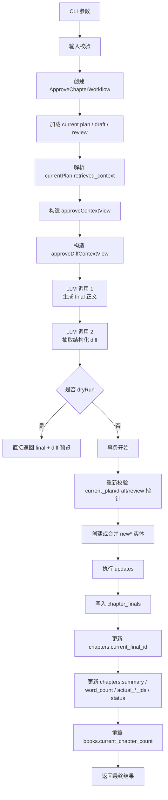
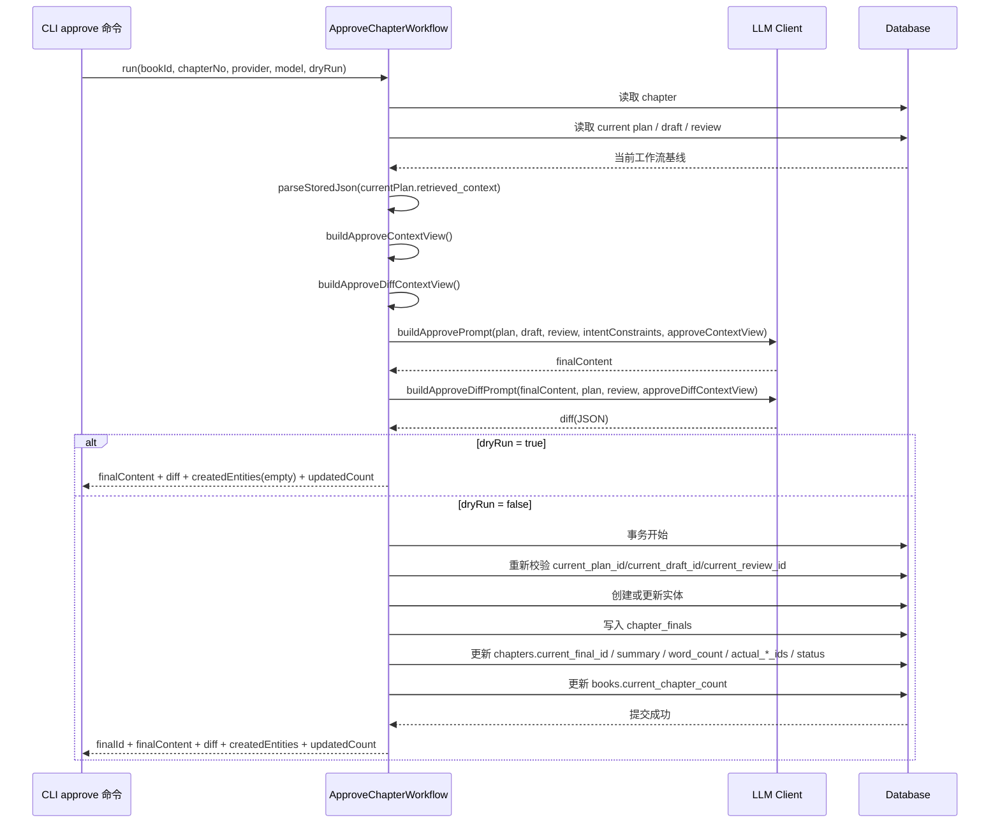

# Approve 工作流详解

本文专门说明 `approve` 命令的项目级实现，包括：

- `approve` 为什么要拆成两次 LLM 调用
- `approve final` 和 `approve diff` 分别做什么
- `dryRun` 和正式提交的真实差异
- 实体创建、实体更新、章节字段回写分别如何发生
- 为什么 `approve` 要在提交前重新校验 `current_*` pointer

如果你想看的是：

- 全工作流与 prompt 关系：看 `docs/prompt-retrieval-relationship.md`
- `plan` 阶段的上下文是怎么来的：看 `docs/plan-workflow-guide.md`
- 召回与打分规则：看 `docs/retrieval-scoring-rules.md`

## 目录

- [1. 涉及文件](#1-涉及文件)
- [2. 一句话理解](#2-一句话理解)
- [3. 输入与输出](#3-输入与输出)
- [4. 主流程图](#4-主流程图)
- [5. 时序图](#5-时序图)
- [6. 详细说明](#6-详细说明)
- [7. 为什么 `approve` 要拆成两次 LLM 调用](#7-为什么-approve-要拆成两次-llm-调用)
- [8. `approve` 结束后，系统真正发生了什么](#8-approve-结束后系统真正发生了什么)
- [9. 错误与边界情况](#9-错误与边界情况)
- [10. 当前实现特征](#10-当前实现特征)
- [11. 建议阅读顺序](#11-建议阅读顺序)
- [相关阅读](#相关阅读)

## 1. 涉及文件

- CLI 入口：`src/cli/commands/approve.ts`
- 工作流主类：`src/domain/workflows/approve-chapter-workflow.ts`
- 共享辅助：`src/domain/workflows/shared.ts`
- 上下文裁剪：`src/domain/planning/context-views.ts`
- Prompt 构建：`src/domain/planning/prompts.ts`

## 2. 一句话理解

`approve` 的核心职责是把章节写作链路正式收口：先产出可保存的最终正文，再把正文中的结构化事实变化抽成 diff，最后把 final 版本、实体变化、章节字段和书籍统计一次性写回数据库。

## 3. 输入与输出

### 3.1 CLI 输入

`approve` 命令当前支持：

- `--book`
- `--chapter`
- `--provider`
- `--model`
- `--dryRun`
- `--json`

### 3.2 工作流输出

`ApproveChapterWorkflow.run()` 返回：

- `chapterId`
- `finalId?`
- `finalContent`
- `diff`
- `createdEntities`
- `updatedCount`

这里有一个重要点：

- `dryRun=true` 时不会返回 `finalId`
- 因为此时不会写入 `chapter_finals`

## 4. 主流程图

## 5. 时序图

## 6. 详细说明

### 6.1 第一步：读取当前工作流基线

`approve` 不是独立运行的，它依赖三个当前指针：

- `current_plan_id`
- `current_draft_id`
- `current_review_id`

因此在正式执行前，工作流会先确认：

- 章节存在
- 当前 `plan / draft / review` 都存在
- 它们都属于同一本书、同一章

这意味着 `approve` 的输入并不是“随便一段正文”，而是已经经过 `plan -> draft -> review` 链路收敛后的结果。

### 6.2 第二步：从 plan 中恢复共享上下文

`approve` 并不会重新做数据库召回，而是直接读取：

- `currentPlan.retrieved_context`

然后分成两份不同的上下文视图：

- `buildApproveContextView()`
  - 给 final 正文生成使用
  - 保留少量支撑背景，如 `supportingOutlines`
- `buildApproveDiffContextView()`
  - 给事实抽取使用
  - 更偏硬约束、核对基准和风险提醒

这一步的设计目标很明确：

- final 写作需要一定的承接性背景
- diff 抽取更需要严格核对，不希望被额外背景带偏

### 6.3 第三步：第一次 LLM 调用，只负责生成 final 正文

第一次模型调用走的是：

- `buildApprovePrompt()`

输入包括：

- `planContent`
- `draftContent`
- `reviewContent`
- `intentConstraints`
- `approveContextView`

这一步只承担一个职责：

- 生成可直接保存为正式稿的最终文稿

它不负责结构化回写。

这样拆开的原因是：

- “把文章写好” 和 “把事实抽对” 是两类不同任务
- 如果强行塞进一个 prompt，模型更容易在写作质量和结构化稳定性之间互相干扰

### 6.4 第四步：第二次 LLM 调用，只负责抽取 diff

第二次模型调用走的是：

- `buildApproveDiffPrompt()`

输入包括：

- `finalContent`
- `planContent`
- `reviewContent`
- `approveDiffContextView`

输出被约束成一个结构化 JSON，核心包含：

- `chapterSummary`
- `actual*Ids`
- `new*`
- `updates`

可以这样理解：

- `chapterSummary`
  - 给章节摘要字段使用
- `actual*Ids`
  - 标记本章真实出场或真实产生影响的实体
- `new*`
  - 表示正文里出现了新的角色、势力、物品、钩子、世界设定、关系
- `updates`
  - 表示已有实体要做字段更新、追加备注或状态变更

### 6.5 第五步：`dryRun` 只做预览，不做任何写库

如果 `dryRun=true`，工作流会在拿到：

- `finalContent`
- `diff`

之后直接返回，不会进入事务。

也就是说，`dryRun` 不会做这些事：

- 不会写入 `chapter_finals`
- 不会创建新实体
- 不会更新旧实体
- 不会更新 `chapters.current_final_id`
- 不会更新 `chapters.summary`
- 不会更新 `chapters.actual_*_ids`
- 不会更新 `books.current_chapter_count`

因此它的定位更准确地说是：

- 定稿预览
- diff 结构验证

而不是“提交一半”。

### 6.6 第六步：正式提交前重新校验 pointer

这一步是 `approve` 最重要的工程保护之一。

因为从第一次 LLM 调用开始，到真正事务提交之间，存在一个时间窗口。

如果这段时间里其他操作切换了：

- `current_plan_id`
- `current_draft_id`
- `current_review_id`

那当前这次 `approve` 就已经建立在过期上下文上了。

所以事务开始后，工作流会重新读取章节并调用：

- `assertChapterPointersUnchanged()`

一旦 pointer 漂移，当前提交会直接失败。

这样做的价值是：

- 避免把新的 final 提交到旧 draft / old review 之上
- 避免多终端、多命令并发时出现“定稿错位”

### 6.7 第七步：先处理 `new*`，再处理 `updates`

正式提交时，实体处理分两层。

第一层是 `new*`：

- `newCharacters`
- `newFactions`
- `newItems`
- `newHooks`
- `newWorldSettings`
- `newRelations`

当前策略不是无脑创建，而是先查重：

- 人物按 `name`
- 势力按 `name`
- 物品按 `name`
- 钩子按 `title`
- 世界设定按 `title`
- 关系按 source/target/relationType 复合键

如果已存在：

- 不会重复创建
- 会把摘要或描述用 `appendChapterNote()` 追加到 `append_notes`

如果不存在：

- 会创建一条新实体记录
- 同时把该实体 ID 记录进 `createdEntities`

第二层是 `updates`：

- `update_fields`
- `append_notes`
- `status_change`

这一步只处理已有实体。

当前支持的实体类型包括：

- `character`
- `faction`
- `item`
- `relation`
- `story_hook`
- `world_setting`

### 6.8 第八步：写入 `chapter_finals`

实体处理完成后，工作流会新增一条 `chapter_finals` 记录，而不是覆盖旧 final。

关键字段包括：

- `based_on_draft_id`
- `content`
- `summary`
- `word_count`
- `source_type=APPROVED`

这里说明了一个重要事实：

- `approve` 是版本化定稿
- 不是简单给章节主表追加一个 `final_content`

### 6.9 第九步：更新章节主表字段

`approve` 不只写 `chapter_finals`，还会同步更新 `chapters` 主表：

- `current_final_id`
- `summary`
- `word_count`
- `actual_character_ids`
- `actual_faction_ids`
- `actual_item_ids`
- `actual_hook_ids`
- `actual_world_setting_ids`
- `status=approved`

其中 `actual_*_ids` 会把两部分合并后去重：

- diff 里给出的 `actual*Ids`
- 本次 `new*` 新建出来的实体 ID

这意味着：

- 即使模型没把刚创建的新实体再手工列进 `actual*Ids`
- 工作流也会把它们自动并入章节的真实涉及实体集合

### 6.10 第十步：写入 retrieval sidecar

这轮升级之后，`approve` 还会继续把章节收口结果写入 retrieval sidecar，而不只是更新设定库。

当前已经接入的 sidecar 包括：

- `retrieval_documents`
- `retrieval_facts`
- `story_events`
- `chapter_segments`

其中最关键的是两类：

- `retrieval_facts`
  - 当前最小已覆盖 `chapter_summary` 与若干 `*_update` facts
- `story_events`
  - 保存关键事件及其 `unresolvedImpact`

这一步的意义是：

- `approve` 不只是把这一章“写完”
- 还会把这一章中值得后续 planning 继续检索的剧情状态沉淀下来

### 6.11 第十一步：更新书籍统计

最后，工作流会重新统计当前书下状态为 `approved` 的章节数，并写回：

- `books.current_chapter_count`

这一步让书籍层的“当前已完成章节数”保持和事实一致，而不是依赖外部脚本维护。

## 7. 为什么 `approve` 要拆成两次 LLM 调用

这也是整个 `approve` 设计里最值得讲清的一点。

如果只做一次调用，让模型同时：

- 定稿正文
- 抽结构化事实

会遇到两个典型问题：

- 写作质量和结构化稳定性会互相干扰
- 模型更容易为了输出 JSON 而牺牲正文自然度，或者为了写好正文而让结构化结果漂移

现在的做法是拆成两步：

1. 先把 final 写好
2. 再基于 final 去抽 diff

这样可以把“定稿质量”与“事实回写质量”分别约束。

## 8. `approve` 结束后，系统真正发生了什么

一次成功的正式 `approve` 结束后，系统会同时得到：

### 8.1 一个新的正式稿版本

落在 `chapter_finals`。

### 8.2 一批设定库变化

包括：

- 新实体创建
- 旧实体字段更新
- 旧实体备注追加
- 旧实体状态变化

### 8.3 章节主表状态更新

包括：

- `current_final_id` 切换
- 摘要更新
- 字数更新
- 本章实际涉及实体集合更新
- 状态切到 `approved`

### 8.4 书籍层完成度更新

包括：

- `books.current_chapter_count`

### 8.5 retrieval sidecar 更新

包括：

- 新的或覆盖后的 `retrieval_documents`
- 新的或覆盖后的 `retrieval_facts`
- 新的或覆盖后的 `story_events`
- 新的或覆盖后的 `chapter_segments`

所以 `approve` 真正是整个章节工作流的“收口事务”。

## 9. 错误与边界情况

当前 `approve` 在以下情况下会失败：

- 章节不存在
- 当前 `plan / draft / review` 不完整
- `current_*` pointer 指向非法记录
- `approve diff` 返回的 JSON 非法或不符合 schema
- 提交前 pointer 漂移
- 数据库事务失败

其中最容易被忽略的是：

- 即使 final 和 diff 都已经生成成功
- 如果提交前 pointer 变了，工作流仍然会拒绝提交

这不是异常，而是保护行为。

## 10. 当前实现特征

从工程角度看，`approve` 当前有几个明确特征：

- 强依赖 `plan` 固化上下文，而不是重新检索
- 用两套 context view 区分“定稿写作”和“事实核对”
- 用两次 LLM 调用拆开 final 与 diff
- `dryRun` 只预览，不写任何库
- 用事务把 final、实体更新、章节更新、书籍统计绑定成一个原子提交
- 用 pointer 校验避免把提交落到过期上下文上
- approve 结束后会同步刷新 retrieval sidecar，使章节结果能真正回流到下一章 `plan`

## 11. 建议阅读顺序

如果你想继续往下看，推荐顺序是：

1. `docs/approve-workflow-guide.md`
2. `docs/plan-workflow-guide.md`
3. `docs/prompt-retrieval-relationship.md`
4. `docs/retrieval-scoring-rules.md`

## 相关阅读

- [`README.md`](../README.md)
- [`docs/cli-usage-guide.md`](./cli-usage-guide.md)
- [`docs/plan-workflow-guide.md`](./plan-workflow-guide.md)
- [`docs/prompt-retrieval-relationship.md`](./prompt-retrieval-relationship.md)

## 阅读导航

- 上一篇：[`docs/repair-workflow-guide.md`](./repair-workflow-guide.md)
- 下一篇：[`docs/chapter-pipeline-overview.md`](./chapter-pipeline-overview.md)
