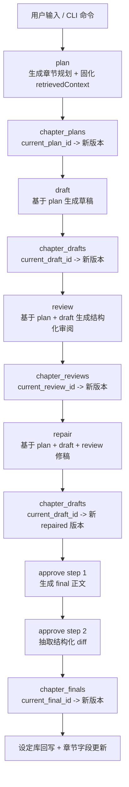
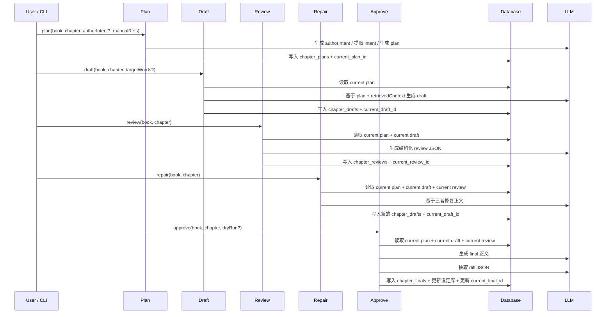
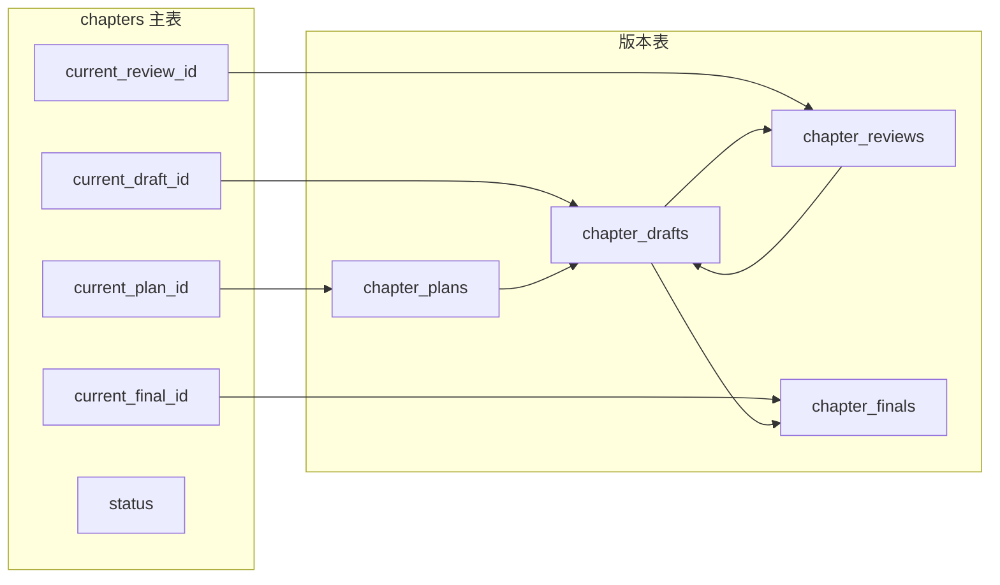
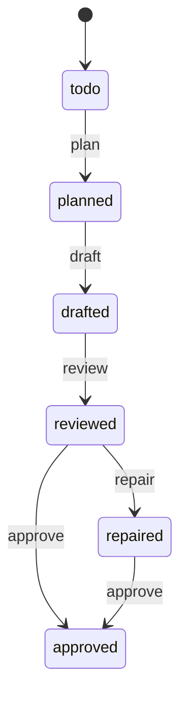

# 章节全流水线总览

本文把章节工作流的五个阶段串起来讲清楚：

- `plan`
- `draft`
- `review`
- `repair`
- `approve`

重点回答这几个问题：

- 一章从开始到定稿，系统内部到底经过了哪些阶段
- 每个阶段分别读什么、写什么
- 为什么项目要把正文拆成多张版本表而不是只存一份内容
- `chapters.current_*_id` 和 `chapters.status` 是怎么流转的
- 哪些阶段会重新召回，哪些阶段只复用 `plan` 固化上下文

如果你想看单阶段细节，请直接看：

- `docs/plan-workflow-guide.md`
- `docs/draft-workflow-guide.md`
- `docs/review-workflow-guide.md`
- `docs/repair-workflow-guide.md`
- `docs/approve-workflow-guide.md`

## 1. 涉及文件

- `src/domain/workflows/plan-chapter-workflow.ts`
- `src/domain/workflows/draft-chapter-workflow.ts`
- `src/domain/workflows/review-chapter-workflow.ts`
- `src/domain/workflows/repair-chapter-workflow.ts`
- `src/domain/workflows/approve-chapter-workflow.ts`
- `src/domain/workflows/shared.ts`
- `src/domain/planning/context-views.ts`
- `src/domain/planning/prompts.ts`
- `src/domain/shared/constants.ts`

## 2. 一句话理解

整条章节流水线的核心目标不是“连续生成几次文本”，而是把一章小说从意图准备、正文生成、结构化审阅、受约束修稿，到最终定稿和事实回写，拆成一组可追溯、可复用、可回滚的版本化阶段。

## 3. 总流程图

## 4. 统一时序图

## 5. 版本表与 current 指针关系图

这张图表达的是两个层面：

- `chapters` 主表只保留“当前生效版本指针”
- 各阶段真实内容都写在版本表里，而不是覆盖主表字段

同时还表达了版本之间的依赖关系：

- `draft` 基于 `plan`
- `review` 基于 `draft`
- `repair` 再生成新的 `draft`
- `approve` 基于当前 `draft`

## 6. 状态流转图

当前章节状态常量定义在：

- `todo`
- `planned`
- `drafted`
- `reviewed`
- `repaired`
- `approved`

有两个容易忽略的点：

- `approve` 可以发生在 `reviewed` 之后，也可以发生在 `repaired` 之后
- `repair` 不会进入新表，而是继续写 `chapter_drafts`

## 7. 每个阶段分别做什么

### 7.1 `plan`

职责：

- 生成或接收 `authorIntent`
- 提取 `intentConstraints`
- 做两次召回
- 生成章节规划正文
- 把 `retrievedContext` 固化到 `chapter_plans`

读：

- 书籍信息
- 相关大纲
- 最近章节摘要
- 设定库实体

写：

- `chapter_plans`
- `chapters.current_plan_id`
- `chapters.status=planned`

### 7.2 `draft`

职责：

- 基于当前 plan 和固化上下文生成草稿正文

读：

- `current plan`
- `currentPlan.retrieved_context`
- `intentConstraints`

写：

- 新的 `chapter_drafts`
- `chapters.current_draft_id`
- `chapters.word_count`
- `chapters.status=drafted`

### 7.3 `review`

职责：

- 基于当前 plan 和当前 draft 生成结构化审阅结果

读：

- `current plan`
- `current draft`
- `currentPlan.retrieved_context`

写：

- 新的 `chapter_reviews`
- `chapters.current_review_id`
- `chapters.status=reviewed`

### 7.4 `repair`

职责：

- 基于当前 plan、当前 draft、当前 review 修复正文

读：

- `current plan`
- `current draft`
- `current review`
- `currentPlan.retrieved_context`

写：

- 新的 repaired `chapter_drafts`
- `chapters.current_draft_id`
- `chapters.word_count`
- `chapters.status=repaired`

### 7.5 `approve`

职责：

- 先生成 final 正文
- 再抽取结构化 diff
- 把实体变更、章节字段、书籍统计统一回写

读：

- `current plan`
- `current draft`
- `current review`
- `currentPlan.retrieved_context`

写：

- `chapter_finals`
- 设定库实体表
- `chapters.current_final_id`
- `chapters.summary`
- `chapters.word_count`
- `chapters.actual_*_ids`
- `chapters.status=approved`
- `books.current_chapter_count`

## 8. 哪些阶段重新召回，哪些阶段只复用 plan 上下文

这是理解整套架构的关键点。

### 8.1 只有 `plan` 会真正做召回主链

当前真正会调 retrieval 主链的是：

- `plan`

而且是两次：

- 一次轻量上下文准备
- 一次完整共享上下文召回

### 8.2 后续阶段默认都复用 `plan` 固化上下文

当前：

- `draft`
- `review`
- `repair`
- `approve`

都不会重新做数据库召回，而是直接读取：

- `currentPlan.retrieved_context`

再通过 `context-views.ts` 裁成阶段化视图。

这样做的最大价值是：

- 减少多次生成时的上下文漂移
- 保证整条流水线围绕同一份事实边界协作

## 9. 为什么要用多张版本表，而不是一份章节正文反复覆盖

这是这个项目最重要的架构选择之一。

如果只保留一份可变正文，会丢掉这些信息：

- 规划和草稿之间的差异
- 审阅针对的是哪一版草稿
- 修稿是从哪一版 draft 修出来的
- 定稿基于哪一版草稿产生

现在拆成：

- `chapter_plans`
- `chapter_drafts`
- `chapter_reviews`
- `chapter_finals`

就能保留：

- 阶段边界
- 版本谱系
- 当前指针
- 历史记录

这让系统可以同时做到：

- 可追溯
- 可回滚
- 可审计
- 可继续自动化处理

## 10. 为什么多个阶段都要做 pointer 校验

从 `draft` 开始，到 `approve` 为止，工作流在模型生成结束、事务提交之前都会重新校验 `current_*` pointer。

原因很简单：

- LLM 生成有耗时
- 在生成期间，章节当前版本可能已经被别的命令切换

如果不校验，就可能出现：

- 基于旧 draft 生成的新 review 落到新 draft 上
- 基于旧 review 修出来的新 draft 覆盖当前章节状态
- 基于旧上下文生成的 final 落到已经推进过的章节上

所以 pointer 校验的本质是：

- 拒绝把生成结果提交到过期上下文上

## 11. `source_type` 和版本语义

当前章节内容相关的 `source_type` 主要包括：

- `ai_generated`
- `repaired`
- `imported`
- `approved`

它们分别表达：

- 普通 AI 生成内容
- 经 review 后修稿得到的内容
- 外部 Markdown 导入内容
- 经过 approve 收口后的正式稿

这让相同的数据表也能承载不同来源语义。

## 12. 一章真正完成后，系统里会留下什么

一章走完完整流水线后，系统通常会留下：

- 一条或多条 `chapter_plans`
- 一条或多条 `chapter_drafts`
- 一条或多条 `chapter_reviews`
- 一条或多条 `chapter_finals`
- 一组最新 `current_*_id`
- 一组更新过的设定库实体与章节实体引用

也就是说，系统留下的不是“最后那篇正文”，而是一整条可回放的生产轨迹。

## 13. 推荐阅读顺序

建议按下面顺序阅读：

1. `docs/chapter-pipeline-overview.md`
2. `docs/plan-workflow-guide.md`
3. `docs/draft-workflow-guide.md`
4. `docs/review-workflow-guide.md`
5. `docs/repair-workflow-guide.md`
6. `docs/approve-workflow-guide.md`
7. `docs/prompt-retrieval-relationship.md`

## 相关阅读

- [`docs/plan-workflow-guide.md`](./plan-workflow-guide.md)
- [`docs/draft-workflow-guide.md`](./draft-workflow-guide.md)
- [`docs/review-workflow-guide.md`](./review-workflow-guide.md)
- [`docs/repair-workflow-guide.md`](./repair-workflow-guide.md)
- [`docs/approve-workflow-guide.md`](./approve-workflow-guide.md)
