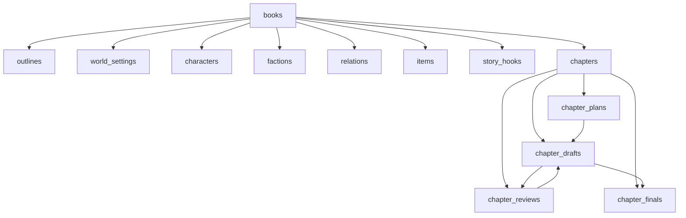
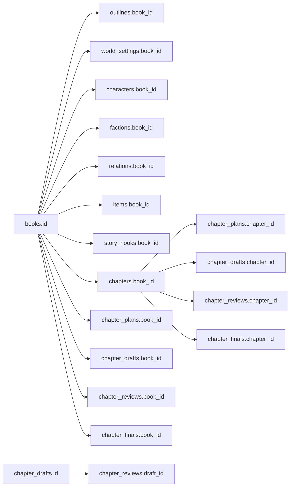
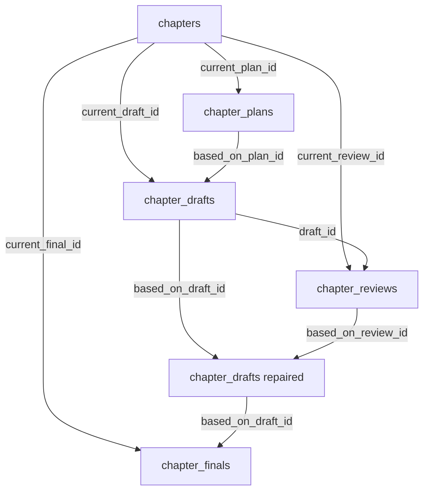
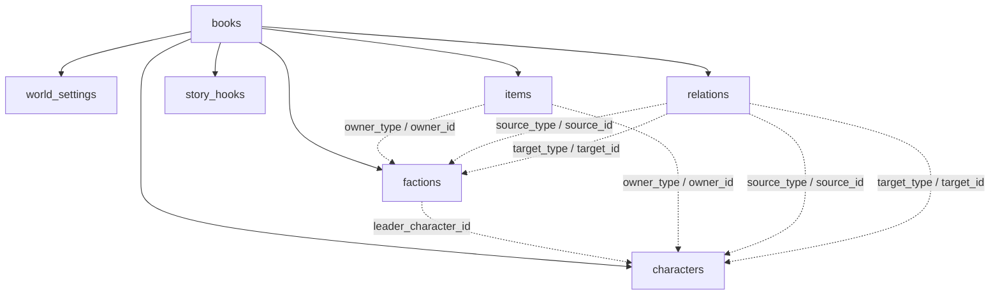

# 数据库表关系总览

本文把项目当前数据库模型按关系层次梳理清楚，重点回答这些问题：

- 当前有哪些核心表
- 哪些关系是数据库级强外键，哪些只是业务级软关联
- 章节工作流相关版本表之间是怎么连起来的
- 设定库实体和章节表之间如何发生关联
- 哪些字段是 `JSON string / ID list / polymorphic reference`，不能当普通外键理解

如果你想看单个工作流怎么读写这些表，请直接看：

- `docs/chapter-pipeline-overview.md`
- `docs/plan-workflow-guide.md`
- `docs/approve-workflow-guide.md`

## 1. 涉及文件

- Schema 类型：`src/core/db/schema/database.ts`
- 初始迁移：`src/core/db/migrations/initial.ts`
- 工作流常量：`src/domain/shared/constants.ts`

## 2. 一句话理解

这套数据库模型可以分成三层：

- `books` 作为根对象
- 设定库实体和章节主表作为书下的核心业务对象
- `chapter_plans / chapter_drafts / chapter_reviews / chapter_finals` 作为章节工作流版本层

同时，项目还刻意保留了一部分“软关联字段”，用来表达多态引用、版本指针和召回结果，而不是把所有关系都硬编码成数据库外键。

## 3. 总体关系图

这张图先表达大层次：

- 一本书下面挂设定库、章节和章节版本
- 章节工作流版本表围绕 `chapters` 组织
- `chapter_drafts` 同时承接 `plan`、`review` 和 `final` 之间的链路

## 4. 强外键关系图

当前真正由数据库层显式声明的强外键主要是：

- 所有核心表的 `book_id -> books.id`
- `chapter_plans.chapter_id -> chapters.id`
- `chapter_drafts.chapter_id -> chapters.id`
- `chapter_reviews.chapter_id -> chapters.id`
- `chapter_reviews.draft_id -> chapter_drafts.id`
- `chapter_finals.chapter_id -> chapters.id`

这些关系的特点是：

- 数据库层面强约束
- 支持级联删除 `onDelete('cascade')`

## 5. 章节工作流版本关系图

这里要注意两种不同关系：

- `chapters.current_*_id`
  - 表示“当前生效版本指针”
- 版本表里的 `based_on_*`
  - 表示“版本谱系来源”

这两者不是一回事。

### 5.1 `chapters` 主表只保留当前指针

`chapters` 本身不是正文内容表，它更像章节的“当前状态快照”。

主要保存：

- 基础元数据：`title`、`summary`、`word_count`
- 状态：`status`
- 当前版本指针：`current_plan_id / current_draft_id / current_review_id / current_final_id`
- 当前章节实际涉及实体：`actual_*_ids`

### 5.2 四张版本表分别承载四种阶段结果

- `chapter_plans`
  - 保存规划正文、意图提取结果、手工实体引用、共享 `retrieved_context`
- `chapter_drafts`
  - 保存普通草稿和修稿后的草稿
- `chapter_reviews`
  - 保存结构化审阅结果
- `chapter_finals`
  - 保存正式稿

### 5.3 `chapter_drafts` 是版本谱系的中枢

当前版本关系里，`chapter_drafts` 是最关键的一张表。

它同时承接：

- `based_on_plan_id`
- `based_on_draft_id`
- `based_on_review_id`

这意味着它既可以表示：

- 首次基于 plan 生成的草稿
- 也可以表示基于旧草稿和 review 修出来的新草稿

## 6. 设定库实体关系图

这张图里有两类关系：

- 实线：数据库级强外键到 `books`
- 虚线：业务级软关联，不是数据库强外键

## 7. 哪些字段是“软关联”

这部分非常重要，因为它决定了你怎么看这个 schema。

### 7.1 `factions.leader_character_id`

这个字段表达：

- 某个势力当前的领导人物

但它当前不是数据库级外键。

它属于：

- 业务层软关联

### 7.2 `items.owner_type + owner_id`

这是一个典型多态引用：

- `owner_type` 说明拥有者类型
- `owner_id` 说明拥有者 ID

当前业务上可以表达：

- 角色拥有物品
- 势力拥有物品
- 或没有拥有者

这种结构很灵活，但数据库层无法对所有情况加单一外键。

### 7.3 `relations.source_type/source_id/target_type/target_id`

关系表同样采用多态引用，表达：

- 角色到角色
- 角色到势力
- 势力到角色
- 势力到势力

所以关系表不是“普通 join table”，而是：

- 带语义类型的多态关系表

### 7.4 `story_hooks.source_chapter_no/target_chapter_no`

这两个字段表达：

- 钩子来自哪一章
- 预期在哪一章回收

但它们当前不是对 `chapters.id` 的外键，而是章节号级软关联。

### 7.5 `chapters.actual_*_ids`

这些字段包括：

- `actual_character_ids`
- `actual_faction_ids`
- `actual_item_ids`
- `actual_hook_ids`
- `actual_world_setting_ids`

它们本质上是：

- JSON string 形式存储的 ID 列表

用途是：

- 标记本章真实涉及到哪些实体
- 便于后续召回、审计和展示

它们不是关系表，也不是数据库级外键。

## 8. 哪些字段是“结构化 JSON 存储”

当前数据库里有不少字段是 `text`，但语义上存的是结构化数据。

典型包括：

### 8.1 `chapter_plans`

- `intent_keywords`
- `intent_must_include`
- `intent_must_avoid`
- `manual_entity_refs`
- `retrieved_context`

### 8.2 `chapter_reviews`

- `issues`
- `risks`
- `continuity_checks`
- `repair_suggestions`
- `raw_result`

### 8.3 章节主表

- `actual_*_ids`

这类字段的共同点是：

- 数据库层把它们当文本存
- 业务层把它们当结构化 JSON 使用

## 9. 索引设计在支持什么

当前迁移里索引大致支持三类查询。

### 9.1 按书聚合查询

几乎所有核心表都有：

- `book_id`

相关索引。

这说明系统的主要访问边界是：

- 以“书”为租户边界

### 9.2 章节版本链查询

版本表都有：

- `chapter_id + version_no` 唯一约束

以及相关索引。

这说明系统非常重视：

- 按章节读取版本历史
- 获取最新版本号

### 9.3 版本谱系查询

`chapter_drafts` 和 `chapter_finals` 额外对这些字段建了索引：

- `based_on_plan_id`
- `based_on_draft_id`
- `based_on_review_id`

这说明设计上已经把“版本来源追踪”作为正式能力，而不只是临时字段。

## 10. 为什么这里既有强外键，也保留软关联

这是这套模型的一个有意识取舍。

### 10.1 强外键用于保证主干完整性

例如：

- 版本表必须属于某本书、某章
- review 必须明确关联某个 draft

这种关系如果错了，整条工作流就不成立，所以适合用强外键。

### 10.2 软关联用于保留建模弹性

例如：

- 关系表的多态 source/target
- 物品拥有者的多态 owner
- 章节实际涉及实体的 ID 列表

这些关系如果全做成强外键和关联表，会让 schema 更复杂，也不利于当前工作流快速迭代。

## 11. 从业务上看，这套表可以怎么分层

更便于理解的分层方式是：

### 11.1 根对象层

- `books`

### 11.2 设定库层

- `outlines`
- `world_settings`
- `characters`
- `factions`
- `relations`
- `items`
- `story_hooks`

### 11.3 章节主索引层

- `chapters`

### 11.4 章节工作流版本层

- `chapter_plans`
- `chapter_drafts`
- `chapter_reviews`
- `chapter_finals`

## 12. 最容易误解的几个点

### 12.1 `chapters` 不是正文内容表

它只是：

- 当前状态
- 当前版本指针
- 当前摘要/字数/实体引用

真正的正文内容在版本表。

### 12.2 `chapter_drafts` 不只保存“初稿”

它也保存：

- repair 之后的新草稿版本

### 12.3 `relations` 不是普通中间表

它是带业务语义的实体表，包含：

- 关系类型
- 强度
- 状态
- 描述
- 追加备注

### 12.4 `actual_*_ids` 不是规范化关系表

它更像：

- 章节侧的快速实体快照

## 13. 推荐阅读顺序

建议按下面顺序阅读：

1. `docs/database-relationship-overview.md`
2. `docs/chapter-pipeline-overview.md`
3. `docs/plan-workflow-guide.md`
4. `docs/approve-workflow-guide.md`

## 相关阅读

- [`docs/chapter-pipeline-overview.md`](./chapter-pipeline-overview.md)
- [`docs/plan-workflow-guide.md`](./plan-workflow-guide.md)
- [`docs/approve-workflow-guide.md`](./approve-workflow-guide.md)
