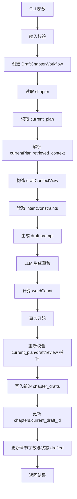
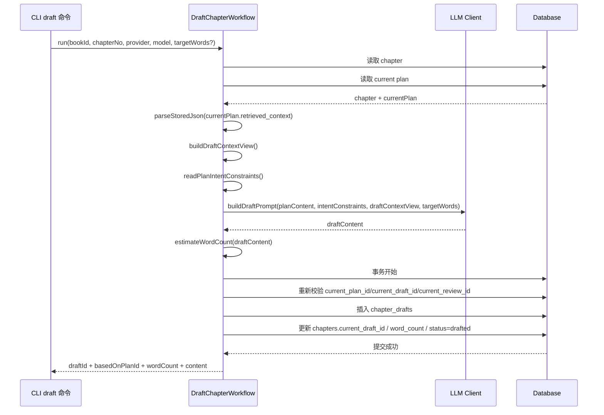

# Draft 工作流详解

本文专门说明 `draft` 命令的项目级实现，包括：

- `draft` 为什么不会重新做数据库召回
- `draft` 如何复用 `plan` 阶段固化的上下文
- `targetWords` 如何参与 prompt
- `draft` 的版本化写入方式
- 为什么 `draft` 提交前也要重新校验 `current_*` pointer

如果你想看的是：

- `plan` 上下文如何产生：看 `docs/plan-workflow-guide.md`
- 全工作流 prompt 关系：看 `docs/prompt-retrieval-relationship.md`
- `review / repair / approve` 后续链路：看对应专题文档

## 1. 涉及文件

- CLI 入口：`src/cli/commands/draft.ts`
- 工作流主类：`src/domain/workflows/draft-chapter-workflow.ts`
- 上下文裁剪：`src/domain/planning/context-views.ts`
- Prompt 构建：`src/domain/planning/prompts.ts`
- 共享辅助：`src/domain/workflows/shared.ts`

## 2. 一句话理解

`draft` 的核心职责不是“重新理解整本书再写一遍正文”，而是基于 `plan` 阶段已经固化的规划和上下文，生成一个新的草稿版本，并把章节当前 draft 指针切到这个新版本上。

## 3. 输入与输出

### 3.1 CLI 输入

`draft` 命令当前支持：

- `--book`
- `--chapter`
- `--provider`
- `--model`
- `--targetWords`
- `--json`

### 3.2 工作流输出

`DraftChapterWorkflow.run()` 返回：

- `chapterId`
- `draftId`
- `basedOnPlanId`
- `wordCount`
- `content`

## 4. 主流程图

## 5. 时序图

## 6. 详细说明

### 6.1 `draft` 直接复用 `plan` 固化上下文

`draft` 当前不会重新做数据库召回。

它直接从：

- `currentPlan.retrieved_context`

恢复上下文，再通过：

- `buildDraftContextView()`

裁成适合正文生成阶段的视图。

这样做的目的很直接：

- 保证 `plan` 和 `draft` 使用同一套事实边界
- 避免多次生成时出现上下文漂移

### 6.2 `draftContextView` 不是完整 JSON 直喂

`draftContextView` 当前会保留这些核心内容：

- `hardConstraints`
- `priorityContext`
- `recentChanges`
- `recentChapters`
- `riskReminders`
- `supportingOutlines`

其中：

- `hardConstraints` 是正文不能写错的底线
- `priorityContext` 帮助模型判断哪些事实更该优先消费
- `recentChanges` 和 `recentChapters` 负责承接上一章状态
- `supportingOutlines` 提供剧情承接背景

### 6.3 `draft` 还会继续消费 `intentConstraints`

除了 `planContent` 和 `retrievedContext`，`draft` 还会从 `currentPlan` 里读取：

- `intentSummary`
- `mustInclude`
- `mustAvoid`

也就是：

- `readPlanIntentConstraints(currentPlan)`

这意味着 `draft` 不是只照着规划写正文，还会继续受 `plan` 阶段提炼出来的意图约束影响。

### 6.4 `targetWords` 是正文长度约束，不是强制精确值

如果用户传了 `--targetWords`，工作流会把它作为“目标字数”写进 prompt。

它的作用更偏：

- 控制正文量级
- 提示模型调整节奏和篇幅

而不是要求模型严格输出某个精确字数。

### 6.5 `draft` 生成后会立刻估算字数

在 LLM 返回草稿后，工作流会调用：

- `estimateWordCount(draftResult.content)`

得到 `wordCount`，并在后续写入：

- 新 draft 版本记录
- 章节主表 `chapters.word_count`

### 6.6 `draft` 是新增版本，不是覆盖旧草稿

`draft` 提交时会新增一条 `chapter_drafts`，关键字段包括：

- `based_on_plan_id`
- `based_on_draft_id`
- `based_on_review_id`
- `content`
- `summary`
- `word_count`

这里的语义是：

- 这份草稿来源于哪个 plan
- 它是否承接了旧 draft / old review 的上下文

### 6.7 `summary` 的来源不是重新总结，而是沿用基线

当前 `draft` 写入时的 `summary` 来源是：

- 优先用 `chapters.summary`
- 否则退回 `currentPlan.author_intent`

这说明 `draft` 当前不会额外生成一份独立草稿摘要，而是沿用章节现有摘要基线。

### 6.8 `source_type` 会反映当前 draft 的来源语义

当前 `draft` 写入时：

- 如果当前章节已经有 `current_review_id`
  - 会把 `source_type` 记成 `REPAIRED`
- 否则
  - 记成 `AI_GENERATED`

这意味着同样是写入 `chapter_drafts`，它也会区分：

- 普通初稿
- 修稿后生成的新草稿

### 6.9 提交前 pointer 校验是必要保护

在模型生成完成后，工作流会重新读取章节，并校验：

- `current_plan_id`
- `current_draft_id`
- `current_review_id`

如果生成期间这些指针被其他操作切换，提交会直接失败。

这样做是为了避免：

- 当前 draft 落到过期 plan 上
- 把新草稿覆盖到已经被别的命令推进过的章节状态上

## 7. `draft` 结束后系统留下了什么

一次成功的 `draft` 结束后，系统会得到：

- 一条新的 `chapter_drafts` 版本记录
- 更新后的 `chapters.current_draft_id`
- 更新后的 `chapters.word_count`
- `chapters.status=drafted`

所以 `draft` 的本质是：

- 生产正文版本
- 切换章节当前草稿指针

## 8. 错误与边界情况

当前 `draft` 在以下情况下会失败：

- 章节不存在
- 当前没有 `current_plan_id`
- `current_plan_id` 指向非法记录
- LLM 调用失败
- 提交前 pointer 漂移
- 数据库事务失败

## 9. 当前实现特征

- 直接复用 `plan` 固化上下文，不重新召回
- 通过 `context-views.ts` 为正文生成裁剪上下文
- 同时消费 `planContent`、`intentConstraints`、`retrievedContext`
- 采用版本化 `chapter_drafts` 写入
- 提交前做 pointer 校验，保证并发安全

## 相关阅读

- [`docs/plan-workflow-guide.md`](./plan-workflow-guide.md)
- [`docs/review-workflow-guide.md`](./review-workflow-guide.md)
- [`docs/prompt-retrieval-relationship.md`](./prompt-retrieval-relationship.md)
