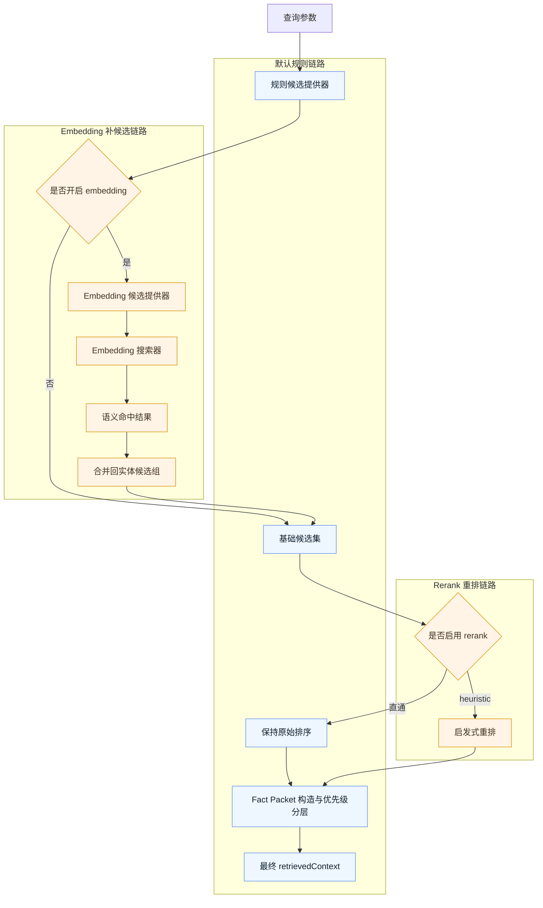
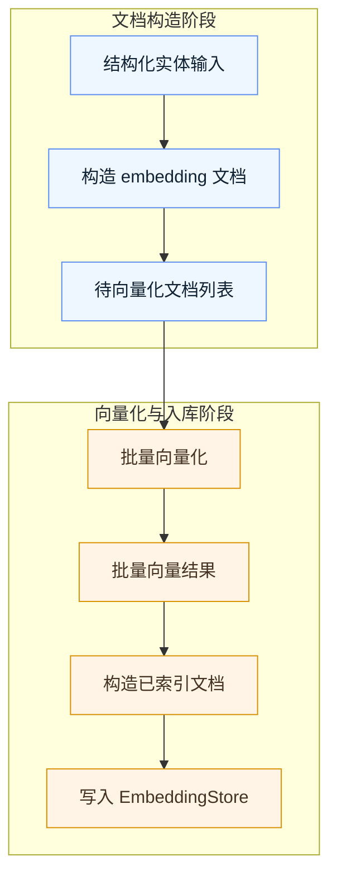
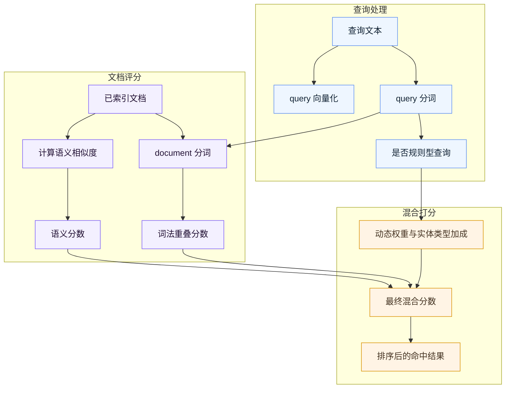

# Embedding 与 Rerank 实现说明

本文单独说明 `myai-novel` 当前 planning retrieval 中 embedding 与 rerank 的实现逻辑、职责边界和工作原理。

目标不是介绍某个算法的学术背景，而是回答这几个工程问题：

- 当前默认主链路和实验链路分别是什么
- embedding 文档是怎么构造、索引、搜索和合并的
- rerank 现在是如何工作的，为什么只做启发式重排
- 两者在 retrieval pipeline 里分别插在哪一层
- 当前实现解决了什么问题，还没有解决什么问题

## 目录

- [1. 总体定位](#1-总体定位)
- [2. 默认链路与实验链路](#2-默认链路与实验链路)
- [3. Embedding 实现逻辑](#3-embedding-实现逻辑)
- [4. Rerank 实现逻辑](#4-rerank-实现逻辑)
- [5. Pipeline 中的职责边界](#5-pipeline-中的职责边界)
- [6. 配置与启用方式](#6-配置与启用方式)
- [7. 端到端实验链路](#7-端到端实验链路)
- [8. 当前优势与限制](#8-当前优势与限制)
- [相关阅读](#相关阅读)

## 1. 总体定位

当前 retrieval 仍然是以规则召回为主，embedding 和 rerank 都属于实验增强层。

- 默认主链路：规则召回 + 规则排序 + `DirectPassThroughReranker`
- 实验链路：规则召回 + embedding candidate merge + `HeuristicReranker`

当前代码层面的模块边界已经进一步收敛为：

- `retrieval-candidate-provider-rule.ts` 负责默认规则候选加载
- `retrieval-service-factory.ts` 负责 embedding 实验链路初始化与接线
- `retrieval-reranker-factory.ts` 负责 reranker 配置选择
- `retrieval-context-builder.ts` 负责最终 `retrievedContext` 装配

这里的设计重点不是把规则召回整体替换掉，而是：

- 让规则召回继续提供稳定、可解释、可控的 baseline
- 用 embedding 去补“关键词没打中，但语义上相关”的候选
- 用 rerank 去把 continuity risk、manual priority、hook payoff 这类高价值候选往前抬

## 2. 默认链路与实验链路

先看 retrieval pipeline 中 embedding 和 rerank 的插入位置。

- `A -> B` 表示先走默认规则候选提供器
- `C` 表示是否开启 embedding 补候选
- `I` 表示是否开启 rerank 重排
- `L -> M` 表示无论是否开启实验链路，最后都会回到统一的 fact packet / priority split 流程

这张图里最重要的两个边界是：

- embedding 只负责把规则链路没抓到的候选补进来
- rerank 只负责重排，不负责扩大候选范围

默认情况下：

- 不启用 embedding candidate provider
- 不启用 heuristic reranker（即使用 `DirectPassThroughReranker`）

这意味着线上主链路仍然尽量保持：

- 行为稳定
- explainability 清楚
- benchmark 回归容易判定

实验链路只是在不破坏 base candidates 的前提下附加增强。

## 3. Embedding 实现逻辑

### 3.1 数据结构

核心类型定义在 `src/domain/planning/embedding-types.ts`：

- `EmbeddingDocument`
  - 表示尚未向量化的检索文档
  - 字段包括 `entityType`、`entityId`、`chunkKey`、`model`、`displayName`、`text`
- `IndexedEmbeddingDocument`
  - 在 `EmbeddingDocument` 基础上增加 `vector`
- `EmbeddingMatch`
  - 表示搜索命中的结果
  - 保留 `displayName` 和 `text`，这样 merge 回 retrieval 时不会退化成只有 id
- `EmbeddingProvider`
  - 统一抽象 `embed` / `embedBatch`

这里的建模有两个工程上的考虑：

- `chunkKey` 让后续一个实体拆多块成为可能
- `displayName` 保证 embedding-only 候选也能在 retrieval explainability 里可读

### 3.2 文档构造

文档构造入口在 `src/domain/planning/embedding-index.ts`，目前会把实体转换成 summary document。

当前实际接入 `buildEmbeddingDocuments()` 与 refresh 主链的实体类型是：

- `character`
- `hook`
- `world_setting`

当前 embedding provider 支持两种实现：

- `hash`：本地 `DeterministicHashEmbeddingProvider`，无远程依赖，适合默认实验链路与测试
- `custom`：自定义远程 embedding provider，走 OpenAI-compatible `/embeddings` 接口

文本模板分散在：

- `embedding-text-characters.ts`
- `embedding-text-hooks.ts`
- `embedding-text-world-settings.ts`

另外，仓库里已经存在 faction / item / relation 的扩展模板文件，但它们目前还没有接进 `buildEmbeddingDocuments()` 和 `EmbeddingRefreshService` 的在线实验链路。

模板的原则不是“原始字段拼接”，而是构造成更可检索的摘要文本，例如：

- 角色身份
- 当前目标
- continuity risk 线索
- 钩子的 foreshadowing / payoff
- 规则的边界与执行条件

### 3.3 索引刷新与存储

刷新流程由 `src/domain/planning/embedding-refresh.ts` 提供：

- `refresh`
  - 全量按实体类型刷新
- `refreshEntityType`
  - 当前只支持刷新 `character | hook | world_setting`
- `clearModel`
  - 清理一个 model 的索引

存储契约定义在 `src/domain/planning/embedding-store.ts`：

- `replaceDocuments`
- `listDocuments`
- `clearDocuments`

当前内置实现是 `InMemoryEmbeddingStore`。

流程图如下：

- `A -> B` 是从结构化实体生成可检索文本
- `C -> D -> E` 是批量向量化
- `F -> G` 是把向量化结果写入 store，供后续 searcher 装载

这里要注意，refresh 流程不是在线 query 时临时拼一段文本去搜，而是先做：

1. 文档构造
2. 向量生成
3. 按 `model + entityType + chunkKey` 存储

因此它更接近一个轻量索引构建流程。

这条链路的意义在于把 embedding 从“单次 demo 搜索”推进到：

- 有文档构造
- 有 model 维度
- 有 entityType 维度
- 有 refresh 生命周期

### 3.4 搜索器

当前有两种 searcher。

#### `InMemoryEmbeddingSearcher`

文件：`src/domain/planning/embedding-searcher-memory.ts`

逻辑很直接：

- 把 query 向量化
- 与所有 indexed document 做 cosine similarity
- 按相似度排序后截断

它适合：

- baseline 实验
- 最简单的 semantic search 验证

#### `HybridEmbeddingSearcher`

文件：`src/domain/planning/embedding-searcher-hybrid.ts`

它在 semantic score 之外，还叠加 lexical overlap：

- `semanticScore`: query vector 和 document vector 的余弦相似度
- `lexicalScore`: query token 与 document token 的重叠度
- `combinedScore = semantic * weight + lexical * weight + entityTypeBonus`

其中有两个关键点：

1. 规则类 query 会做 `ruleHeavyQuery` 判断
2. 对 `world_setting` / `faction` 有额外 entity type bonus

也就是说，hybrid search 不是泛化地“语义 + 词法平均混合”，而是：

- 对规则类 query 更偏 lexical
- 对规则相关实体类型做轻量偏置

流程图：

- 左侧是 query 的两条并行处理路径：向量化与分词
- 中间是 document 的两条评分路径：semantic similarity 与 lexical overlap
- 右侧再做动态加权和 entity type bonus，得到最终排序分数

如果 query 更像规则/制度查询，hybrid search 会：

- 提高 lexical weight
- 对 `world_setting` 给更高 bonus
- 对 `faction` 给较轻的 bonus

这样做是为了避免纯语义相似度把“规则边界”类查询拉向过于泛化的人物/事件描述。

### 3.5 Candidate merge

embedding 不直接替代规则召回，而是通过 `EmbeddingCandidateProvider` 合并回原始候选。

文件：`src/domain/planning/embedding-candidate-provider.ts`

逻辑是：

1. 先调用 base candidate provider，拿到规则召回结果
2. 再做 embedding search
3. 只把“base 里没有的同类型实体”补进去
4. 保留原先实体，不做覆盖

这意味着：

- embedding 是补候选，不是改写已有候选
- 规则链路仍然是主骨架
- semantic match 只在“原规则没抓到”时补位

## 4. Rerank 实现逻辑

### 4.1 Pipeline 接口

rerank 抽象定义在 `src/domain/planning/retrieval-pipeline.ts`：

- `RetrievalRerankerInput`
- `RetrievalRerankerOutput`
- `RetrievalReranker`

默认实现是 `DirectPassThroughReranker`，等于不改顺序。

### 4.2 `HeuristicReranker`

文件：`src/domain/planning/retrieval-reranker-heuristic.ts`

当前 rerank 不是 cross-encoder，也不是 LLM judge，而是规则型启发式重排。

重排时会对实体补分：

- `manual_id`
- `keyword_hit`
- `embedding_match`
- `countKeywordHits(...)`
- `continuityBonus(...)`
- `hookChapterBonus(...)`

其中：

- `continuityBonus` 会识别 `current_location`、`owner_type`、`relation_type`、`规则/制度` 等文本线索
- `hookChapterBonus` 会把接近目标章节的 hook 往前提

它的本质是：

- 不改召回集合
- 只调整候选排序
- 优先把高 continuity risk、高显式命中、高 payoff 的内容抬到前面

### 4.3 为什么先用 heuristic rerank

当前先选 heuristic rerank，而不是更重的模型式 rerank，主要是因为：

- 成本更低
- explainability 更强
- 测试与 benchmark 更稳定
- 能直接和现有规则特征共用一套判断

它适合现阶段的角色是：

- 排序增强
- benchmark gap 实验
- 为未来更强 reranker 预留接口

## 5. Pipeline 中的职责边界

embedding 和 rerank 虽然都影响召回结果，但职责不同。

### embedding 的职责

- 补候选
- 解决关键词没直接命中时的语义召回问题
- 提供额外实体进入后续规则排序 / priority split 的机会

### rerank 的职责

- 重排已有候选
- 让更高价值的信息更靠前
- 不负责扩大候选覆盖面

可以把它理解为：

- embedding 解决“有没有被看见”
- rerank 解决“谁应该先被看见”

## 6. 配置与启用方式

当前相关开关主要包括：

- `PLANNING_RETRIEVAL_EMBEDDING_PROVIDER=hash|custom`
- `PLANNING_RETRIEVAL_EMBEDDING_ENABLED`
- `PLANNING_RETRIEVAL_EMBEDDING_SEARCH_MODE=basic|hybrid`
- `PLANNING_RETRIEVAL_RERANKER=none|heuristic`
- `CUSTOM_EMBEDDING_BASE_URL`
- `CUSTOM_EMBEDDING_API_KEY`
- `CUSTOM_EMBEDDING_MODEL`
- `CUSTOM_EMBEDDING_PATH`

需要注意，当前正常工作流已经通过 `src/domain/planning/retrieval-service-factory.ts` 接入了 embedding 实验链路。

也就是说：

- 如果只开 `PLANNING_RETRIEVAL_EMBEDDING_ENABLED=true`，workflow 会实际构造 in-memory store、refresh 文档并装载 searcher
- 如果同时配置 `PLANNING_RETRIEVAL_RERANKER=heuristic`，则会继续在统一 pipeline 中走启发式重排
- 默认不打开这些配置时，主链路仍保持规则召回 + pass-through rerank

组合关系通常是：

- 默认：embedding 关闭，rerank 为 pass-through
- 实验 1：只开 heuristic rerank
- 实验 2：只开 embedding candidate provider
- 实验 3：embedding + heuristic rerank 同时开启

## 7. 端到端实验链路

前面的图分别说明了：

- embedding 在 retrieval pipeline 里的插入位置
- embedding refresh / store 的索引构建流程
- hybrid search 的混合打分过程

如果把这些环节串起来，当前实际的实验闭环更接近下面这条链路。

- 左半部分是离线或半离线准备阶段：构造文档、生成向量、写入 store
- 中间是在线检索阶段：从 store 装载 indexed docs，执行 search，补回候选池
- 右半部分是验证阶段：继续走 priority split，并进入 benchmark 检查

这张图对应了当前项目里最关键的工程事实：embedding 已经不是“临时塞几条语义命中结果”这么简单，而是有完整生命周期。

1. refresh 阶段负责把结构化实体转成可检索文档并生成向量
2. store 阶段负责按 `model / entityType / chunkKey` 保存索引结果
3. retrieval 阶段负责把语义命中结果作为补充候选并入主链路
4. benchmark 阶段负责判断这条实验链路到底是在真实补缺口，还是只是制造噪音

这也是为什么当前 benchmark 设计里一直保留 strict / baseline_gap 两种模式：

- `strict` 用来保护已经收口的能力
- `baseline_gap` 用来固定实验链路还没解决的真实缺口

## 8. 当前优势与限制

### 当前优势

- embedding 已经不是一次性 demo，而是完整的 refresh -> store -> load -> search -> merge 链路
- rerank 已经从 pipeline 层抽象出来，并通过 `retrieval-reranker-factory.ts` 独立选择实现
- semantic 补候选和 heuristic 重排职责明确，不会相互覆盖
- benchmark 已能用 strict / gap 样本验证增强是否真实有效

### 当前限制

- 当前 store 仍是内存实现，不是持久化索引
- hybrid search 的权重和 bonus 仍然是手工启发式
- rerank 仍然只基于规则特征，没有使用更强的 learned reranker
- query-intent / boost / priority 特征虽然已经开始模块化，但还没有完全收敛成统一的策略层
- 当前在线实验链路只对 `character / hook / world_setting` 建索引并补候选，faction / item / relation 模板仍处于未接线状态

## 相关阅读

- [`retrieval-scoring-rules.md`](./retrieval-scoring-rules.md)
- [`prompt-retrieval-relationship.md`](./prompt-retrieval-relationship.md)
- [`engineering-overview.md`](./engineering-overview.md)

## 阅读导航

- 上一篇：[`docs/retrieval-scoring-rules.md`](./retrieval-scoring-rules.md)
- 下一篇：[`docs/engineering-overview.md`](./engineering-overview.md)
