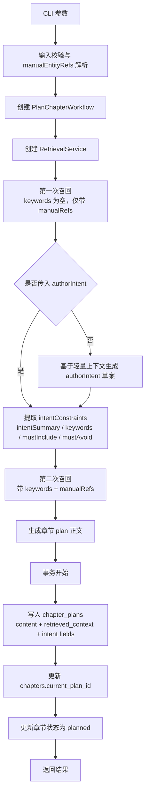
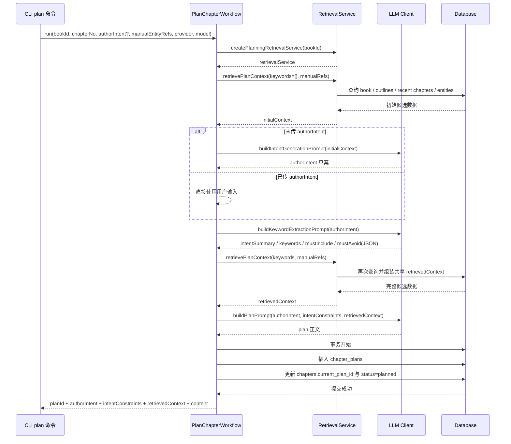

# Plan 工作流详解

本文专门说明 `plan` 命令的项目级实现，包括：

- CLI 输入如何进入工作流
- `plan` 阶段为什么会做两次召回
- `authorIntent`、`intentConstraints`、`retrievedContext` 分别扮演什么角色
- `chapter_plans` 是如何落库的
- `plan` 阶段给后续 `draft / review / repair / approve` 留下了什么基线

如果你想看的是：

- 召回细则和打分规则：看 `docs/retrieval-scoring-rules.md`
- prompt 与全工作流关系：看 `docs/prompt-retrieval-relationship.md`
- embedding / rerank 实验链路：看 `docs/embedding-rerank-architecture.md`

## 目录

- [1. 涉及文件](#1-涉及文件)
- [2. 一句话理解](#2-一句话理解)
- [3. 输入与输出](#3-输入与输出)
- [4. 主流程图](#4-主流程图)
- [5. 时序图](#5-时序图)
- [6. 详细说明](#6-详细说明)
- [7. 为什么 `plan` 要两次召回](#7-为什么-plan-要两次召回)
- [8. `plan` 给后续阶段留下了什么](#8-plan-给后续阶段留下了什么)
- [9. 错误与边界情况](#9-错误与边界情况)
- [10. 当前实现特征](#10-当前实现特征)
- [11. 建议阅读顺序](#11-建议阅读顺序)
- [相关阅读](#相关阅读)

## 1. 涉及文件

- CLI 入口：`src/cli/commands/plan.ts`
- 工作流主类：`src/domain/workflows/plan-chapter-workflow.ts`
- 输入校验：`src/domain/planning/input.ts`
- Prompt 构建：`src/domain/planning/prompts.ts`
- 检索服务创建：`src/domain/planning/retrieval-service-factory.ts`
- 上下文类型：`src/domain/planning/types.ts`

## 2. 一句话理解

`plan` 的核心职责不是“直接写一个大纲”，而是先把本章写作意图和事实边界准备好，再把这两者一起固化成一条可复用的 `chapter_plans` 记录，供后续整个章节流水线共享。

## 3. 输入与输出

### 3.1 CLI 输入

`plan` 命令当前支持：

- `--book`
- `--chapter`
- `--authorIntent`
- `--characterIds`
- `--factionIds`
- `--itemIds`
- `--hookIds`
- `--relationIds`
- `--worldSettingIds`
- `--provider`
- `--model`
- `--json`

其中实体 ID 参数支持两种格式：

- JSON 数组，如 `[1,2,3]`
- 逗号分隔，如 `1,2,3`

### 3.2 工作流输出

`PlanChapterWorkflow.run()` 返回：

- `chapterId`
- `planId`
- `authorIntent`
- `intentSource`
- `intentKeywords`
- `intentSummary`
- `mustInclude`
- `mustAvoid`
- `retrievedContext`
- `content`

可以把它理解为三部分结果：

- 本章最终采用的意图
- 结构化后的意图约束
- 基于这些约束生成的章节规划正文和共享上下文

## 4. 主流程图

## 5. 时序图

## 6. 详细说明

### 6.1 第一步：CLI 负责把输入整理成结构化参数

CLI 层本身不做业务判断，主要做三件事：

- 解析基础参数，如 `bookId`、`chapterNo`
- 把多组实体 ID 统一整理成 `manualEntityRefs`
- 把 provider / model 透传给工作流

这里有一个重要点：

- `manualEntityRefs` 是 `plan` 最强的显式召回信号
- 它既会参与第一次轻量召回，也会参与第二次完整召回

也就是说，即使关键词还没提取出来，手工指定实体也会尽早进入上下文准备阶段。

### 6.2 第二步：先做一次“轻量召回”

`plan` 一开始并不会直接用作者意图做完整检索，而是先调用：

- `retrievePlanContext({ keywords: [], manualRefs })`

这次召回的作用不是生成最终共享上下文，而是给“作者意图生成”准备背景。

这样做的原因是：

- 如果完全没有上下文，模型很容易生成偏题或过空的作者意图
- 如果一开始就把完整召回做满，又会让尚未明确的意图过早受噪声干扰

所以第一次召回本质上是一个折中：

- 提供最基本的章节承接背景
- 让作者意图生成不是凭空开始

### 6.3 第三步：决定 `authorIntent` 来源

`authorIntent` 有两种来源：

- 用户显式传入 `--authorIntent`
- 模型根据轻量上下文自动生成

对应的 `intentSource` 也会写入数据库：

- `user_input`
- `ai_generated`

这意味着 `plan` 不只是保存结果，还会保留“这章意图是人给的，还是模型补出来的”这层来源信息。

### 6.4 第四步：把意图转成结构化约束

无论 `authorIntent` 来自哪里，都会继续进入 `buildKeywordExtractionPrompt()`。

这一步要求模型返回 JSON，结构包括：

- `intentSummary`
- `keywords`
- `mustInclude`
- `mustAvoid`

这一层的意义很大，因为它把原本偏自然语言的写作意图拆成了三种不同用途的信号：

- `keywords`
  - 用来驱动第二次完整召回
- `mustInclude`
  - 约束后续规划里必须出现的内容
- `mustAvoid`
  - 约束后续规划里不能走偏的方向

最终这些内容会被收口成 `intentConstraints`，并进入 `plan prompt`。

### 6.5 第五步：做第二次召回，得到真正共享的 `retrievedContext`

这是 `plan` 最关键的一步。

第二次召回会带上：

- `buildRetrievalQueryPayload(...)` 生成的 retrieval keywords
- `manualEntityRefs`

得到的 `retrievedContext` 才是后续 `draft / review / repair / approve` 共同复用的事实边界。

这意味着：

- 第一次召回只是为意图生成服务
- 第二次召回才是真正进入章节工作流主链的上下文基线

这里一个已经发生的重要变化是：第二次召回不再机械依赖 `extractedIntent.keywords`，而是会把：

- `intentSummary`
- `mustInclude`
- `keywords`

一起压成更接近 retrieval 语言的 query payload，再送进正式检索。

当前 `retrievedContext` 不只是实体列表，而是一个多层结构，核心包括：

- `hardConstraints`
- `softReferences`
- `riskReminders`
- `priorityContext`
- `recentChanges`
- `retrievalObservability`（可选诊断层）

因此，`plan` 阶段真正做的是“上下文固化”，而不仅仅是“生成一段 planning 文本”。

### 6.6 第六步：生成章节规划正文

在 `buildPlanPrompt()` 里，输入会同时包含：

- `authorIntent`
- `intentConstraints`
- `retrievedContext`

这里的设计目标很明确：

- `authorIntent` 解决“这章想写什么”
- `retrievedContext` 解决“这章不能写错什么”
- `intentConstraints` 解决“哪些方向必须满足 / 必须避免”

所以 `plan prompt` 不是简单让模型“写个大纲”，而是在意图、事实和限制三层之间求一个可执行的章节规划。

### 6.7 第七步：事务落库

`plan` 的数据库写入分成两部分，但在一个事务里提交：

- 新建一条 `chapter_plans`
- 更新 `chapters.current_plan_id` 和章节状态

写入 `chapter_plans` 的关键字段包括：

- `author_intent`
- `intent_source`
- `intent_summary`
- `intent_keywords`
- `intent_must_include`
- `intent_must_avoid`
- `manual_entity_refs`
- `retrieved_context`
- `content`

这里最重要的不是字段多，而是它们的组合意义：

- 规划正文被保存了
- 规划生成时依赖的共享上下文也被保存了
- 规划背后的意图约束和手工实体引用也被保存了

也就是说，后续阶段拿到的不只是“这章怎么写”，还包括“当时为什么这样写、基于哪些约束这样写”。

## 7. 为什么 `plan` 要两次召回

这是整个设计里最值得讲清的一点。

如果只做一次召回，会有两个典型问题：

- 在没有明确意图前就做完整检索，容易召回噪声太多
- 在没有上下文的情况下生成作者意图，容易产生偏题或空泛意图

现在的做法相当于把问题拆成两段：

1. 先用轻量上下文帮助模型明确“本章想写什么”
2. 再用明确后的意图去召回“本章真正该参考什么”

这样得到的 `retrievedContext` 会更稳定，也更适合在后续阶段长期复用。

## 8. `plan` 给后续阶段留下了什么

`plan` 阶段最终留下三类核心资产：

### 8.1 章节规划正文

供 `draft` 直接展开正文。

### 8.2 结构化意图约束

包括：

- `intentSummary`
- `mustInclude`
- `mustAvoid`

这些约束会继续被 `draft / repair / approve` 消费。

### 8.3 共享事实边界

也就是落在 `chapter_plans.retrieved_context` 里的 `retrievedContext`。

后续阶段默认不会重新检索，而是优先复用这份已经固化的上下文。

这样做的最大价值是：

- 减少多次生成时的上下文漂移
- 保证 `plan` 和 `draft / review / repair / approve` 讨论的是同一章、同一套事实边界

## 9. 错误与边界情况

当前 `plan` 在以下情况下会失败：

- `bookId` 或 `chapterNo` 非法
- 实体 ID 参数格式非法
- 关键词提取结果不是合法 JSON 或不符合 schema
- 对应章节不存在
- LLM 调用失败
- 数据库事务失败

这里有一个和后续阶段不同的点：

- `plan` 当前没有像 `draft / review / repair / approve` 那样做提交前的 `current_* pointer` 二次校验
- 原因是 `plan` 本身就是这条指针的生产者，而不是消费已有 `current_plan_id` 的后续阶段

## 10. 当前实现特征

从工程角度看，`plan` 当前有几个很明确的实现特征：

- 入口简单，复杂性都压在 workflow 和 planning 层
- 用 schema 约束输入和关键词提取结果
- 用两次召回把“意图生成”和“共享上下文固化”分开
- 把规划正文、意图约束、召回上下文同时持久化
- 为后续章节流水线提供稳定基线，而不是一次性临时结果

## 11. 建议阅读顺序

如果你想继续往下看，推荐顺序是：

1. `docs/plan-workflow-guide.md`
2. `docs/prompt-retrieval-relationship.md`
3. `docs/retrieval-scoring-rules.md`
4. `docs/embedding-rerank-architecture.md`

## 相关阅读

- [`README.md`](../README.md)
- [`docs/cli-usage-guide.md`](./cli-usage-guide.md)
- [`docs/prompt-retrieval-relationship.md`](./prompt-retrieval-relationship.md)
- [`docs/retrieval-scoring-rules.md`](./retrieval-scoring-rules.md)

## 阅读导航

- 上一篇：[`docs/chapter-pipeline-overview.md`](./chapter-pipeline-overview.md)
- 下一篇：[`docs/draft-workflow-guide.md`](./draft-workflow-guide.md)
