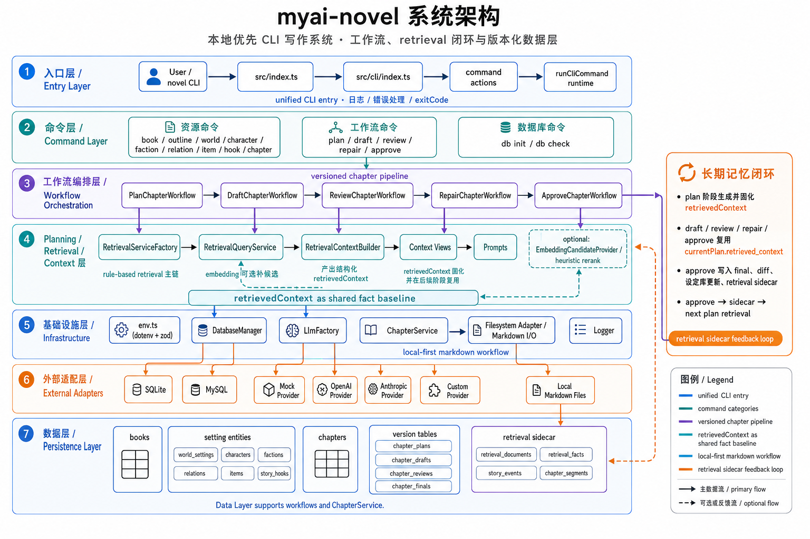
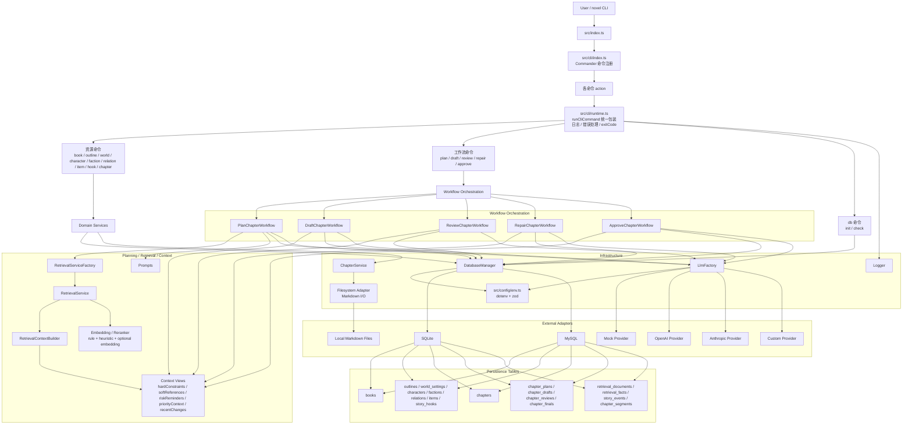

# 项目架构总览

本文把 `myai-novel` 当前最核心的运行时结构画成一份开发者总览图，重点回答这些问题：

- 命令行入口之后，系统内部是怎么分层的
- `plan -> draft -> review -> repair -> approve` 这条主线挂在什么位置
- retrieval、版本化章节表、设定库回写、sidecar 各自处于哪一层
- SQLite / MySQL、LLM provider、Markdown 导入导出分别从哪里接入

如果你想看单个专题的细节，请继续阅读：

- `docs/chapter-pipeline-overview.md`
- `docs/database-relationship-overview.md`
- `docs/retrieval-pipeline-guide.md`
- `docs/retrieval-sidecar-provenance-guide.md`
- `docs/engineering-overview.md`

## 目录

- [1. 涉及文件](#1-涉及文件)
- [2. 一句话理解](#2-一句话理解)
- [3. 分层架构图](#3-分层架构图)
- [4. 章节工作流与数据闭环图](#4-章节工作流与数据闭环图)
- [5. 各层职责说明](#5-各层职责说明)
- [6. 为什么这个项目的核心不是 Web，而是 CLI 工作流](#6-为什么这个项目的核心不是-web而是-cli-工作流)
- [7. 推荐阅读顺序](#7-推荐阅读顺序)
- [相关阅读](#相关阅读)

## 1. 涉及文件

- 入口：`src/index.ts`
- CLI 注册：`src/cli/index.ts`
- 各命令通过 `runCliCommand` 进入统一命令运行时：`src/cli/runtime.ts`
- 配置层：`src/config/env.ts`
- 数据库接线：`src/core/db/client.ts`
- LLM 接线：`src/core/llm/factory.ts`
- 章节工作流：
  - `src/domain/workflows/plan-chapter-workflow.ts`
  - `src/domain/workflows/draft-chapter-workflow.ts`
  - `src/domain/workflows/review-chapter-workflow.ts`
  - `src/domain/workflows/repair-chapter-workflow.ts`
  - `src/domain/workflows/approve-chapter-workflow.ts`
- planning / retrieval：
  - `src/domain/planning/retrieval-service.ts`
  - `src/domain/planning/retrieval-service-factory.ts`
  - `src/domain/planning/retrieval-context-builder.ts`
  - `src/domain/planning/context-views.ts`
- 章节服务与 Markdown 导入导出：`src/domain/chapter/service.ts`
- 数据模型：`src/core/db/schema/database.ts`

## 2. 一句话理解

`myai-novel` 不是“把一个模型接到几个命令上”的简单脚手架，而是一套以 CLI 为外壳、以章节工作流为主线、以设定库与 retrieval 闭环为长期记忆核心的本地优先写作系统。

## 3. 分层架构图





这张图表达的重点是：

- `src/index.ts -> src/cli/index.ts -> 各命令 action -> runCliCommand(runtime)` 是确定无误的统一运行入口链
- 资源 CRUD 和章节 workflow 共享同一套 CLI runtime、日志和配置体系
- workflow 并不直接把所有逻辑写死在命令层，而是继续下沉到 `domain/workflows` 与 `domain/planning`
- retrieval、LLM、数据库、章节服务与 Markdown 文件系统都被放在明确的边界后面，而不是散落在命令实现里

## 4. 章节工作流与数据闭环图

```mermaid
flowchart LR
    A[plan]\n生成 authorIntent\n两次召回\n固化 retrievedContext
    B[draft]\n复用 plan context\n生成草稿
    C[review]\n基于 plan + draft\n生成结构化审阅
    D[repair]\n基于 plan + draft + review\n生成新 draft 版本
    E[approve]\n生成 final\n抽取 diff\n回写事实

    P1[chapter_plans]
    P2[chapter_drafts]
    P3[chapter_reviews]
    P4[chapter_finals]
    P5[chapters.current_*_id]

    S1[设定库实体\ncharacters / factions / relations / items / story_hooks / world_settings]
    S2[retrieval sidecar\nretrieval_documents / retrieval_facts / story_events / chapter_segments]
    S3[next plan retrieval]

    A --> P1 --> B --> P2 --> C --> P3 --> D --> P2 --> E --> P4
    P1 --> P5
    P2 --> P5
    P3 --> P5
    P4 --> P5

    E --> S1
    E --> S2
    S1 --> S3 --> A
    S2 --> S3
```

这条闭环是整个项目最有辨识度的地方：

- `plan` 不是一次性生成文本，而是会把共享 `retrievedContext` 固化到 `chapter_plans`
- `draft / review / repair / approve` 主要消费 `plan` 阶段固化下来的上下文，而不是每一步都重新任意召回
- `approve` 不是简单“出 final”，而是还要抽取结构化 diff、回写设定库、沉淀 retrieval sidecar
- 下一次 `plan` 又会继续消费这些累计出来的事实和事件，所以系统会随着章节推进持续积累长期记忆

## 5. 各层职责说明

### 5.1 CLI 与 Runtime 层

`src/index.ts` 只做一件事：调用 `runCli(process.argv)`。真正的命令注册都集中在 `src/cli/index.ts`，这里统一挂载了资源命令、工作流命令与数据库命令。随后各个命令文件在 action 内再通过 `runCliCommand(...)` 进入 `src/cli/runtime.ts`，由它统一提供日志上下文、开始/结束事件和失败退出码策略。

这意味着命令层的职责很克制：主要负责把用户输入导向正确的 service 或 workflow，而不是自己承载复杂业务。

### 5.2 Workflow 编排层

`src/domain/workflows/` 是项目运行时主线所在的地方。尤其是 `plan-chapter-workflow.ts` 与 `approve-chapter-workflow.ts`，直接体现了这套系统的两端：前者负责构建写作上下文，后者负责把章节结果沉淀回系统状态。

其中 `plan` 的关键特点是：

- 先做一轮轻量上下文准备
- 必要时生成作者意图
- 再做第二轮真正会被共享的召回
- 把 `retrieved_context` 和 plan 正文一起事务化落库

而 `approve` 的关键特点是：

- 先生成 final 正文
- 再单独抽取结构化 diff
- 先校验当前 `plan / draft / review` 指针仍然有效
- 最后在事务内统一回写章节、设定库、sidecar 和当前版本指针

这说明 workflow 并不是“一次 LLM 调用 = 一个阶段”，而是带明确事务边界和数据边界的业务编排器。

### 5.3 Planning / Retrieval 层

`src/domain/planning/` 是这个仓库最厚的一层，因为它承担了长篇写作里最难稳定的部分：如何把大量设定、前文、近期变化和实验性 embedding 候选，整理成后续 prompt 可消费的上下文。

这一层的职责大致分成四块：

- 候选获取：规则式召回、embedding 补候选
- 排序与裁剪：heuristic rerank、优先级和风险提醒
- 上下文装配：`retrieval-context-builder.ts`
- 阶段视图裁剪：`context-views.ts`

因此图里把它单独拉成一层，而不是简单归到“工具函数”。

### 5.4 章节服务与文件边界

`src/domain/chapter/service.ts` 不能简单理解成“Markdown 导入导出工具”。从真实代码看，它同时承担：

- 章节 CRUD
- 当前章节查询与更新
- `plan / draft / final` 的导出
- Markdown 导入后的版本化写回
- 指针与状态更新

也就是说，Markdown 只是 chapter service 暴露给用户的一种输入输出形式；真正的职责核心还是“章节领域服务”。因此图里更准确的表达应当是：`ChapterService -> Filesystem Adapter(Markdown I/O)`。

### 5.5 Infrastructure 与 External Adapter 层

`src/config/env.ts` 用 `dotenv + zod` 在启动期完成配置加载和校验。`src/core/db/client.ts` 根据 `DB_CLIENT` 在 SQLite / MySQL 间切换，`src/core/llm/factory.ts` 根据 `LLM_PROVIDER` 在 `mock / openai / anthropic / custom` 间切换。

这个结构的好处是，业务层只依赖“数据库管理器”和“LLM factory”，而不需要知道具体是本地 SQLite、远端 MySQL，还是哪一种模型 provider。

### 5.6 数据层

从数据模型看，这个项目至少有三条并行但互相关联的主线：

- 设定库主线：`world_settings / characters / factions / relations / items / story_hooks`
- 章节版本主线：`chapters + chapter_plans / chapter_drafts / chapter_reviews / chapter_finals`
- retrieval sidecar 主线：`retrieval_documents / retrieval_facts / story_events / chapter_segments`

其中 `chapters` 主表并不承载正文主体，而更像“当前状态指针表”；真正的 plan、draft、review、final 内容都在版本表中。这也是为什么图里要把 `chapters` 和版本表拆开表达。

## 6. 为什么这个项目的核心不是 Web，而是 CLI 工作流

从真实代码入口看，这个仓库当前没有 Web server 作为主运行边界，系统对外暴露的是 `novel` 命令。也正因为这样，它的稳定性主要取决于三件事：

- 命令入口是否统一
- 工作流事务边界是否清晰
- 章节状态与设定事实是否能够持续回流到后续 planning

换句话说，这个项目最核心的架构价值，不在于“提供多少界面”，而在于把长篇小说写作中最容易失控的上下文、版本和事实更新，收敛成可持续推进的命令行工作流系统。

## 7. 推荐阅读顺序

如果你刚接触这个仓库，建议按下面顺序继续：

1. `docs/project-architecture-overview.md`
2. `docs/chapter-pipeline-overview.md`
3. `docs/database-relationship-overview.md`
4. `docs/retrieval-pipeline-guide.md`
5. `docs/retrieval-sidecar-provenance-guide.md`
6. `docs/engineering-overview.md`

## 相关阅读

- [`README.md`](../README.md)
- [`docs/README.md`](./README.md)
- [`docs/chapter-pipeline-overview.md`](./chapter-pipeline-overview.md)
- [`docs/database-relationship-overview.md`](./database-relationship-overview.md)
- [`docs/retrieval-pipeline-guide.md`](./retrieval-pipeline-guide.md)
- [`docs/retrieval-sidecar-provenance-guide.md`](./retrieval-sidecar-provenance-guide.md)
- [`docs/engineering-overview.md`](./engineering-overview.md)

## 阅读导航

- 上一篇：[`docs/engineering-overview.md`](./engineering-overview.md)
- 下一篇：[`docs/README.md`](./README.md)
