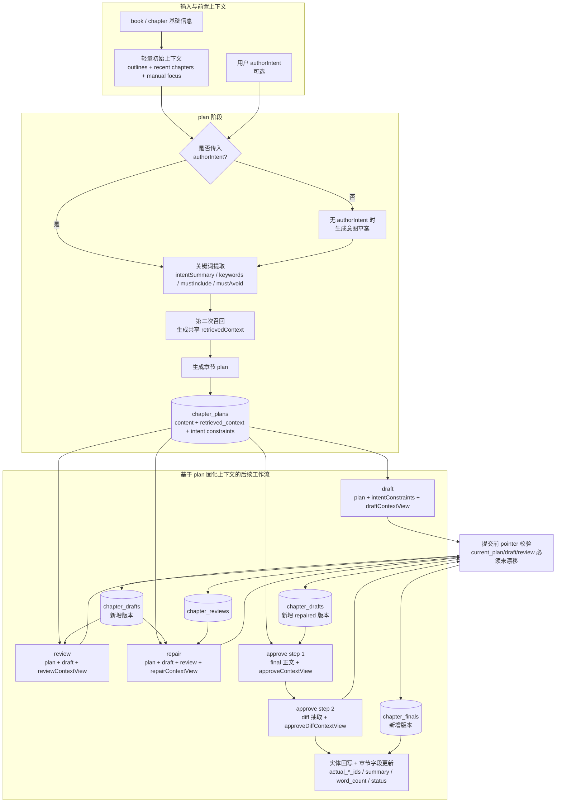
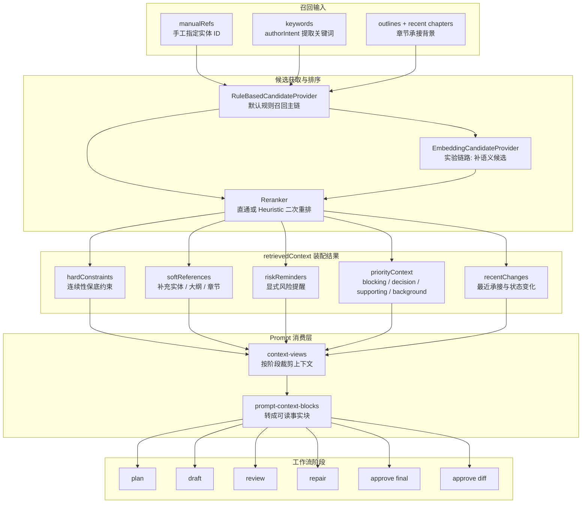
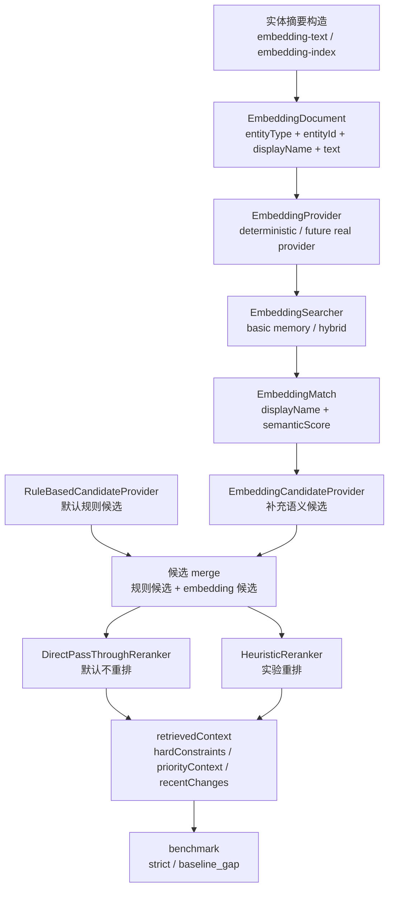
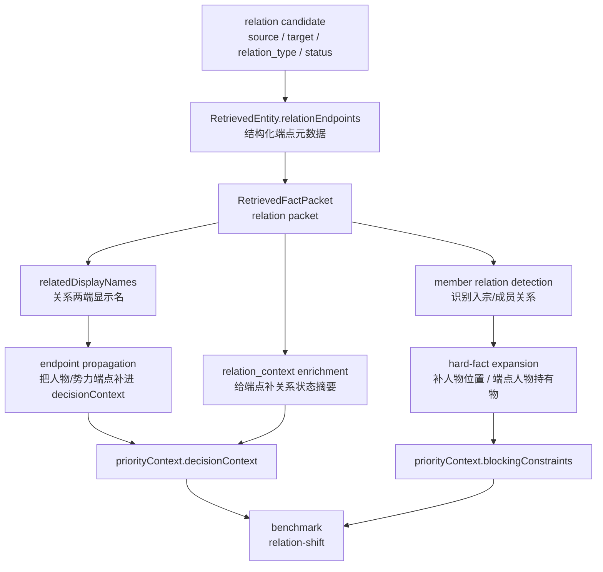

# Prompt 与工作流关系说明

## 目录

- [1. 文档目标](#1-文档目标)
- [2. 总体流程](#2-总体流程)
- [3. Prompt 的统一构建规则](#3-prompt-的统一构建规则)
- [4. Provider 层对 Prompt 的附加规则](#4-provider-层对-prompt-的附加规则)
- [5. Plan 阶段的 Prompt 链路](#5-plan-阶段的-prompt-链路)
- [6. Draft / Review / Repair / Approve 的 Prompt 链路](#6-draft--review--repair--approve-的-prompt-链路)
- [7. `retrievedContext` 在工作流中的角色](#7-retrievedcontext-在工作流中的角色)
- [8. 一句话理解当前链路](#8-一句话理解当前链路)
- [相关阅读](#相关阅读)

## 1. 文档目标

本文只回答一个问题：当前系统里，`plan / draft / review / repair / approve` 这些阶段的 prompt 是如何在工作流里串起来的。

如果你想看的是：

- 召回按什么规则命中
- 各类实体如何打分
- 为什么某个人物/物品会被召回
- 环境变量如何控制召回上限

请直接看：[`docs/retrieval-scoring-rules.md`](./retrieval-scoring-rules.md)

## 2. 总体流程

当前核心工作流位于：

- `src/domain/workflows/plan-chapter-workflow.ts`
- `src/domain/workflows/draft-chapter-workflow.ts`
- `src/domain/workflows/review-chapter-workflow.ts`
- `src/domain/workflows/repair-chapter-workflow.ts`
- `src/domain/workflows/approve-chapter-workflow.ts`

Prompt 模板统一定义在：

- `src/domain/planning/prompts.ts`

整体链路如下：

1. `plan`
2. `draft`
3. `review`
4. `repair`
5. `approve`

其中：

- `plan` 最多会调用 3 次 LLM
- `approve` 会调用 2 次 LLM
- 其余阶段通常各 1 次

这张图现在刻意把“主线顺序”和“共享上下文复用”分开画，读起来会更接近真实实现。

可以这样读：

- 左侧只保留 `plan` 真正需要先准备的输入
- 中间强调 `plan` 里“意图提取 -> 第二次召回 -> 固化上下文 -> 生成 plan”的主线
- 右侧强调后续阶段并不是重新查库，而是基于 `chapter_plans` 中固化的上下文继续推进
- `approve` 被拆成 `final 正文` 和 `diff 抽取` 两步，更贴近真实代码
- `pointer 校验` 被单独画出来，便于理解为什么工作流在并发场景下会主动失败

另外，当前 workflow 还有一个很重要但容易被忽略的工程约束：

- `draft / review / repair / approve` 在模型生成完成后、事务提交前，都会重新校验章节的 `current_*` pointer
- 如果这段时间内 `current_plan_id / current_draft_id / current_review_id` 被别的操作切换，当前提交会直接失败
- 这样做是为了避免把新版本提交到已经过期的上下文之上

## 3. Prompt 的统一构建规则

所有 prompt 都遵循相同的基础模式：

- 使用 `system` message 设定模型角色和硬约束
- 使用 `user` message 提供结构化业务上下文
- 多段正文通过 `buildStructuredPrompt()` 拼接
- 每段通过 `section(title, content)` 组织为 `标题：\n内容`
- 复杂上下文仍可通过 `jsonSection()` 序列化后喂给模型
- 但当前默认优先先构造成“可读事实块”再进入 prompt

对应实现位于 `src/domain/planning/prompts.ts`：

- `buildStructuredPrompt(sections)`
- `section(title, content)`
- `jsonSection(title, content)`

这意味着当前 prompt 设计不是“自由描述式”，而是“结构化输入式”：

- `system` 负责定义职责与规则
- `user` 负责提供当前章节上下文

当前还新增了一层：

- `src/domain/planning/prompt-context-blocks.ts`

它会优先把 `retrievedContext` 转成更可读的事实块，而不是直接把整包 JSON 塞给模型。

## 4. Provider 层对 Prompt 的附加规则

除业务 prompt 本身外，provider 层还会对 JSON 类型请求做二次约束：

- OpenAI provider：追加一条 `system`，要求只返回合法 JSON
- Custom provider：追加一条 `system`，要求只返回合法 JSON
- Anthropic provider：追加一条 `user`，要求只返回合法 JSON

对应文件：

- `src/core/llm/providers/openai.ts`
- `src/core/llm/providers/custom.ts`
- `src/core/llm/providers/anthropic.ts`

也就是说，最终发给模型的内容 = 业务 prompt 模板 + provider 的输出约束。

## 5. Plan 阶段的 Prompt 链路

### 5.1 初始上下文

`plan` 开始时，系统会先准备一份轻量上下文，主要用于后续生成作者意图草案。

这里的关键点不是“怎么打分”，而是：

- 给模型一份写意图所需的上下文
- 让后续 prompt 不从空白开始

### 5.2 作者意图生成 Prompt

当用户没有传 `authorIntent` 时，会调用 `buildIntentGenerationPrompt()`。

输入通常包括：

- 书名
- 当前章节号
- 近期相关大纲
- 最近几章摘要

输出目标：

- 生成一段“本章作者意图草案”

它不直接写正文，也不直接写 plan，而是先把“这章想写什么”凝练出来。

### 5.3 关键词提取 Prompt

无论 `authorIntent` 是用户输入还是模型生成，都会进入 `buildKeywordExtractionPrompt()`。

要求模型返回 JSON：

- `intentSummary`
- `keywords`
- `mustInclude`
- `mustAvoid`

这里的重点是：

- 它的职责是把写作意图进一步结构化
- 它为后续生成 `retrievedContext` 提供输入
- 当前 workflow 不再直接把 `extractedIntent.keywords` 原样送进第二次 retrieval，而是会把 `intentSummary / mustInclude / keywords` 进一步压成 retrieval query payload

### 5.4 章节规划 Prompt

在得到 `retrievedContext` 之后，系统会调用 `buildPlanPrompt()`。

核心输入：

- 书名
- 章节号
- 作者意图
- `retrievedContext`

输出通常会包含：

- 本章目标
- 主线
- 支线
- 出场角色
- 出场势力
- 关键道具
- 钩子推进
- 节奏分段
- 风险提醒

可以把这一阶段理解为：

- `authorIntent` 决定“本章想写什么”
- `retrievedContext` 决定“本章不能写错什么”

当前 `buildPlanPrompt()` 里，模型看到的主要上下文块包括：

- `本章必须遵守的事实`
- `最近承接的变化`
- `本章核心人物/势力/关系`
- `必须推进的钩子`
- `禁止改写与禁止新增`
- `补充背景`

同时，`plan` 和 `repair` 现在仍会带一份精简版 JSON 作为兜底，但已经不是整包 `retrievedContext` 原文，而是 compact 视图：

- `hardConstraints`
- `riskReminders`
- `recentChanges`
- `priorityContext.blockingConstraints`
- repair 额外带少量 `decisionContext`

## 6. Draft / Review / Repair / Approve 的 Prompt 链路

### 6.1 Draft Prompt

`buildDraftPrompt()` 输入：

- `planContent`
- `intentConstraints`
- `retrievedContext`
- 可选 `targetWords`

职责：

- 在既有规划和事实约束内，产出完整章节草稿
- 当前会优先消费 `blockingConstraints`、`decisionContext`、`recentChanges` 与 `riskReminders` 组织出的事实块
- 在真正进入 prompt 之前，workflow 会先通过 `buildDraftContextView()` 把 plan 中固化的 `retrievedContext` 裁成 draft 阶段使用的视图
- `prompt-context-blocks.ts` 现在也已经按阶段显式区分 `plan / draft / review / repair / approve / approveDiff`，不再是一套固定上限打到底

落库时还需要注意两点：

- draft 会新增一条 `chapter_drafts` 版本记录，而不是覆盖旧 draft
- draft 的 `summary` 会优先沿用 `chapters.summary`，否则退回 `currentPlan.author_intent`

### 6.2 Review Prompt

`buildReviewPrompt()` 输入：

- `planContent`
- `draftContent`
- `retrievedContext`

职责：

- 检查草稿是否违背规划与事实边界
- 输出结构化审阅结果，便于落库和后续修稿

当前 review prompt 已偏“缺陷导向”，而不是泛泛评价文风。

同样地，workflow 会先通过 `buildReviewContextView()` 把 `retrievedContext` 裁成 review 阶段的核对视图。

### 6.3 Repair Prompt

`buildRepairPrompt()` 输入：

- `planContent`
- `draftContent`
- `reviewContent`
- `intentConstraints`
- `retrievedContext`

职责：

- 根据 review 修复 draft
- 保持原有规划与事实边界不漂移

workflow 在这一阶段会先通过 `buildRepairContextView()` 提供包含 `supportingOutlines` 的修稿视图。

落库行为上，repair 不是“原地修改当前 draft”，而是：

- 新增一条新的 `chapter_drafts`
- 写入 `based_on_draft_id` 和 `based_on_review_id`
- 把 `source_type` 标记为 `REPAIRED`
- 再把 `chapters.current_draft_id` 切到新版本

### 6.4 Approve Prompt

`approve` 阶段通常分两步：

1. 生成最终正文
2. 从最终正文中抽取结构化事实变更

这意味着 `approve` 不只是“定稿”，还是“把正文变化转成可回写数据库的数据结构”。

这里对应两份不同的上下文视图：

- `buildApproveContextView()`：给最终正文生成使用，保留少量支撑背景
- `buildApproveDiffContextView()`：给 diff 抽取使用，更偏硬约束与事实核对

正式提交时，approve 除了写入 `chapter_finals` 以外，还会：

- 把 diff 中识别到的新实体创建出来，或把已有实体做更新 / append note / status change
- 把新建实体并入章节的 `actualCharacterIds / actualFactionIds / actualItemIds / actualHookIds / actualWorldSettingIds`
- 更新 `chapters.summary`、`chapters.word_count`、`chapters.status`
- 按当前已批准章节数回写 `books.current_chapter_count`

如果启用 `dryRun`，这些数据库写入都会跳过，只保留 final 与 diff 的预览结果。

## 7. `retrievedContext` 在工作流中的角色

`retrievedContext` 是这条链路里最关键的共享上下文之一。

这张图现在也和前面的总流程图统一成了“输入 -> 主链 -> 结构化结果 -> prompt 消费 -> 阶段使用”的读法。

可以这样读：

- 左侧 `Inputs` 是召回真正消费的输入信号
- 中间 `Retrieval` 是候选获取与排序主链
  - 默认从 `RuleBasedCandidateProvider` 开始
  - embedding 只是补候选的实验层
  - reranker 既可以直通，也可以走 `HeuristicReranker`
- `Context` 是最终落入 `retrievedContext` 的多层结构
  - 不是单一实体列表，而是给后续阶段共享的事实边界
  - 现在还会包含一份可选的 `retrievalObservability` 诊断层
- `PromptLayer` 明确拆出了两层
  - `context-views.ts` 负责按阶段裁剪
  - `prompt-context-blocks.ts` 负责转成模型更容易消费的事实块
- 右侧 `Stages` 是各工作流阶段
  - 它们共享同一份上下文基线
  - 只是消费重点不同

它的作用不是“展示召回结果”，而是作为后续所有阶段共同依赖的事实边界：

- `plan` 用它生成章节规划
- `draft` 用它写正文
- `review` 用它核对正文
- `repair` 用它约束修稿
- `approve` 用它保持定稿阶段的连续性

因此，当前链路的核心特征是：

- 工作流各阶段不是各自独立取数
- 当前 `retrievedContext` 已不只是实体列表，而包含：
  - `hardConstraints`
  - `softReferences`
  - `riskReminders`
  - `priorityContext`
  - `recentChanges`

当前 prompt 最优先消费的是：

- `priorityContext.blockingConstraints`
- `priorityContext.decisionContext`
- `recentChanges`
- `riskReminders`

JSON 原文仍保留，但更多是兜底、核对和调试用途。

另外，`retrievalObservability` 不会作为 prompt 主输入参与生成；它的定位是：

- retrieval 调试
- benchmark 回归观察
- 为什么某个事实会进入 hardConstraints / priorityContext 的解释层

从代码结构上看，当前 `retrievedContext` 相关职责已经拆成：

- `retrieval-hard-constraints.ts`
- `retrieval-risk-reminders.ts`
- `retrieval-facts.ts`
- `recent-changes.ts`
- `retrieval-context-builder.ts`

- 多个阶段围绕同一份固化上下文协作
- 这样能减少多次生成时上下文漂移

### 7.0 实验链路图：Embedding 与 Rerank

这张图主要描述默认链路之外的实验层：

- 左侧 `A` 区域是 embedding 预处理与检索准备
  - 先把实体整理成 embedding 摘要
  - 再生成 `EmbeddingDocument`
  - 再交给 provider 与 searcher
- 中间 `B` 区域是 embedding 候选生成
  - `EmbeddingMatch` 会带 `displayName`
  - `EmbeddingCandidateProvider` 只负责补候选，不直接覆盖规则结果
- `C` 区域是候选合并与可选重排
  - 默认是 `DirectPassThroughReranker`
  - 实验模式下可以换成 `HeuristicReranker`
- 右侧 `D` 区域说明实验结果的去向
  - 仍然回到统一的 `retrievedContext`
  - 再由 benchmark 去观察提升还是回退

当前需要特别注意：

- 默认主链路并不依赖 embedding
- embedding 目前主要用于实验和对照验证
- 当前 workflow 在线接入的 embedding 实验链路只覆盖 `character / hook / world_setting`
- `world-rule` 已在规则召回主链路中收口到 strict，embedding 仍保留为补充实验链路

### 7.0b 实验链路图：Relation Propagation 与 Hard-Fact Expansion

这张图描述的是 relation 命中后的二次整理层，而不是基础打分层。

可以这样理解：

- `A` 区域是 relation 候选本身
  - 当前 relation 在生成时就会带 `relationEndpoints`
  - 不再完全依赖 `content` 文本反向解析
- `B` 区域是关系传播
  - 命中关系后，会把关系两端的人物/势力补进 `decisionContext`
  - 同时给端点 packet 补 `relation_context`
- `C` 区域是更窄的 hard-fact 扩展
  - 当前只对 `member` 这类关系做
  - 会补人物位置、端点人物持有物等更像硬约束的事实
- `D` 区域说明这些结果最终会如何影响 benchmark
  - `relation-shift` 现在可以稳定验证 relation propagation 是否把 blocking facts 补齐

当前这条链路已经解决的问题：

- relation 命中后不再只留下“关系实体自己”
- 端点人物/势力可以进入 `decisionContext`
- 端点 packet 会带关系状态摘要

当前这条链路最新已解决的问题：

- relation query 现在可以稳定把 `林夜 / 黑铁令 / 宗门制度` 这类关联 hard facts 带进 `blockingConstraints`
- `relation-shift` 已从 `baseline_gap` 收口到 `strict`

### 7.1 `hardConstraints`

`hardConstraints` 是最接近“本章不能写错什么”的一层。

当前典型会进入这一层的内容包括：

- 章节邻近的关键钩子
- 带 `current_location` / `status` 的人物
- 带 `owner_type / owner_id / status` 的物品
- 高分或手工指定的关系
- 活跃的世界规则与制度边界

它的用途是：

- 给 `plan` 提供明确约束
- 给 `draft` 提供连续性保底
- 给 `review` 和 `approve` 提供核对基准

### 7.2 `softReferences`

`softReferences` 是补充上下文层。

它通常包含：

- 相关大纲
- 最近章节摘要
- 没进入 `hardConstraints` 的实体候选

它的用途不是强制模型逐条遵守，而是：

- 提供补充背景
- 避免正文只剩硬约束、缺少剧情语境

### 7.3 `riskReminders`

`riskReminders` 不是实体，也不是打分结果，而是面向模型的显式提醒。

当前常见提醒包括：

- 钩子接近回收节点
- 最近章节状态需要承接
- 人物位置连续性
- 关键物品持有者连续性
- 不要违反已激活规则/制度边界

它的作用是把“容易写错但不一定能从实体列表里一眼看出的问题”直接说给模型听。

### 7.4 `priorityContext`

`priorityContext` 是 V3 新增的中间层，目的是把召回结果再按 prompt 预算和重要性分组。

当前包含四层：

- `blockingConstraints`
  - 最重要，优先进入 prompt
- `decisionContext`
  - 对本章决策和推进有直接帮助
- `supportingContext`
  - 有帮助，但不是必须
- `backgroundNoise`
  - 命中了，但默认不进入 prompt 主体

这里要特别区分：

- `hardConstraints`
  - 更偏业务连续性语义
- `blockingConstraints`
  - 更偏 prompt 展示优先级

两者相关，但不是同一个概念。

### 7.5 `recentChanges`

`recentChanges` 负责把“最近刚发生的事”单独抽出来，避免被静态设定淹没。

当前来源包括：

- 最近章节摘要
- 高风险提醒
- 带状态变化信号的实体

它的作用是减少这类错误：

- 历史设定记住了，但最新状态没承接
- 人物位置、关系、物品归属刚变过，却在正文里被忽略

### 7.6 Prompt 怎么消费 `retrievedContext`

当前 prompt 不是直接“整包读取 `retrievedContext`”，而是先走：

- `prompt-context-blocks.ts`
- `context-views.ts`

把它转成这些可读区块：

- `本章必须遵守的事实`
- `最近承接的变化`
- `本章核心人物/势力/关系`
- `必须推进的钩子`
- `禁止改写与禁止新增`
- `补充背景`

这样做的目的有两个：

- 把最重要的信息顶到最前面
- 减少模型自己从 JSON 里提炼重点的负担

对应到 workflow，当前阶段化视图大致是：

- `draft`：`buildDraftContextView()`，保留 `supportingOutlines`
- `review`：`buildReviewContextView()`，更偏核对基准
- `repair`：`buildRepairContextView()`，保留修稿所需支撑背景
- `approve`：`buildApproveContextView()` / `buildApproveDiffContextView()`，分别服务正文定稿与结构化 diff

### 7.7 默认链路和实验链路的关系

当前需要明确区分两件事：

- 默认稳定链路
  - 规则召回
  - 规则打分排序
  - 直通 reranker
- 实验链路
  - `HeuristicReranker`
  - `EmbeddingCandidateProvider`
  - `basic / hybrid` embedding search mode

所以：

- `retrievedContext` 的主结构已经稳定存在
- 但里面的候选来源和排序细节，仍然可以在实验模式下变化

关于 `retrievedContext` 是如何命中的、如何打分排序、各类实体字段如何参与匹配，请看：[`docs/retrieval-scoring-rules.md`](./retrieval-scoring-rules.md)

## 8. 一句话理解当前链路

如果只用一句话概括当前机制，可以写成：

系统先把章节意图与事实边界准备好，再让 `draft / review / repair / approve` 围绕同一份上下文协作完成整章写作与回写闭环。

## 相关阅读

- [`README.md`](../README.md)
- [`docs/cli-usage-guide.md`](./cli-usage-guide.md)
- [`docs/retrieval-scoring-rules.md`](./retrieval-scoring-rules.md)

## 阅读导航

- 上一篇：[`docs/retrieval-pipeline-guide.md`](./retrieval-pipeline-guide.md)
- 下一篇：[`docs/retrieval-scoring-rules.md`](./retrieval-scoring-rules.md)
