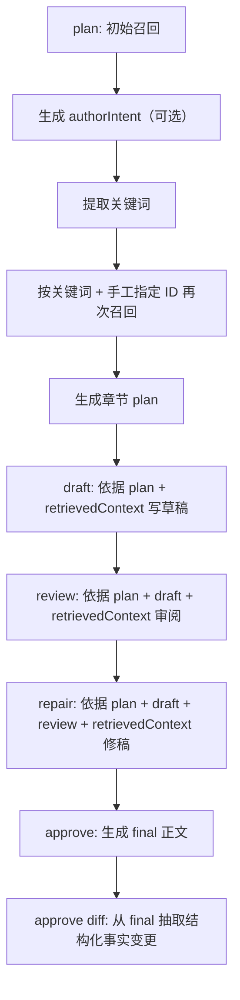

# Prompt 与召回关系说明

本文说明当前 AI 小说工具中，`plan / draft / review / repair / approve` 相关 AI 请求的 prompt 是如何构建的、召回内容包含什么、召回是按什么规则命中的，以及这些信息是如何在工作流中串联起来的。

## 1. 总体流程

当前核心工作流位于以下文件：

- `src/domain/workflows/plan-chapter-workflow.ts`
- `src/domain/workflows/draft-chapter-workflow.ts`
- `src/domain/workflows/review-chapter-workflow.ts`
- `src/domain/workflows/repair-chapter-workflow.ts`
- `src/domain/workflows/approve-chapter-workflow.ts`

Prompt 模板统一定义在：

- `src/domain/planning/prompts.ts`

召回逻辑统一定义在：

- `src/domain/planning/retrieval-service.ts`

整体链路如下：

1. `plan`
2. `draft`
3. `review`
4. `repair`
5. `approve`

其中 `plan` 最多会调用 3 次 LLM，`approve` 会调用 2 次 LLM，其余阶段各 1 次。

## 2. Prompt 的统一构建规则

所有 prompt 都遵循相同的基础模式：

- 使用 `system` message 设定模型角色和硬约束。
- 使用 `user` message 提供结构化业务上下文。
- 多段正文通过 `buildStructuredPrompt()` 拼接。
- 每段通过 `section(title, content)` 组织为 `标题：\n内容`。
- 复杂上下文通过 `jsonSection()` 直接序列化成 JSON 字符串后喂给模型。

对应实现位于 `src/domain/planning/prompts.ts`：

- `buildStructuredPrompt(sections)`
- `section(title, content)`
- `jsonSection(title, content)`

这意味着当前 prompt 设计不是“自由描述式”，而是“结构化输入式”：

- `system` 负责定义职责与规则
- `user` 负责塞入当前章的事实上下文

## 3. Provider 层对 Prompt 的附加规则

除模板本身外，provider 层还会对 JSON 类型请求做二次加工：

- OpenAI provider：追加一条 `system`，要求只返回合法 JSON
- Custom provider：追加一条 `system`，要求只返回合法 JSON
- Anthropic provider：追加一条 `user`，要求只返回合法 JSON

对应文件：

- `src/core/llm/providers/openai.ts`
- `src/core/llm/providers/custom.ts`
- `src/core/llm/providers/anthropic.ts`

也就是说，最终发给模型的内容 = 业务 prompt 模板 + provider 的 JSON 输出约束。

## 4. Plan 阶段的 Prompt 关系

### 4.1 第一次召回：为作者意图生成提供上下文

`plan` 工作流开始时，先进行一次轻量召回：

- `keywords = []`
- `manualRefs = 用户显式传入的人物 / 势力 / 物品 / 钩子 / 关系 / 世界设定 ID`

此时会拿到：

- 书籍信息
- 相关大纲
- 最近章节摘要
- 基于手工 ID 命中的实体

这一步的主要目的不是直接写 plan，而是给“作者意图生成”提供上下文。

### 4.2 作者意图生成 Prompt

当用户没有传 `authorIntent` 时，才会调用 `buildIntentGenerationPrompt()`。

输入内容：

- 书名
- 当前章节号
- 近期相关大纲
- 最近几章摘要

输出目标：

- 生成一段“本章作者意图草案”

特点：

- 不直接写正文，也不直接写 plan
- 先把“这章想写什么”凝练出来
- 为下一步关键词提取做准备

### 4.3 关键词提取 Prompt

无论 `authorIntent` 是用户输入还是模型生成，都会进入 `buildKeywordExtractionPrompt()`。

要求模型返回 JSON：

- `intentSummary`
- `keywords`
- `mustInclude`
- `mustAvoid`

当前 schema 定义在 `src/domain/planning/input.ts`：

- `keywords` 最多 20 个
- 每个关键词不超过 8 个字

当前实际生效情况：

- `keywords` 会参与后续召回
- `mustInclude` / `mustAvoid` 当前只被提取，尚未真正进入后续召回或写作约束逻辑

### 4.4 第二次召回：为 plan 生成准备强相关上下文

在拿到关键词之后，会再次执行 `retrievePlanContext()`。

这一次输入是：

- `keywords = 关键词提取结果`
- `manualRefs = 用户显式指定 ID`

这一步产出的 `retrievedContext` 会被完整写入：

- `chapter_plans.retrieved_context`

同时也会直接进入 `buildPlanPrompt()`，作为后续 `draft / review / repair / approve` 的基础事实库。

### 4.5 章节规划 Prompt

`buildPlanPrompt()` 的核心输入：

- 书名
- 章节号
- 作者意图
- `retrievedContext`

Prompt 强调：

- 召回出来的人物、势力、关系、物品、钩子、世界规则默认都应视为有效约束
- 规划要优先保证连续性、设定一致性、人物动机成立和钩子推进清晰

输出要求至少包含：

- 本章目标
- 主线
- 支线
- 出场角色
- 出场势力
- 关键道具
- 钩子推进
- 节奏分段
- 风险提醒

这里可以理解为：

- `authorIntent` 决定“本章想干什么”
- `retrievedContext` 决定“本章不能写错什么”

## 5. Draft / Review / Repair / Approve 的 Prompt 关系

### 5.1 Draft Prompt

`buildDraftPrompt()` 输入：

- `planContent`
- `retrievedContext`
- 可选 `targetWords`

Prompt 约束重点：

- 召回上下文中的人物状态、关系、势力、物品、钩子、世界规则都视为硬约束
- 如果 `plan` 与召回上下文有冲突，优先设定一致与前后连续
- 输出只允许是完整章节正文

这是当前“创作正文”的主提示词。

### 5.2 Review Prompt

`buildReviewPrompt()` 输入：

- `planContent`
- `draftContent`
- `retrievedContext`

Prompt 约束重点：

- 召回上下文被视为核对基准
- 重点检查设定一致性、人物行为、节奏、逻辑链路、关系演变、钩子推进
- 输出为 JSON，便于落库

结构化输出字段：

- `summary`
- `issues`
- `risks`
- `continuity_checks`
- `repair_suggestions`

### 5.3 Repair Prompt

`buildRepairPrompt()` 输入：

- `planContent`
- `draftContent`
- `reviewContent`
- `retrievedContext`

修稿阶段的重要规则是：

- 优先修复 review 提出的关键问题
- 不得偏离原始 `plan`
- 不得违反 `retrievedContext` 中的事实约束
- 尽量保留已有草稿的节奏、气氛和可用内容

这一步非常关键，因为 `repair` 不是重新自由创作，而是在固定边界内修复草稿。

### 5.4 Approve Prompt

`buildApprovePrompt()` 输入：

- `planContent`
- `draftContent`
- `reviewContent`
- `retrievedContext`

其目标不是简单地“确认草稿”，而是生成一版真正可保存的最终稿。

Prompt 约束重点：

- 必须修复 review 中的问题
- 不能丢失 `plan` 中的主线、支线、人物关系和钩子推进
- 不能违背召回出的设定和事实
- 尽量继承当前草稿中写得好的段落和气氛

### 5.5 Approve Diff Prompt

`approve` 完成后，还会调用一次 `buildApproveDiffPrompt()`。

输入：

- `finalContent`
- `planContent`
- `reviewContent`
- `retrievedContext`

输出为结构化 JSON，用于更新数据库中的事实层。

主要字段：

- `chapterSummary`
- `actualCharacterIds`
- `actualFactionIds`
- `actualItemIds`
- `actualHookIds`
- `actualWorldSettingIds`
- `newCharacters`
- `newFactions`
- `newItems`
- `newHooks`
- `newWorldSettings`
- `newRelations`
- `updates`

可以把它理解为：

- 第一轮 `approve` 负责写最终稿
- 第二轮 `approve diff` 负责从最终稿中回收“本章到底改了哪些事实”

## 6. 召回内容包含什么

当前 `retrievePlanContext()` 统一返回以下结构：

- `book`
- `outlines`
- `recentChapters`
- `hooks`
- `characters`
- `factions`
- `items`
- `relations`
- `worldSettings`
- `riskReminders`

### 6.1 书籍信息

包含：

- `id`
- `title`
- `summary`
- `targetChapterCount`
- `currentChapterCount`

### 6.2 大纲

每条大纲返回：

- `id`
- `title`
- `reason`
- `content`

`content` 通常压缩为多行文本，可能包含：

- `title`
- `story_core`
- `main_plot`
- `sub_plot`
- `foreshadowing`
- `expected_payoff`

### 6.3 最近章节

每条最近章节包含：

- `id`
- `chapterNo`
- `title`
- `summary`
- `status`

章节摘要的取值顺序为：

1. `chapters.summary`
2. 当前 `final` 的 `summary`
3. 当前 `draft` 的 `summary`
4. 当前 `plan` 的 `author_intent`

只有存在可读摘要的章节才会进入最近章节召回结果。

### 6.4 人物

人物的召回内容会压缩为多行文本，可能包含：

- `name`
- `alias`
- `gender`
- `age`
- `personality`
- `background`
- `current_location`
- `professions`
- `levels`
- `currencies`
- `abilities`
- `status`
- `goal`
- `append_notes`

### 6.5 势力

势力的召回内容可能包含：

- `name`
- `category`
- `core_goal`
- `description`
- `leader_character_id`
- `headquarter`
- `status`
- `append_notes`

### 6.6 物品

物品的召回内容可能包含：

- `name`
- `category`
- `description`
- `owner_type`
- `owner_id`
- `rarity`
- `status`
- `append_notes`

### 6.7 钩子

钩子的召回内容可能包含：

- `title`
- `hook_type`
- `status`
- `source_chapter_no`
- `target_chapter_no`
- `description`
- `append_notes`

### 6.8 关系

关系的召回内容已经不是单纯的 ID，而是可读文本，格式类似：

- `source=林夜 (character:12)`
- `target=青岳宗 (faction:7)`
- `relation_type=member`
- `status=active`
- `description=...`
- `append_notes=...`

也就是说，关系召回会先尝试把两端实体 ID 解析为名字，便于模型理解。

### 6.9 世界设定

世界设定的召回内容可能包含：

- `title`
- `category`
- `content`
- `append_notes`

### 6.10 风险提醒

风险提醒是系统根据召回结果自动生成的高层提醒，不是直接从数据库读取。

当前规则包括：

- 如果命中了接近回收章节的钩子，提醒不要遗漏推进
- 如果有最近章节，提醒承接最近章节的状态延续和人物位置变化
- 如果命中了世界设定，提醒不要违反世界规则、职业体系和货币体系

## 7. 召回规则与排序规则

当前召回不是向量检索，而是基于关键词匹配 + 人工指定 ID + 少量业务加权。

### 7.1 通用评分公式

大部分实体的基础打分逻辑为：

- 如果实体 ID 在手工指定 ID 列表中：`+100`
- 每命中一个关键词：`+25`

文本匹配范围由各实体自己的 `textSources` 决定。

最终只有 `score > 0` 的实体才会被保留。

排序规则：

1. 分数降序
2. 分数相同则按 `id` 升序
3. 再按各类型的上限截断

### 7.2 命中原因字段

每个召回实体还会附带 `reason`，用于说明为什么被召回。

当前原因标签包括：

- `manual_id`
- `keyword_hit`
- `chapter_proximity`
- `manual_entity_link`
- `low_relevance`

其中：

- `manual_id` 表示用户显式指定了该实体 ID
- `keyword_hit` 表示实体文本命中了关键词
- `chapter_proximity` 主要用于钩子，表示与目标章节距离近
- `manual_entity_link` 主要用于关系，表示它与手工指定的人物或势力存在连接

### 7.3 各类实体的检索范围和过滤条件

#### 大纲

命中规则：

- `chapter_start_no <= 当前章节 <= chapter_end_no`
- 或 `chapter_start_no is null`

数量上限：

- `3`

#### 最近章节

过滤规则：

- `chapter_no < 当前章节`
- `status != todo`

数量策略：

- 先按章节号倒序取最多 `15` 条
- 计算可读摘要
- 过滤掉没有摘要的章节
- 最终保留前 `3` 条

#### 人物

过滤规则：

- `status in [alive, missing, unknown]`

数量上限：

- `12`

匹配字段：

- `name`
- `alias`
- `background`
- `current_location`
- `personality`
- `professions`
- `levels`
- `currencies`
- `abilities`
- `goal`
- `append_notes`
- `keywords`

#### 势力

数量上限：

- `8`

匹配字段：

- `name`
- `category`
- `core_goal`
- `append_notes`
- `keywords`

#### 物品

数量上限：

- `8`

匹配字段：

- `name`
- `description`
- `append_notes`
- `keywords`

#### 钩子

过滤规则：

- `status in [open, progressing]`

数量上限：

- `10`

匹配字段：

- `title`
- `description`
- `append_notes`
- `keywords`

额外加权：

- `target_chapter_no == 当前章节`：`+40`
- 与当前章节相差 `1`：`+25`
- 与当前章节相差 `2`：`+10`

#### 关系

数量上限：

- `10`

匹配字段：

- 关系起点名字
- 关系终点名字
- `relation_type`
- `description`
- `append_notes`
- `keywords`

额外加权：

- 如果关系两端任一实体命中手工指定的人物或势力 ID，则 `+35`

#### 世界设定

过滤规则：

- `status = active`

数量上限：

- `8`

匹配字段：

- `title`
- `category`
- `content`
- `append_notes`
- `keywords`

## 8. Prompt 与召回之间的关系

当前系统的核心设计不是“把数据库原样塞给模型”，而是先经过业务筛选，再把结果压缩成模型易读的结构化文本或 JSON。

关系可以概括为：

- `authorIntent` 负责表达本章目标
- `keywords` 负责驱动召回
- `manualRefs` 负责显式指定强关联实体
- `retrievedContext` 负责提供事实边界
- `plan` 负责输出章节规划
- `draft / repair / approve` 负责在规划和事实边界内生成正文
- `review` 负责用同一套事实边界反向校验正文
- `approve diff` 负责从最终正文中提取事实变更并回写数据库

这套设计的核心价值在于：

- AI 不是“脱离数据库自由生成”
- AI 的写作与审阅围绕同一套召回事实库展开
- 最终稿又能反向更新数据库，形成闭环

## 9. 当前实现中的已知特点

### 9.1 优点

- Prompt 模板集中，维护成本低
- 写作、审阅、修稿、定稿都共享同一份 `retrievedContext`
- 关系召回已经做了实体名解析，不再只暴露裸 ID
- 最近章节召回已经规避 `todo` 占位章节
- 人物召回已覆盖背景、地点、职业、等级、货币、能力等关键字段

### 9.2 当前尚未完全利用的信息

关键词提取时返回的：

- `mustInclude`
- `mustAvoid`

目前还没有进入后续召回排序或 prompt 约束主逻辑，后续可以继续增强。

### 9.3 当前召回的边界

当前召回仍然属于“规则式召回”而非“语义向量召回”：

- 优点是稳定、可解释、可控
- 缺点是对同义表达、隐喻表达、跨字段弱相关场景的召回能力有限

## 10. 后续可优化方向

建议后续按以下方向迭代：

1. 将 `mustInclude` / `mustAvoid` 真正接入 `plan / draft / approve` prompt。
2. 对 `retrievedContext` 做分层压缩，避免高章节数后 token 膨胀。
3. 对 `approve diff` 增加更强的“仅依据 final 明示信息抽取”的约束，减少脑补。
4. 在规则召回之外，后续可考虑补充 embedding 或 rerank 方案，提高弱相关内容的召回能力。
5. 将 review 的部分规则固化为程序校验，减少完全依赖模型判断。

