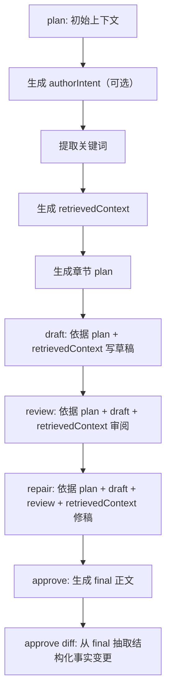

# Prompt 与工作流关系说明

## 目录

- [1. 文档目标](#1-文档目标)
- [2. 总体流程](#2-总体流程)
- [3. Prompt 的统一构建规则](#3-prompt-的统一构建规则)
- [4. Provider 层对 Prompt 的附加规则](#4-provider-层对-prompt-的附加规则)
- [5. Plan 阶段的 Prompt 链路](#5-plan-阶段的-prompt-链路)
- [6. Draft / Review / Repair / Approve 的 Prompt 链路](#6-draft--review--repair--approve-的-prompt-链路)
- [7. `retrievedContext` 在工作流中的角色](#7-retrievedcontext-在工作流中的角色)
- [8. 一句话理解当前链路](#8-一句话理解当前链路)
- [相关阅读](#相关阅读)

## 1. 文档目标

本文只回答一个问题：当前系统里，`plan / draft / review / repair / approve` 这些阶段的 prompt 是如何在工作流里串起来的。

如果你想看的是：

- 召回按什么规则命中
- 各类实体如何打分
- 为什么某个人物/物品会被召回
- 环境变量如何控制召回上限

请直接看：[`docs/retrieval-scoring-rules.md`](./retrieval-scoring-rules.md)

## 2. 总体流程

当前核心工作流位于：

- `src/domain/workflows/plan-chapter-workflow.ts`
- `src/domain/workflows/draft-chapter-workflow.ts`
- `src/domain/workflows/review-chapter-workflow.ts`
- `src/domain/workflows/repair-chapter-workflow.ts`
- `src/domain/workflows/approve-chapter-workflow.ts`

Prompt 模板统一定义在：

- `src/domain/planning/prompts.ts`

整体链路如下：

1. `plan`
2. `draft`
3. `review`
4. `repair`
5. `approve`

其中：

- `plan` 最多会调用 3 次 LLM
- `approve` 会调用 2 次 LLM
- 其余阶段通常各 1 次

## 3. Prompt 的统一构建规则

所有 prompt 都遵循相同的基础模式：

- 使用 `system` message 设定模型角色和硬约束
- 使用 `user` message 提供结构化业务上下文
- 多段正文通过 `buildStructuredPrompt()` 拼接
- 每段通过 `section(title, content)` 组织为 `标题：\n内容`
- 复杂上下文通过 `jsonSection()` 序列化后喂给模型

对应实现位于 `src/domain/planning/prompts.ts`：

- `buildStructuredPrompt(sections)`
- `section(title, content)`
- `jsonSection(title, content)`

这意味着当前 prompt 设计不是“自由描述式”，而是“结构化输入式”：

- `system` 负责定义职责与规则
- `user` 负责提供当前章节上下文

## 4. Provider 层对 Prompt 的附加规则

除业务 prompt 本身外，provider 层还会对 JSON 类型请求做二次约束：

- OpenAI provider：追加一条 `system`，要求只返回合法 JSON
- Custom provider：追加一条 `system`，要求只返回合法 JSON
- Anthropic provider：追加一条 `user`，要求只返回合法 JSON

对应文件：

- `src/core/llm/providers/openai.ts`
- `src/core/llm/providers/custom.ts`
- `src/core/llm/providers/anthropic.ts`

也就是说，最终发给模型的内容 = 业务 prompt 模板 + provider 的输出约束。

## 5. Plan 阶段的 Prompt 链路

### 5.1 初始上下文

`plan` 开始时，系统会先准备一份轻量上下文，主要用于后续生成作者意图草案。

这里的关键点不是“怎么打分”，而是：

- 给模型一份写意图所需的上下文
- 让后续 prompt 不从空白开始

### 5.2 作者意图生成 Prompt

当用户没有传 `authorIntent` 时，会调用 `buildIntentGenerationPrompt()`。

输入通常包括：

- 书名
- 当前章节号
- 近期相关大纲
- 最近几章摘要

输出目标：

- 生成一段“本章作者意图草案”

它不直接写正文，也不直接写 plan，而是先把“这章想写什么”凝练出来。

### 5.3 关键词提取 Prompt

无论 `authorIntent` 是用户输入还是模型生成，都会进入 `buildKeywordExtractionPrompt()`。

要求模型返回 JSON：

- `intentSummary`
- `keywords`
- `mustInclude`
- `mustAvoid`

这里的重点是：

- 它的职责是把写作意图进一步结构化
- 它为后续生成 `retrievedContext` 提供输入

### 5.4 章节规划 Prompt

在得到 `retrievedContext` 之后，系统会调用 `buildPlanPrompt()`。

核心输入：

- 书名
- 章节号
- 作者意图
- `retrievedContext`

输出通常会包含：

- 本章目标
- 主线
- 支线
- 出场角色
- 出场势力
- 关键道具
- 钩子推进
- 节奏分段
- 风险提醒

可以把这一阶段理解为：

- `authorIntent` 决定“本章想写什么”
- `retrievedContext` 决定“本章不能写错什么”

## 6. Draft / Review / Repair / Approve 的 Prompt 链路

### 6.1 Draft Prompt

`buildDraftPrompt()` 输入：

- `planContent`
- `retrievedContext`
- 可选 `targetWords`

职责：

- 在既有规划和事实约束内，产出完整章节草稿

### 6.2 Review Prompt

`buildReviewPrompt()` 输入：

- `planContent`
- `draftContent`
- `retrievedContext`

职责：

- 检查草稿是否违背规划与事实边界
- 输出结构化审阅结果，便于落库和后续修稿

### 6.3 Repair Prompt

`buildRepairPrompt()` 输入：

- `planContent`
- `draftContent`
- `reviewContent`
- `retrievedContext`

职责：

- 根据 review 修复 draft
- 保持原有规划与事实边界不漂移

### 6.4 Approve Prompt

`approve` 阶段通常分两步：

1. 生成最终正文
2. 从最终正文中抽取结构化事实变更

这意味着 `approve` 不只是“定稿”，还是“把正文变化转成可回写数据库的数据结构”。

## 7. `retrievedContext` 在工作流中的角色

`retrievedContext` 是这条链路里最关键的共享上下文之一。

它的作用不是“展示召回结果”，而是作为后续所有阶段共同依赖的事实边界：

- `plan` 用它生成章节规划
- `draft` 用它写正文
- `review` 用它核对正文
- `repair` 用它约束修稿
- `approve` 用它保持定稿阶段的连续性

因此，当前链路的核心特征是：

- 工作流各阶段不是各自独立取数
- 多个阶段围绕同一份固化上下文协作
- 这样能减少多次生成时上下文漂移

关于 `retrievedContext` 是如何命中的、如何打分排序、各类实体字段如何参与匹配，请看：[`docs/retrieval-scoring-rules.md`](./retrieval-scoring-rules.md)

## 8. 一句话理解当前链路

如果只用一句话概括当前机制，可以写成：

系统先把章节意图与事实边界准备好，再让 `draft / review / repair / approve` 围绕同一份上下文协作完成整章写作与回写闭环。

## 相关阅读

- [`README.md`](../README.md)
- [`docs/cli-usage-guide.md`](./cli-usage-guide.md)
- [`docs/retrieval-scoring-rules.md`](./retrieval-scoring-rules.md)
