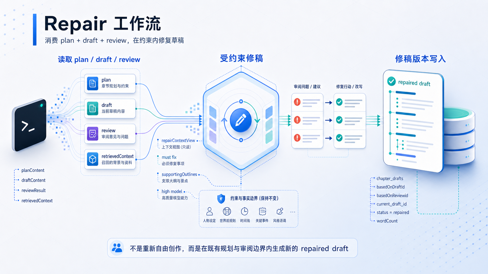
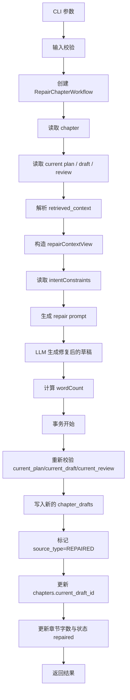
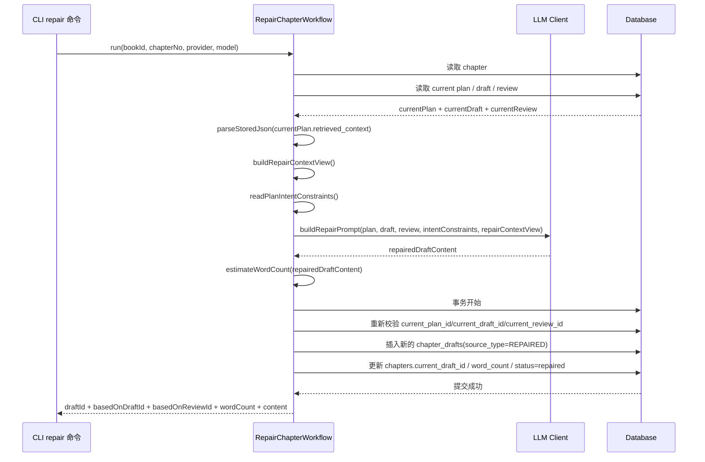

# Repair 工作流详解

本文专门说明 `repair` 命令的项目级实现，包括：

- `repair` 为什么不是重新自由创作
- `repair` 如何消费 `plan + draft + review`
- `repairContextView` 为什么保留 `supportingOutlines`
- 新草稿版本是如何写入的
- 为什么 `repair` 和 `draft` 都写 `chapter_drafts`，但语义不同

如果你想看的是：

- `review` 结果如何产生：看 `docs/review-workflow-guide.md`
- `approve` 如何消费 repair 后的 draft：看 `docs/approve-workflow-guide.md`
- 全工作流关系：看 `docs/prompt-retrieval-relationship.md`

> 图示重点：`repair` 同时消费 `plan + current draft + current review` 与共享 `retrievedContext`，通过 `repairContextView` 在既有规划和事实边界内修复问题，生成新的 repaired draft 版本，写入 `chapter_drafts` 并切换 `chapters.current_draft_id`。

## 目录

- [1. 涉及文件](#1-涉及文件)
- [2. 一句话理解](#2-一句话理解)
- [3. 输入与输出](#3-输入与输出)
- [4. 主流程图](#4-主流程图)
- [5. 时序图](#5-时序图)
- [6. 详细说明](#6-详细说明)
- [7. `repair` 结束后系统留下了什么](#7-repair-结束后系统留下了什么)
- [8. 错误与边界情况](#8-错误与边界情况)
- [9. 当前实现特征](#9-当前实现特征)
- [相关阅读](#相关阅读)

## 1. 涉及文件

- CLI 入口：`src/cli/commands/repair.ts`
- 工作流主类：`src/domain/workflows/repair-chapter-workflow.ts`
- 上下文裁剪：`src/domain/planning/context-views.ts`
- Prompt 构建：`src/domain/planning/prompts.ts`
- 共享辅助：`src/domain/workflows/shared.ts`

## 2. 一句话理解

`repair` 的核心职责是在既有 `plan`、当前 `draft`、当前 `review` 的共同边界内修复当前草稿的问题，并产出一条新的 repaired draft 版本。

## 3. 输入与输出

### 3.1 CLI 输入

`repair` 命令当前支持：

- `--book`
- `--chapter`
- `--provider`
- `--model`
- `--json`

### 3.2 工作流输出

### 3.1.1 当前默认模型档位映射

`repair` 当前只有一次修稿调用，默认走：

- 修复后的正文生成：`high`

优先级规则是：

- 如果显式传了 `--model`，优先使用该模型
- 如果没有显式传 `--model`，工作流会先尝试 `high` 档模型
- `high` 未配置时，再回退到当前 provider 默认模型

这和 `draft` 的定位相近：`repair` 虽然是“受约束修稿”，但本质上仍是正文级生成任务，因此默认使用高档位模型。

`RepairChapterWorkflow.run()` 返回：

- `chapterId`
- `draftId`
- `basedOnDraftId`
- `basedOnReviewId`
- `wordCount`
- `content`

## 4. 主流程图

## 5. 时序图

## 6. 详细说明

### 6.1 `repair` 的前提比 `draft` 更严格

`repair` 运行前要求章节已经有：

- `current_plan_id`
- `current_draft_id`
- `current_review_id`

这说明它不是“有 plan 就能写”，而是必须建立在：

- 已有草稿
- 已有结构化审阅结果

之上。

### 6.2 `repair` 不是重新自由创作

当前 `repair` 的设计定位很明确：

- 根据 review 修复问题
- 尽量少破坏当前 draft 中已有的可用内容
- 保持 `plan`、设定、人物行为和剧情推进的一致性

所以它更像：

- 受约束修稿

而不是：

- 再来一次 draft

### 6.3 `repairContextView` 保留了修稿所需背景

`repair` 使用的是：

- `buildRepairContextView()`

当前它会保留：

- `hardConstraints`
- `priorityContext`
- `recentChanges`
- `recentChapters`
- `riskReminders`
- `supportingOutlines`

和 `review` 相比，它重新带回了 `supportingOutlines`。

原因是：

- `repair` 不只是找问题
- 还要在修复问题的同时保持剧情推进和章节承接

### 6.4 `repair` 同时消费四类输入

`buildRepairPrompt()` 当前会同时拿到：

- `planContent`
- `draftContent`
- `reviewContent`
- `intentConstraints`
- `repairContextView`

这里每一层作用不同：

- `planContent`：告诉模型这章原本该怎么推进
- `draftContent`：告诉模型当前正文已经写成什么样
- `reviewContent`：告诉模型哪里有问题、需要修什么
- `intentConstraints`：告诉模型哪些方向必须继续保留
- `repairContextView`：告诉模型修稿时不能违反哪些事实边界

### 6.5 `repair` 也会重新估算字数

在模型返回修复后的草稿后，工作流会调用：

- `estimateWordCount(repairResult.content)`

这个字数会继续写入：

- 新 draft 版本记录
- `chapters.word_count`

### 6.6 `repair` 仍然写入 `chapter_drafts`，但语义不同于普通 draft

`repair` 不会生成新的数据表类型，而是继续写入：

- `chapter_drafts`

但这次写入有明显不同的语义字段：

- `based_on_draft_id = currentDraft.id`
- `based_on_review_id = currentReview.id`
- `source_type = REPAIRED`

这意味着：

- repaired draft 和普通 draft 共用一套版本表
- 但可以通过版本链和 `source_type` 区分来源

### 6.7 `based_on_plan_id` 会沿用旧 draft 的 plan 基线

当前 `repair` 新版本写入时：

- `based_on_plan_id = currentDraft.based_on_plan_id`

这说明 repair 不会重新切换 plan 基线，而是继续沿用当前 draft 背后的那条 plan 线索。

### 6.8 提交前 pointer 校验同样必需

`repair` 在事务提交前会重新校验：

- `current_plan_id`
- `current_draft_id`
- `current_review_id`

一旦模型生成期间这些指针被其他操作切换，提交会直接失败。

这样做可以避免：

- 用旧 review 修出来的新草稿覆盖到已经推进过的新 draft 上

## 7. `repair` 结束后系统留下了什么

一次成功的 `repair` 结束后，系统会得到：

- 一条新的 repaired draft 版本
- 更新后的 `chapters.current_draft_id`
- 更新后的 `chapters.word_count`
- `chapters.status=repaired`

所以 `repair` 的本质是：

- 生产修稿版本
- 保留版本谱系
- 把章节当前草稿切到最新修订版

## 8. 错误与边界情况

当前 `repair` 在以下情况下会失败：

- 章节不存在
- 当前没有完整的 `plan / draft / review`
- `current_*` pointer 指向非法记录
- LLM 调用失败
- 提交前 pointer 漂移
- 数据库事务失败

## 9. 当前实现特征

- 基于 `plan + draft + review` 的受约束修稿
- 使用修稿视图而不是 review 视图
- 继续写入版本化 `chapter_drafts`
- 通过 `based_on_draft_id / based_on_review_id / source_type` 记录修稿谱系
- 提交前做 pointer 校验，保证并发安全

## 相关阅读

- [`docs/review-workflow-guide.md`](./review-workflow-guide.md)
- [`docs/approve-workflow-guide.md`](./approve-workflow-guide.md)
- [`docs/prompt-retrieval-relationship.md`](./prompt-retrieval-relationship.md)

## 阅读导航

- 上一篇：[`docs/review-workflow-guide.md`](./review-workflow-guide.md)
- 下一篇：[`docs/approve-workflow-guide.md`](./approve-workflow-guide.md)
