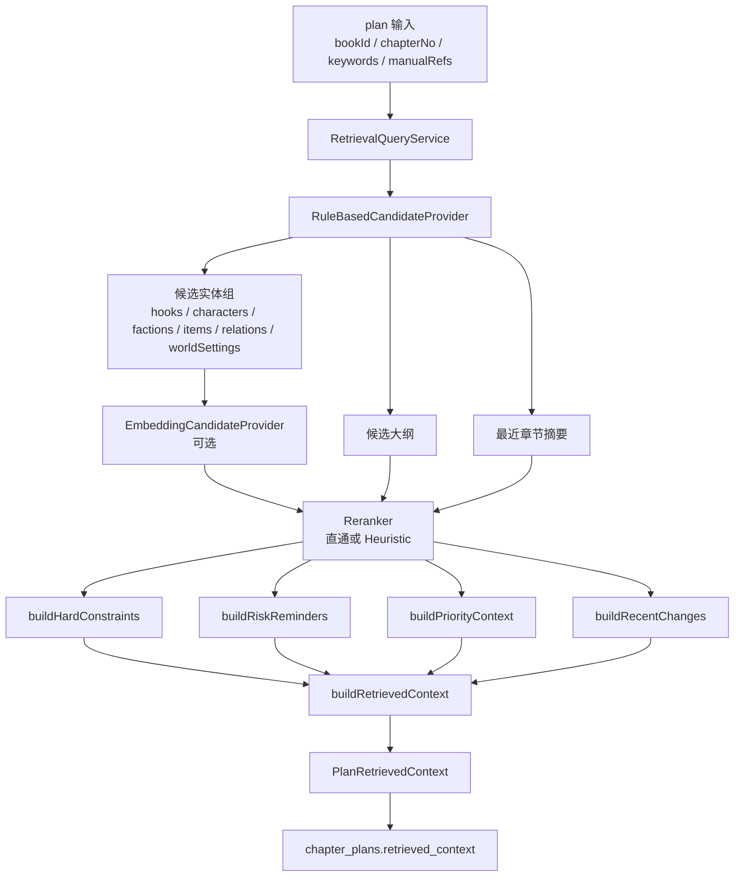
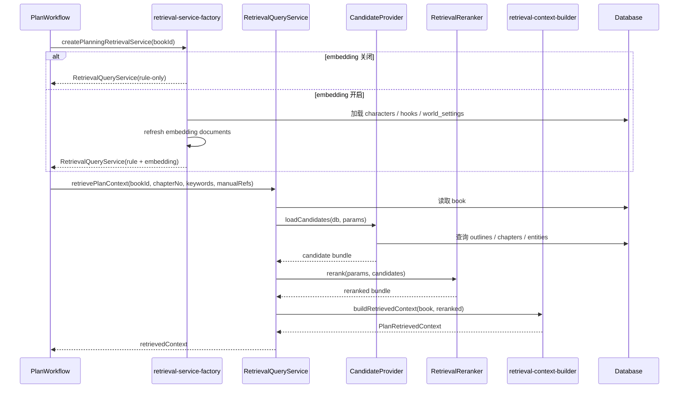
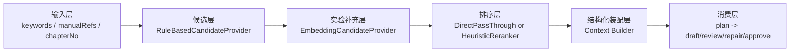

# Retrieval 全链路详解

本文专门说明 `plan` 阶段 retrieval 的完整链路，从输入、候选获取、可选 embedding 补候选、可选 rerank，到最终 `retrievedContext` 装配，全部串起来说明。

重点回答这些问题：

- `plan` 阶段到底是怎么取数的
- 为什么 retrieval 只发生在 `plan`，而不是每个阶段都重新查库
- candidate provider、reranker、context builder 各自负责什么
- `hardConstraints / softReferences / priorityContext / riskReminders / recentChanges` 是怎么来的
- embedding 实验链路是怎么接进主流程的

如果你想看的是：

- 具体打分权重：看 `docs/retrieval-scoring-rules.md`
- prompt 如何消费上下文：看 `docs/prompt-retrieval-relationship.md`
- 章节全流水线：看 `docs/chapter-pipeline-overview.md`

## 目录

- [1. 涉及文件](#1-涉及文件)
- [2. 一句话理解](#2-一句话理解)
- [3. 总流程图](#3-总流程图)
- [4. 时序图](#4-时序图)
- [5. 链路分层图](#5-链路分层图)
- [6. 入口层：`RetrievalQueryService`](#6-入口层retrievalqueryservice)
- [7. 输入层：`RetrievePlanContextParams`](#7-输入层retrieveplancontextparams)
- [8. 候选层：`RuleBasedCandidateProvider`](#8-候选层rulebasedcandidateprovider)
- [9. 排序前候选长什么样](#9-排序前候选长什么样)
- [10. 实验补充层：`EmbeddingCandidateProvider`](#10-实验补充层embeddingcandidateprovider)
- [11. rerank 层：直通或 Heuristic](#11-rerank-层直通或-heuristic)
- [12. 装配层：`buildRetrievedContext()`](#12-装配层buildretrievedcontext)
- [13. `hardConstraints` 是怎么来的](#13-hardconstraints-是怎么来的)
- [14. `priorityContext` 是怎么来的](#14-prioritycontext-是怎么来的)
- [15. `riskReminders` 和 `recentChanges` 是怎么来的](#15-riskreminders-和-recentchanges-是怎么来的)
- [16. 工厂层：`createPlanningRetrievalService()`](#16-工厂层createplanningretrievalservice)
- [17. 为什么 retrieval 只发生在 `plan`](#17-为什么-retrieval-只发生在-plan)
- [18. 两次 retrieval 在 `plan` 里的位置](#18-两次-retrieval-在-plan-里的位置)
- [19. 当前实现特征](#19-当前实现特征)
- [20. 推荐阅读顺序](#20-推荐阅读顺序)
- [相关阅读](#相关阅读)

## 1. 涉及文件

- 服务入口：`src/domain/planning/retrieval-service.ts`
- 候选/重排接口：`src/domain/planning/retrieval-pipeline.ts`
- 规则候选提供器：`src/domain/planning/retrieval-candidate-provider-rule.ts`
- reranker 选择：`src/domain/planning/retrieval-reranker-factory.ts`
- heuristic reranker：`src/domain/planning/retrieval-reranker-heuristic.ts`
- 上下文装配：`src/domain/planning/retrieval-context-builder.ts`
- hard constraints：`src/domain/planning/retrieval-hard-constraints.ts`
- priority context：`src/domain/planning/retrieval-facts.ts`
- risk reminders：`src/domain/planning/retrieval-risk-reminders.ts`
- embedding 接线：`src/domain/planning/retrieval-service-factory.ts`
- embedding 候选补充：`src/domain/planning/embedding-candidate-provider.ts`

## 2. 一句话理解

当前 retrieval 主链本质上是：

- 用规则式 provider 先拉候选
- 可选地补入 embedding 候选
- 可选地做 heuristic rerank
- 再把结果收口成一份结构化 `retrievedContext`

而这份 `retrievedContext` 不是临时召回结果，而是会被持久化到 `chapter_plans` 并被后续阶段共享的事实基线。

## 3. 总流程图

## 4. 时序图

## 5. 链路分层图

这张图表达的是职责边界：

- 输入层决定查询信号
- 候选层决定先把哪些数据拉出来
- 实验层负责补候选，不替代主链
- 排序层决定候选顺序
- 装配层决定最终上下文结构
- 消费层只读 `retrievedContext`，不关心 retrieval 细节

## 6. 入口层：`RetrievalQueryService`

`RetrievalQueryService` 是当前 retrieval 的统一服务入口。

它当前做三件事：

- 读取 `books` 基础信息
- 调用 candidate provider 获取候选集
- 调用 reranker 排序后，再交给 context builder 装配成 `PlanRetrievedContext`

它本身不关心：

- 规则候选是怎么查出来的
- embedding 是怎么补进来的
- heuristic rerank 具体怎么算分

这些都交给下游组件完成。

## 7. 输入层：`RetrievePlanContextParams`

当前 retrieval 输入统一抽象成：

- `bookId`
- `chapterNo`
- `keywords`
- `manualRefs`

这四类信号的作用不同：

### 7.1 `bookId`

决定整次 retrieval 的书籍边界。

### 7.2 `chapterNo`

决定：

- 应命中的大纲范围
- 最近章节摘要窗口
- 钩子邻近性判断

### 7.3 `keywords`

决定：

- 文本命中打分
- query boost 触发
- embedding 查询文本

### 7.4 `manualRefs`

决定：

- 手工强指定实体优先级
- 关系和多实体联动场景的显式锚点

## 8. 候选层：`RuleBasedCandidateProvider`

默认候选层是：

- `RuleBasedCandidateProvider`

它当前负责拉三大类候选：

### 8.1 大纲候选

从 `outlines` 里取：

- 当前章节范围覆盖的大纲

### 8.2 最近章节候选

从 `chapters` 里取：

- 当前章节之前、状态不为 `todo` 的近期章节

并且会优先补全摘要来源：

- 先用 `chapters.summary`
- 没有则回退到当前 final / draft / plan 的摘要字段

### 8.3 实体候选

当前会拉这六组实体：

- `characters`
- `factions`
- `items`
- `hooks`
- `relations`
- `worldSettings`

每组实体都在 provider 层完成：

- 扫描表
- 基础打分
- query boost 加权
- reason 生成
- 截断 limit

## 9. 排序前候选长什么样

每个实体候选在 provider 层都会先被转成统一的 `RetrievedEntity`，关键字段包括：

- `id`
- `name/title`
- `reason`
- `content`
- `score`

这里最关键的是两个字段：

### 9.1 `reason`

它不是给机器二次算分用的主字段，而是：

- explainability 字段
- 给后续 heuristic reranker、context builder、prompt 理解“为什么命中”提供信号

### 9.2 `content`

它不是原始行对象，而是被压成了面向 retrieval 的“扁平文本块”，例如：

- `name=...`
- `current_location=...`
- `status=...`
- `append_notes=...`

这让后续层更容易：

- 做统一关键词命中
- 做 continuity 判断
- 做 prompt 展示

## 10. 实验补充层：`EmbeddingCandidateProvider`

如果开启 embedding，当前不会替换规则主链，而是：

- 先跑规则 provider
- 再用 `EmbeddingCandidateProvider` 把语义命中结果补进候选集

当前补候选逻辑的特点是：

- 只做“补充缺失候选”
- 不覆盖规则 provider 已经命中的同 ID 实体
- 新补进来的候选会带 `reason=embedding_match`

这层的定位很明确：

- 实验补充层
- 不是正式默认主链的替代品

## 11. rerank 层：直通或 Heuristic

当前 reranker 通过 `createConfiguredReranker()` 选择：

- `none` -> `DirectPassThroughReranker`
- `heuristic` -> `HeuristicReranker`

### 11.1 `DirectPassThroughReranker`

作用非常简单：

- 直接透传候选顺序

### 11.2 `HeuristicReranker`

会在已有 `score` 基础上再叠加一层启发式排序信号，例如：

- `manual_id`
- `keyword_hit`
- `embedding_match`
- 关键词命中次数
- continuity bonus
- hook 的目标章节邻近性

这层做的不是重新查库，而是：

- 在候选已经拿到之后，做更轻量的二次排序

## 12. 装配层：`buildRetrievedContext()`

候选和 rerank 完成后，真正决定 `retrievedContext` 长什么样的是：

- `buildRetrievedContext()`

它会把 reranked 结果装成：

- `book`
- `outlines`
- `recentChapters`
- 六类实体组
- `hardConstraints`
- `softReferences`
- `priorityContext`
- `recentChanges`
- `riskReminders`

也就是说，retrieval 链路最终目标不是“找一堆相关实体”，而是“生成一份可直接给后续阶段共享的上下文对象”。

## 13. `hardConstraints` 是怎么来的

`buildHardConstraints()` 会从每类实体组里挑出最值得当作硬约束的那部分。

当前规则核心是：

- 手工指定实体优先
- 强关键词命中且带关键状态字段的实体优先
- continuity risk 高的实体优先
- 高分实体优先

不同实体类型有不同保留逻辑，比如：

- 人物更看重 `current_location / goal / background`
- 物品更看重 `owner / status`
- 世界设定更看重规则类活跃内容

## 14. `priorityContext` 是怎么来的

`buildPriorityContext()` 不是简单复制实体列表，而是会：

- 先把 hard/soft 候选转成 fact packets
- 去重
- 做优先级分类
- 再进行 relation context 传播

最终得到四层：

- `blockingConstraints`
- `decisionContext`
- `supportingContext`
- `backgroundNoise`

这层的意义是：

- 不只是告诉模型“有哪些事实”
- 还告诉模型“哪些事实更应该先看”

## 15. `riskReminders` 和 `recentChanges` 是怎么来的

### 15.1 `riskReminders`

`buildRiskReminders()` 会根据：

- 邻近钩子
- 最近章节窗口
- 人物位置
- 关键物品归属/状态
- 世界规则

生成一组自然语言风险提醒。

这层不是召回候选本身，而是：

- 连续性防错提示层

### 15.2 `recentChanges`

`buildRecentChanges()` 会把：

- 最近章节摘要
- 风险提醒
- 高优先实体状态变化

再压成一层更适合 prompt 消费的近期变化视图。

## 16. 工厂层：`createPlanningRetrievalService()`

retrieval 服务不是直接 new 出来的，而是通过工厂创建。

这样做是为了统一处理：

- embedding 是否启用
- 使用哪种 embedding provider
- 使用 basic 还是 hybrid search mode

当前如果开启 embedding，工厂会：

- 从数据库加载 `characters / hooks / world_settings`
- 刷新 embedding 文档
- 读取索引文档
- 构造 searcher
- 把 searcher 注入 `RetrievalQueryService`

当前在线接线的 embedding 实体范围是：

- `character`
- `hook`
- `world_setting`

## 17. 为什么 retrieval 只发生在 `plan`

这是当前架构最关键的设计点之一。

如果每个阶段都重新 retrieval，会出现两个问题：

- 同一章在不同阶段看到的事实边界不一致
- 多次生成后上下文容易漂移

现在的设计是：

- 只有 `plan` 做 retrieval
- 然后把 `retrievedContext` 固化到 `chapter_plans`
- `draft / review / repair / approve` 全部复用这份上下文

这样做的价值是：整条工作流共享同一份事实基线，prompt 行为更稳定，问题也更容易追踪和解释。

## 18. 两次 retrieval 在 `plan` 里的位置

严格说，retrieval 主链会在 `plan` 里调用两次：

### 18.1 第一次

输入：

- `keywords=[]`
- `manualRefs`

用途：

- 为 author intent 生成提供轻量上下文

### 18.2 第二次

输入：

- `keywords=extractedIntent.keywords`
- `manualRefs`

用途：

- 生成真正会被持久化和复用的共享 `retrievedContext`

## 19. 当前实现特征

- 默认稳定主链仍是规则式 retrieval
- embedding 只做实验候选补充
- rerank 是可插拔层，不强绑到主链
- context builder 是 retrieval 和 workflow/prompt 之间的边界层
- `retrievedContext` 的目标是共享上下文，而不是一次性搜索结果

## 20. 推荐阅读顺序

建议按下面顺序阅读：

1. `docs/retrieval-pipeline-guide.md`
2. `docs/retrieval-scoring-rules.md`
3. `docs/prompt-retrieval-relationship.md`
4. `docs/plan-workflow-guide.md`

## 相关阅读

- [`docs/retrieval-scoring-rules.md`](./retrieval-scoring-rules.md)
- [`docs/prompt-retrieval-relationship.md`](./prompt-retrieval-relationship.md)
- [`docs/plan-workflow-guide.md`](./plan-workflow-guide.md)
- [`docs/embedding-rerank-architecture.md`](./embedding-rerank-architecture.md)

## 阅读导航

- 上一篇：[`docs/database-relationship-overview.md`](./database-relationship-overview.md)
- 下一篇：[`docs/prompt-retrieval-relationship.md`](./prompt-retrieval-relationship.md)
