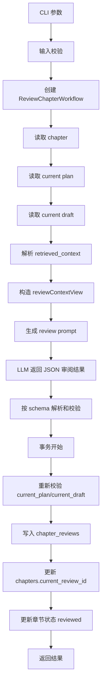
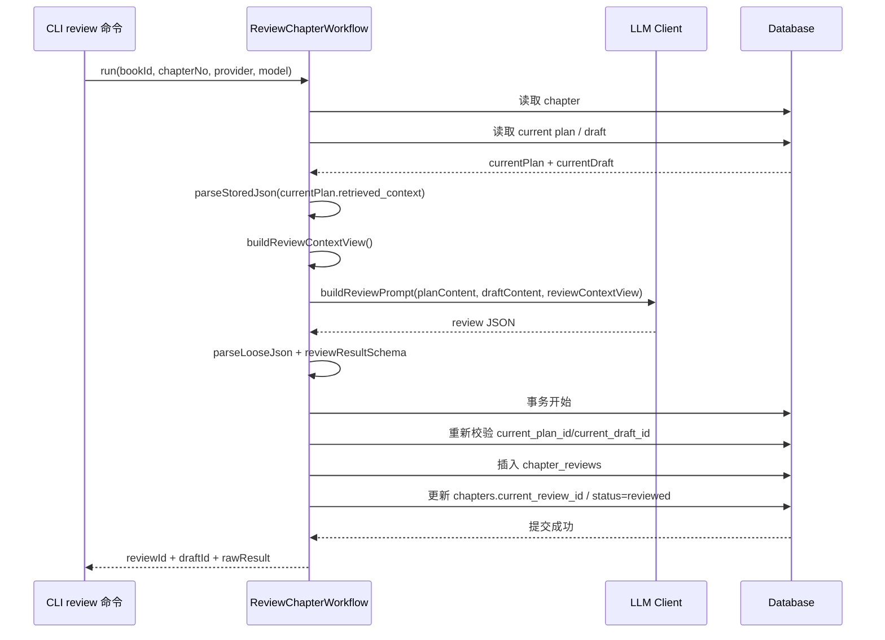

# Review 工作流详解

本文专门说明 `review` 命令的项目级实现，包括：

- `review` 为什么输出结构化 JSON
- `review` 如何把草稿问题转成可落库、可修稿的结果
- `reviewContextView` 和核对基准的关系
- 为什么 `review` 也要做版本化写入和 pointer 校验

如果你想看的是：

- `draft` 如何产生：看 `docs/draft-workflow-guide.md`
- `repair` 如何消费 review 结果：看 `docs/repair-workflow-guide.md`
- 全工作流关系：看 `docs/prompt-retrieval-relationship.md`

## 1. 涉及文件

- CLI 入口：`src/cli/commands/review.ts`
- 工作流主类：`src/domain/workflows/review-chapter-workflow.ts`
- 上下文裁剪：`src/domain/planning/context-views.ts`
- Prompt 构建：`src/domain/planning/prompts.ts`
- 共享辅助：`src/domain/workflows/shared.ts`

## 2. 一句话理解

`review` 的核心职责不是给草稿写一段笼统评价，而是把“这章草稿在哪些地方违背了规划和事实边界”整理成一份稳定、可落库、可供 `repair` 直接消费的结构化审阅结果。

## 3. 输入与输出

### 3.1 CLI 输入

`review` 命令当前支持：

- `--book`
- `--chapter`
- `--provider`
- `--model`
- `--json`

### 3.2 工作流输出

`ReviewChapterWorkflow.run()` 返回：

- `chapterId`
- `reviewId`
- `draftId`
- `rawResult`

其中 `rawResult` 当前固定包含：

- `summary`
- `issues`
- `risks`
- `continuity_checks`
- `repair_suggestions`

## 4. 主流程图

## 5. 时序图

## 6. 详细说明

### 6.1 `review` 必须建立在当前 plan 和 draft 之上

`review` 至少要求章节已经有：

- `current_plan_id`
- `current_draft_id`

也就是说，它审的不是任意文本，而是：

- 这章的当前规划
- 这章的当前草稿

### 6.2 `review` 使用的是核对视图，不是写作视图

`review` 同样会从 `currentPlan.retrieved_context` 恢复上下文，但它用的是：

- `buildReviewContextView()`

这个视图当前保留：

- `hardConstraints`
- `priorityContext`
- `recentChanges`
- `recentChapters`
- `riskReminders`

它不保留 `supportingOutlines`。

这说明 `review` 的目标不是帮模型“写得更丰富”，而是让模型更聚焦地做核对。

### 6.3 `review` 输出 JSON 是为了后续链路稳定

`review` 不是输出自然语言长文，而是强制输出结构化 JSON。

这是因为它的下游不是人类直接阅读为主，而是：

- 要落库到 `chapter_reviews`
- 要被 `repair` 直接消费

如果这里输出不稳定，后续修稿链路就会很脆弱。

### 6.4 `review` 当前关注的是“关键问题”，不是泛泛点评

当前 prompt 的核心要求是：

- 检查设定一致性
- 检查人物行为是否合理
- 检查关系演变和钩子推进
- 优先指出真正会影响后续章节连锁正确性的问题

所以 `review` 更像是：

- 连续性审校
- 结构化缺陷报告

而不是文学评论。

### 6.5 解析阶段会对 JSON 做二次校验

模型返回 JSON 后，工作流会先做：

- `parseLooseJson()`

然后再用：

- `reviewResultSchema`

做结构校验。

只有符合 schema 的结果才会继续落库。

### 6.6 `review` 也是版本化记录

一次成功的 `review` 会新增一条 `chapter_reviews`，不会覆盖旧审阅结果。

关键字段包括：

- `draft_id`
- `summary`
- `issues`
- `risks`
- `continuity_checks`
- `repair_suggestions`
- `raw_result`

这意味着你不仅保存了“审阅结论”，还保留了“当时审的是哪一版 draft”。

### 6.7 `current_review_id` 的切换和 review 版本写入必须一起提交

事务里会同时做两件事：

- 插入 `chapter_reviews`
- 更新 `chapters.current_review_id`

这样可以避免出现：

- 章节指针已经切到新 review
- 但 review 行还没成功落库

### 6.8 提交前 pointer 校验同样必需

`review` 在事务提交前会重新校验：

- `current_plan_id`
- `current_draft_id`

如果模型生成期间，这两个指针被别的操作切换，提交会直接失败。

这样能避免：

- 用旧 draft 生成的新 review 落到新 draft 的章节状态上

## 7. `review` 结束后系统留下了什么

一次成功的 `review` 结束后，系统会得到：

- 一条新的 `chapter_reviews`
- 更新后的 `chapters.current_review_id`
- `chapters.status=reviewed`

从工作流角度看，它产出的是：

- 可追溯的结构化审阅报告
- 供 `repair` 直接消费的修稿输入

## 8. 错误与边界情况

当前 `review` 在以下情况下会失败：

- 章节不存在
- 当前没有 `plan` 或 `draft`
- `current_plan_id / current_draft_id` 指向非法记录
- LLM 返回的 JSON 非法或不符合 schema
- 提交前 pointer 漂移
- 数据库事务失败

## 9. 当前实现特征

- 强制输出稳定 JSON 协议
- 基于核对视图而不是写作视图
- 以版本化 `chapter_reviews` 形式保存
- 提交前做 pointer 校验，保证与当前 draft/plan 一致

## 相关阅读

- [`docs/draft-workflow-guide.md`](./draft-workflow-guide.md)
- [`docs/repair-workflow-guide.md`](./repair-workflow-guide.md)
- [`docs/prompt-retrieval-relationship.md`](./prompt-retrieval-relationship.md)
