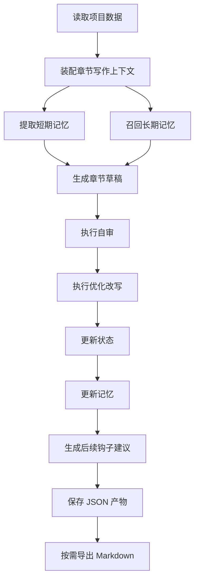

# AI 自动写小说工具 MVP 方案

## 1. 产品定位

- 形态：本地单用户命令行工具
- 技术栈：Node.js + TypeScript
- 存储：本地 JSON 文件
- 模型：第一版只接入一个大模型供应商
- 目标：优先跑通从设定到生成、自审、优化、状态更新、钩子续埋、记忆沉淀的完整闭环

## 2. MVP 功能范围

### 必做能力

1. 小说基础设定管理
   - 全局大纲
   - 分卷设定
   - 分章故事线
   - 核心人物设定
   - 地点设定
   - 势力设定
   - 支持设定单章目标字数
2. 世界状态追踪
   - 主角当前位置
   - 角色持有物品
   - 关键事件进展
3. 钩子管理
   - 已埋钩子
   - 待回收钩子
   - 新钩子建议
4. 自动写作链路
   - 基于当前章节目标生成正文
   - 支持章节重写
   - 写后自审
   - 自动优化改写
5. 记忆机制
   - 短期记忆：最近章节上下文
   - 长期记忆：稳定设定、事实、角色关系、已发生事件
6. 写后更新
   - 更新章节结果
   - 更新状态与物品
   - 更新钩子状态
   - 生成后续伏笔建议
7. Markdown 双向导入导出
   - 支持单个 JSON 数据文件导出为 Markdown
   - 支持单个 Markdown 文件回导为 JSON
   - 支持项目全部数据一键导出为 Markdown
   - 支持项目全部 Markdown 一键导入回 JSON

### 第一版暂不做

- 多用户
- 云端同步
- 图形界面
- 多模型切换
- 自动插画
- 自动发布平台对接
- 多人实时协同编辑

## 3. 核心领域模型

### 3.1 Book

单小说项目根对象，统一承载全书级配置，包括默认单章目标字数。

```ts
/**
 * 书籍根配置。
 * 负责描述整本书的元信息、默认章节字数规则与模型配置。
 */
type Book = {
  /** 书籍唯一标识 */
  id: string
  /** 书名 */
  title: string
  /** 题材类型，例如玄幻、科幻、悬疑 */
  genre: string
  /** 全书写作风格约束 */
  styleGuide: string[]
  /** 默认单章目标字数 */
  defaultChapterWordCount: number
  /** 单章字数允许偏差比例，例如 0.15 表示 ±15% */
  chapterWordCountToleranceRatio: number
  /** 当前接入的大模型配置 */
  model: ModelConfig
  /** 创建时间，ISO 8601 格式 */
  createdAt: string
  /** 最后更新时间，ISO 8601 格式 */
  updatedAt: string
}
```

默认值建议：

1. [`Book.defaultChapterWordCount`](plans/mvp-plan.md:69) 默认值设为 `3000`
2. [`Book.chapterWordCountToleranceRatio`](plans/mvp-plan.md:70) 默认值设为 `0.15`
3. 以上表示默认目标单章字数为 3000，允许偏差区间为 ±15%
4. 对应默认可接受区间为 2550 到 3450 字

### 3.2 Outline

```ts
/**
 * 全书大纲信息。
 * 用于约束小说的主题、世界观、核心冲突与结局方向。
 */
type Outline = {
  /** 故事核心设定或一句话提要 */
  premise: string
  /** 主题表达 */
  theme: string
  /** 世界观说明 */
  worldview: string
  /** 核心冲突列表，允许并行存在多条主冲突 */
  coreConflicts: string[]
  /** 预期结局方向 */
  endingVision: string
}
```

大纲冲突设计建议：

1. 使用 [`Outline.coreConflicts`](plans/mvp-plan.md) 支持同时定义多条核心冲突
2. 冲突可分别对应人物冲突、阵营冲突、世界规则冲突、情感冲突、生存冲突等
3. 章节规划时应标记当前章节主要推进哪一条或哪几条冲突
4. 自审阶段检查章节内容是否真正服务于至少一条核心冲突推进
5. 长期记忆应记录各条冲突的阶段进展，避免主线断裂

### 3.3 Volume 与 Chapter

```ts
/**
 * 分卷信息。
 * 用于组织章节并描述该卷的阶段目标。
 */
type Volume = {
  /** 分卷唯一标识 */
  id: string
  /** 分卷标题 */
  title: string
  /** 该卷的主要目标 */
  goal: string
  /** 该卷摘要 */
  summary: string
  /** 属于本卷的章节 ID 列表 */
  chapterIds: string[]
}

/**
 * 章节信息。
 * 用于描述单章的计划、状态与产物路径。
 */
type Chapter = {
  /** 章节唯一标识 */
  id: string
  /** 所属分卷 ID */
  volumeId: string
  /** 章节序号 */
  index: number
  /** 章节标题 */
  title: string
  /** 本章写作目标 */
  objective: string
  /** 本章计划节拍 */
  plannedBeats: string[]
  /** 当前处理状态 */
  status: 'planned' | 'drafted' | 'reviewed' | 'finalized'
  /** 草稿文件路径 */
  draftPath?: string
  /** 最终稿文件路径 */
  finalPath?: string
}
```

### 3.4 Character

```ts
/**
 * 角色信息。
 * 记录角色身份、动机、关系、当前位置、持有物、势力归属与当前成长体系。
 */
type Character = {
  /** 角色唯一标识 */
  id: string
  /** 角色名 */
  name: string
  /** 角色定位，例如主角、反派、导师 */
  role: string
  /** 角色简介 */
  profile: string
  /** 角色核心动机 */
  motivation: string
  /** 角色秘密或隐藏信息 */
  secrets: string[]
  /** 角色关系集合 */
  relationships: CharacterRelation[]
  /** 当前持有物品 */
  inventory: ItemRef[]
  /** 当前所在地点 ID */
  currentLocationId?: string
  /** 所属势力关系，可同时属于多个势力并记录不同职务 */
  factionMemberships: CharacterFactionMembership[]
  /** 当前成长体系，统一记录职业、等级与能力 */
  progression: CharacterProgression
  /** 角色阶段状态补充 */
  statusNotes: string[]
}
```

```ts
/**
 * 角色势力归属关系。
 * 用于记录角色在不同势力中的身份、职务与状态。
 */
type CharacterFactionMembership = {
  /** 势力 ID */
  factionId: string
  /** 在该势力中的身份或职务，例如长老、卧底、客卿、盟友代表 */
  roleTitle: string
  /** 归属状态，例如正式成员、附属、合作、潜伏、敌对渗透 */
  status: string
  /** 备注信息，例如加入原因、隐瞒关系、权限范围 */
  notes?: string[]
}
```

```ts
/**
 * 角色成长体系。
 * 用于统一表达角色当前职业、等级与能力结构。
 */
type CharacterProgression = {
  /** 当前职业，例如剑修、调查员、外交官 */
  className: string
  /** 当前等级描述，例如练气一层、Lv.12、三级调查员 */
  rank: string
  /** 当前能力列表 */
  abilities: CharacterAbility[]
}

/**
 * 角色能力定义。
 * 用于表达角色当前掌握的能力、效果与限制。
 */
type CharacterAbility = {
  /** 能力唯一标识 */
  id: string
  /** 能力名称 */
  name: string
  /** 能力分类，例如战斗、法术、社交、侦查 */
  category: string
  /** 能力描述 */
  description: string
  /** 当前熟练度、强度或阶位 */
  rank?: string
  /** 使用限制、代价或冷却 */
  constraints?: string[]
}
```

### 3.5 State Tracker

```ts
/**
 * 全局故事状态。
 * 记录当前推进位置、地点状态、物品状态与主线线程。
 */
type StoryState = {
  /** 当前推进到的章节 ID */
  currentChapterId: string
  /** 当前主角 ID */
  protagonistId: string
  /** 地点状态列表 */
  locations: LocationState[]
  /** 物品状态列表 */
  itemStates: ItemState[]
  /** 当前活跃中的故事线 */
  activeThreads: string[]
  /** 已解决的故事线 */
  resolvedThreads: string[]
  /** 最近发生的重要事件 */
  recentEvents: string[]
}
```

```ts
/**
 * 角色持有物引用。
 * 用于记录角色当前拥有的具体物品信息。
 */
type ItemRef = {
  /** 物品唯一标识 */
  id: string
  /** 物品名称，例如灵石、照妖镜 */
  name: string
  /** 数量值，例如 10000、1 */
  quantity: number
  /** 数量单位，例如颗、个、把、枚 */
  unit: string
  /** 物品类型，例如法宝、货币、丹药、材料 */
  type: string
  /** 是否为全世界唯一 */
  isUniqueWorldwide: boolean
  /** 当前状态，例如完好、破损、封印中、已认主 */
  status: string
  /** 扩展描述，例如来历、能力、外观、限制 */
  description?: string
}

/**
 * 全局物品状态。
 * 用于从世界状态角度追踪关键物品的归属、位置与变化。
 */
type ItemState = {
  /** 物品唯一标识 */
  id: string
  /** 物品名称 */
  name: string
  /** 当前数量 */
  quantity: number
  /** 数量单位 */
  unit: string
  /** 物品类型 */
  type: string
  /** 是否为全世界唯一 */
  isUniqueWorldwide: boolean
  /** 当前持有角色 ID，可选 */
  ownerCharacterId?: string
  /** 当前所在地点 ID，可选 */
  locationId?: string
  /** 当前状态 */
  status: string
  /** 扩展描述 */
  description?: string
}
```

### 3.6 Location

```ts
/**
 * 地点设定。
 * 用于描述小说中的关键地点、归属、规则与当前状态。
 */
type Location = {
  /** 地点唯一标识 */
  id: string
  /** 地点名称 */
  name: string
  /** 地点类型，例如宗门、城市、遗迹、酒馆 */
  type: string
  /** 所属区域或上级地点 */
  parentRegion?: string
  /** 当前控制该地点的势力 ID，可选 */
  controllingFactionId?: string
  /** 当前位于该地点的关键角色 ID */
  residentCharacterIds?: string[]
  /** 地点描述 */
  description: string
  /** 地点规则、禁忌或特殊机制 */
  rules: string[]
  /** 当前状态，例如封锁中、繁荣、战乱、废墟 */
  status: string
  /** 与剧情相关的重要标签 */
  tags: string[]
}
```

### 3.7 Faction

```ts
/**
 * 势力设定。
 * 用于描述组织、阵营、国家、宗门等群体信息。
 */
type Faction = {
  /** 势力唯一标识 */
  id: string
  /** 势力名称 */
  name: string
  /** 势力类型，例如宗门、王国、商会、教团 */
  type: string
  /** 势力宗旨或核心目标 */
  objective: string
  /** 势力描述 */
  description: string
  /** 关键成员或核心人物 ID */
  keyCharacterIds: string[]
  /** 势力内的角色职务映射 */
  memberRoles?: FactionMemberRole[]
  /** 主要据点或控制地点 ID */
  locationIds: string[]
  /** 盟友势力 ID */
  allyFactionIds: string[]
  /** 对立势力 ID */
  rivalFactionIds: string[]
  /** 当前势力状态，例如扩张、衰落、潜伏 */
  status: string
}
```

```ts
/**
 * 势力成员职务映射。
 * 用于从势力视角记录成员及其职务。
 */
type FactionMemberRole = {
  /** 角色 ID */
  characterId: string
  /** 角色在该势力中的职务 */
  roleTitle: string
}
```

### 3.8 Hook

```ts
/**
 * 钩子记录。
 * 用于追踪伏笔来源、预期回收方式与当前状态。
 */
type Hook = {
  /** 钩子唯一标识 */
  id: string
  /** 钩子标题 */
  title: string
  /** 钩子首次出现的章节 ID */
  sourceChapterId: string
  /** 钩子描述 */
  description: string
  /** 预期回收方式或效果 */
  payoffExpectation: string
  /** 优先级 */
  priority: 'low' | 'medium' | 'high'
  /** 当前状态 */
  status: 'open' | 'foreshadowed' | 'payoff-planned' | 'resolved'
}
```

### 3.9 Memory

```ts
/**
 * 长期记忆条目。
 * 用于沉淀稳定事实、关系、约束与历史事件。
 */
type MemoryEntry = {
  /** 记忆唯一标识 */
  id: string
  /** 记忆类型 */
  type: 'fact' | 'event' | 'style' | 'relationship' | 'constraint'
  /** 记忆摘要 */
  summary: string
  /** 来源章节 ID，可选 */
  sourceChapterId?: string
  /** 重要度分值 */
  importance: number
  /** 标签列表，用于召回 */
  tags: string[]
  /** 最近一次使用时间 */
  lastUsedAt?: string
}
```

## 4. 数据目录规划

```text
project/
  book.json
  outline.json
  volumes.json
  chapters.json
  characters.json
  locations.json
  factions.json
  hooks.json
  state.json
  memory/
    short-term.json
    long-term.json
  drafts/
    chapter-001.draft.md
  reviews/
    chapter-001.review.json
  outputs/
    chapter-001.final.md
  exports/
    markdown/
      book.md
      outline.md
      volumes.md
      chapters.md
      characters.md
      locations.md
      factions.md
      hooks.md
      state.md
      short-term-memory.md
      long-term-memory.md
  logs/
    runs.jsonl
```

## 5. 核心工作流

### 5.1 写作主流程



### 5.2 各阶段职责

1. 装配上下文
   - 当前章节目标
   - 当前章节目标字数
   - 上一章摘要
   - 相关角色与地点
   - 相关势力
   - 活跃钩子
   - 风格约束
2. 生成草稿
   - 输出章节正文
   - 控制章节长度接近目标字数
   - 输出本章事件列表
   - 输出可能新增的设定变化
3. 自审
   - 检查设定冲突
   - 检查角色行为合理性
   - 检查角色职业、等级与能力使用是否匹配
   - 检查角色所在地点与多势力归属是否一致
   - 检查地点与势力状态是否前后一致
   - 检查关键物品的数量、唯一性与归属是否一致
   - 检查钩子承接
   - 检查文风与节奏
4. 优化
   - 根据审查意见重写
   - 保留核心事件不漂移
5. 更新
   - 写入最终正文
   - 更新状态
   - 更新记忆
   - 更新钩子

## 6. 短期记忆与长期记忆设计

### 6.1 短期记忆

- 来源：最近 N 章正文摘要、最近事件、最近状态变化
- 用途：保障续写连贯性
- 形式：[`memory/short-term.json`](plans/mvp-plan.md)
- 更新时机：每章完成后重算

建议结构：

```ts
/**
 * 短期记忆结构。
 * 保存最近几章的摘要、事件与临时约束，保障续写连贯性。
 */
type ShortTermMemory = {
  /** 纳入短期记忆的最近章节 ID */
  recentChapterIds: string[]
  /** 最近章节摘要 */
  summaries: string[]
  /** 最近关键事件 */
  recentEvents: string[]
  /** 仅在短期内有效的临时约束 */
  temporaryConstraints: string[]
}
```

### 6.2 长期记忆

- 来源：稳定世界设定、角色关系、关键事件、不可违背事实、写作风格规则
- 重点覆盖：人物、地点、势力、规则、历史事件
- 用途：保障长期一致性
- 形式：[`memory/long-term.json`](plans/mvp-plan.md)
- 更新方式：每章完成后由 LLM 提炼候选，再由规则去重合并

建议策略：

1. 新章完成后生成候选记忆
2. 按 type + tags + summary 相似度去重
3. 提升高重要度设定优先级
4. 记录来源章节，便于追溯

角色能力追踪建议：

1. 角色职业变化、等级变化或能力变化应在章节完成后写入 [`characters.json`](plans/mvp-plan.md)
2. 新能力获取、旧能力失效、能力强化都应同步进入长期记忆
3. 写作上下文中应优先注入与当前章节冲突、战斗、解谜相关的角色能力
4. 自审阶段检查能力使用是否越级、遗忘或前后矛盾
5. 若角色发生转职、觉醒、进阶，也应作为重要事件进入长期记忆
6. 角色位置迁移与势力归属变化也应在章节完成后同步更新并进入长期记忆
7. 若角色在不同势力拥有不同职务，应分别记录并在冲突章节优先召回

物品追踪建议：

1. [`ItemRef`](plans/mvp-plan.md) 用于角色库存，[`ItemState`](plans/mvp-plan.md) 用于全局物品状态追踪
2. 唯一物品必须保证全局只存在一份有效记录
3. 物品数量变化、归属变化、状态变化都应在章节完成后同步更新
4. 重要物品的来历、用途、限制与损耗情况应写入扩展描述
5. 涉及关键法宝、货币、任务道具时，应优先注入写作上下文与长期记忆

单一真源建议：

1. [`Character.factionMemberships`](plans/mvp-plan.md) 作为角色与势力关系的真源
2. [`Faction.memberRoles`](plans/mvp-plan.md) 作为可重建视图或派生缓存，不作为主写入入口
3. [`Character.currentLocationId`](plans/mvp-plan.md) 作为角色位置真源
4. [`Location.residentCharacterIds`](plans/mvp-plan.md) 作为派生视图，可由角色位置聚合生成
5. [`ItemState`](plans/mvp-plan.md) 作为关键物品全局审计真源，负责唯一性与归属校验
6. [`ItemRef`](plans/mvp-plan.md) 作为角色库存视图，写入时需与 [`ItemState`](plans/mvp-plan.md) 同步校验

## 7. 命令行模块设计

### 7.1 CLI 命令

```text
novel init
novel book show
novel outline set
novel volume add
novel chapter add
novel character add
novel location add
novel faction add
novel hook add
novel write next
novel chapter rewrite <id>
novel review chapter <id>
novel optimize chapter <id>
novel state show
novel memory rebuild
novel export markdown [target]
novel import markdown [target]
novel backup list
novel backup restore <backupId> [target]
```

### 7.2 内部模块

- [`src/cli`](plans/mvp-plan.md)：命令入口与参数解析
- [`src/core/book`](plans/mvp-plan.md)：书籍配置加载与保存
- [`src/core/context`](plans/mvp-plan.md)：上下文组装
- [`src/core/world`](plans/mvp-plan.md)：地点与势力管理
- [`src/core/generation`](plans/mvp-plan.md)：章节生成
- [`src/core/rewrite`](plans/mvp-plan.md)：章节重写与版本管理
- [`src/core/review`](plans/mvp-plan.md)：自审
- [`src/core/optimization`](plans/mvp-plan.md)：改写优化
- [`src/core/memory`](plans/mvp-plan.md)：短期长期记忆管理
- [`src/core/hooks`](plans/mvp-plan.md)：钩子提取与状态更新
- [`src/core/state`](plans/mvp-plan.md)：人物位置、物品、事件状态
- [`src/core/markdown-sync`](plans/mvp-plan.md)：JSON 与 Markdown 双向转换
- [`src/infra/llm`](plans/mvp-plan.md)：模型适配器
- [`src/infra/storage`](plans/mvp-plan.md)：JSON 文件读写

## 8. 关键接口设计

### 8.1 LLM Adapter

```ts
interface LlmAdapter {
  generateText(input: PromptInput): Promise<GenerateResult>
  generateStructured<T>(input: PromptInput, schemaName: string): Promise<T>
}
```

### 8.2 Context Builder

```ts
/**
 * 写作上下文。
 * 聚合当前章节生成所需的全部输入。
 */
interface WritingContext {
  /** 全书大纲 */
  outline: Outline
  /** 当前待写章节 */
  chapter: Chapter
  /** 当前章节相关角色 */
  relevantCharacters: Character[]
  /** 当前章节相关地点 */
  relevantLocations: Location[]
  /** 当前章节相关势力 */
  relevantFactions: Faction[]
  /** 当前需要关注的活跃钩子 */
  activeHooks: Hook[]
  /** 当前故事状态 */
  storyState: StoryState
  /** 短期记忆 */
  shortTermMemory: ShortTermMemory
  /** 召回的长期记忆 */
  longTermMemories: MemoryEntry[]
}
```

章节字数约束建议：

1. [`Book.defaultChapterWordCount`](plans/mvp-plan.md) 作为生成阶段的默认硬约束输入
2. 第一版字数配置放在全书级，不在章节级单独配置
3. [`Book.chapterWordCountToleranceRatio`](plans/mvp-plan.md:70) 用于判定生成结果是否超出可接受范围
4. 生成结果记录实际字数，便于审查偏差
5. 若偏差超出阈值，可在自审或重写阶段触发长度修正
6. 长度修正优先保证剧情完整性，其次再收敛到目标字数

长度修正规则建议：

1. 若实际字数低于下限，优先补强场景描写、人物反应、动作过渡、对话层次
2. 若实际字数高于上限，优先压缩重复表达、冗余描写、低价值旁白、重复回顾
3. 长度修正不得删除核心事件、关键设定、已埋钩子与结尾推进点
4. 重写模式应支持传入长度修正目标，例如 `expand-to-target` 与 `shrink-to-target`
5. 若首次修正后仍超阈值，可再执行一次定向修正，但最多限制重试次数，避免无限循环
6. 最终审查报告中输出目标字数、实际字数、偏差比例、是否达标

### 8.3 Review Output

```ts
/**
 * 审查报告。
 * 汇总一致性、角色、节奏、钩子与字数检查结果。
 */
type ReviewReport = {
  /** 设定一致性问题 */
  consistencyIssues: string[]
  /** 角色行为或动机问题 */
  characterIssues: string[]
  /** 节奏问题 */
  pacingIssues: string[]
  /** 钩子承接问题 */
  hookIssues: string[]
  /** 字数检查结果 */
  wordCountCheck: {
    /** 目标字数 */
    target: number
    /** 实际字数 */
    actual: number
    /** 允许偏差比例 */
    toleranceRatio: number
    /** 实际偏差比例 */
    deviationRatio: number
    /** 是否通过检查 */
    passed: boolean
  }
  /** 修订建议 */
  revisionAdvice: string[]
}
```

### 8.4 Rewrite Input

```ts
/**
 * 重写请求参数。
 * 用于控制章节重写范围、目标与保护约束。
 */
type RewriteRequest = {
  /** 目标章节 ID */
  chapterId: string
  /** 重写策略，整体或局部 */
  strategy: 'full' | 'partial'
  /** 长度修正策略 */
  lengthPolicy?: 'keep' | 'expand-to-target' | 'shrink-to-target'
  /** 本次重写目标列表 */
  goals: string[]
  /** 是否保留已确认事实 */
  preserveFacts: boolean
  /** 是否保留已埋钩子 */
  preserveHooks: boolean
  /** 是否保留结尾推进点 */
  preserveEndingBeat: boolean
}
```

重写机制建议：

1. 保留原章节版本快照
2. 允许基于审查报告发起重写
3. 允许用户指定重写目标，比如节奏更快、冲突更强、对话更多
4. 重写后再次执行一致性检查
5. 通过后再覆盖当前最终版本，并同步更新状态、记忆、钩子

### 8.5 Markdown Sync Contract

```ts
/**
 * Markdown 同步目标。
 * 表示单文件或全量导入导出的作用范围。
 */
type MarkdownSyncTarget =
  | 'book'
  | 'outline'
  | 'volumes'
  | 'chapters'
  | 'characters'
  | 'locations'
  | 'factions'
  | 'hooks'
  | 'state'
  | 'short-term-memory'
  | 'long-term-memory'
  | 'all'

/**
 * Markdown 同步服务。
 * 负责 JSON 与 Markdown 之间的双向转换。
 */
interface MarkdownSyncService {
  /** 将指定目标导出为 Markdown */
  exportToMarkdown(target: MarkdownSyncTarget): Promise<void>
  /** 从 Markdown 导入并覆盖对应 JSON */
  importFromMarkdown(target: MarkdownSyncTarget): Promise<void>
}
```

### 8.6 Backup Restore Contract

```ts
/**
 * 备份清单。
 * 描述一次导入前自动备份的元数据与结果。
 */
type BackupManifest = {
  /** 备份批次 ID */
  backupId: string
  /** 创建时间 */
  createdAt: string
  /** 触发来源 */
  trigger: 'import-markdown'
  /** 本次作用目标 */
  target: MarkdownSyncTarget
  /** 触发导入的源 Markdown 文件 */
  sourceFiles: string[]
  /** 已备份的 JSON 文件 */
  backedUpFiles: string[]
  /** 恢复提示 */
  restoreHint: string
  /** 备份后续导入结果 */
  result: 'success' | 'partial-failed' | 'failed'
  /** 错误列表 */
  errors: string[]
}

/**
 * 备份服务。
 * 负责列出历史备份并按批次或目标恢复。
 */
interface BackupService {
  /** 列出全部备份 */
  listBackups(): Promise<BackupManifest[]>
  /** 按备份批次恢复，可选仅恢复指定目标 */
  restoreBackup(backupId: string, target?: MarkdownSyncTarget): Promise<void>
}
```

设计约束：

1. Markdown 文件要保持稳定模板，便于人工编辑
2. 每个字段使用明确标题与代码块或表格表达，避免解析歧义
3. 导入时先做结构校验，再写回 JSON
4. Markdown 导入默认覆盖原有 JSON
5. 覆盖前必须将原 JSON 备份到 [`backup/`](plans/mvp-plan.md) 目录
6. 全量导入导出本质是逐文件批处理，并输出成功与失败清单
7. 导入失败时不得覆盖原 JSON，应保留备份并输出错误报告
8. [`book.md`](plans/mvp-plan.md) 与 `book` target 对应 [`book.json`](plans/mvp-plan.md)
9. [`characters.md`](plans/mvp-plan.md) 必须覆盖 [`Character`](plans/mvp-plan.md)、[`CharacterProgression`](plans/mvp-plan.md)、[`CharacterFactionMembership`](plans/mvp-plan.md) 与 [`ItemRef`](plans/mvp-plan.md)
10. [`state.md`](plans/mvp-plan.md) 必须覆盖 [`StoryState`](plans/mvp-plan.md) 与 [`ItemState`](plans/mvp-plan.md)

备份目录建议：

```text
project/
  backup/
    import-2026-03-30T13-30-00Z/
      manifest.json
      data/
        book.json
        outline.json
        volumes.json
        chapters.json
        characters.json
        locations.json
        factions.json
        hooks.json
        state.json
        short-term.json
        long-term.json
```

backup 命名规则建议：

1. 目录名格式为 `import-<UTC 时间戳>`
2. 时间戳使用文件系统安全格式，例如 `2026-03-30T13-30-00Z`
3. 每次导入动作只创建一个 backup 目录，便于回滚整个批次
4. [`manifest.json`](plans/mvp-plan.md) 记录本次导入的目标、源 Markdown 文件、备份文件列表、导入结果、失败原因
5. 如果同一秒发生重复导入，可在目录名后追加递增后缀，例如 `import-2026-03-30T13-30-00Z-2`

恢复命令设计：

1. [`novel backup list`](plans/mvp-plan.md)
   - 列出所有 backup 批次
   - 展示 backupId、创建时间、触发来源、结果状态
2. [`novel backup restore <backupId>`](plans/mvp-plan.md)
   - 将该批次备份文件整体恢复到当前项目 JSON
   - 恢复前再次创建一份当前状态 backup，避免二次误操作
3. [`novel backup restore <backupId> [target]`](plans/mvp-plan.md)
   - 只恢复某一个目标文件，例如 `outline` 或 `characters`
4. 恢复后输出恢复清单与覆盖结果
5. 如果目标文件缺失或 backupId 不存在，命令直接失败，不做覆盖

## 9. 推荐实施顺序

1. 初始化 TypeScript CLI 工程
2. 建立 JSON 存储层与项目目录结构
3. 实现基础实体读写
4. 实现书籍初始化与设定录入命令
5. 实现全书默认章节字数配置、偏差阈值与长度校验
6. 实现 Markdown 单文件与全量导入导出
7. 实现 backup 清单、恢复命令与导入前自动备份
8. 实现上下文组装器
9. 实现章节生成
10. 实现章节重写与版本快照机制
11. 实现自审与优化链路
12. 实现状态更新、钩子更新、记忆更新
13. 增加日志与可追溯性输出

## 10. MVP 验收标准

1. 可以创建一个书籍项目
2. 可以录入大纲、卷章、角色、地点、势力、钩子
3. 角色支持记录所在位置、多个所属势力及各自职务，以及对象形式的职业、等级与能力，并可在章节推进后更新
4. 可以在书籍级设置默认单章目标字数与偏差阈值，并在生成时作为约束使用
5. 可以指定当前章节并自动生成草稿
6. 可以对草稿执行包含字数检查的自审与优化
7. 可以对指定章节执行重写，并保留版本记录
8. 物品支持记录名称、数量、单位、类型、唯一性、状态与扩展描述，并在章节推进后更新
9. 可以将任意核心 JSON 文件单独导出为 Markdown，并支持单独导入回 JSON
10. 可以执行项目级全部数据一键导出 Markdown 与一键导入 JSON
11. Markdown 导入覆盖前会自动创建 backup 批次，并生成可追溯 [`manifest.json`](plans/mvp-plan.md)
12. 可以通过 [`novel backup list`](plans/mvp-plan.md) 与 [`novel backup restore <backupId>`](plans/mvp-plan.md) 执行查看和恢复
13. 可以在写完后更新主角位置、物品、事件状态
14. 可以沉淀短期记忆与长期记忆
15. 可以为下一章生成后续钩子建议
16. 全部数据可通过本地 JSON 持久化并再次读取
