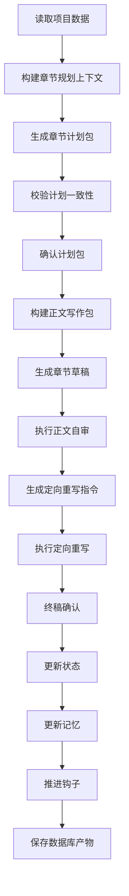

# AI 自动写小说工具 MVP 方案

## 1. 产品定位

- 形态：本地单用户命令行工具
- 技术栈：Node.js + TypeScript
- 存储：数据库持久化，第一版默认 SQLite，后续再扩展 MySQL
- 模型：第一版只接入一个大模型供应商
- 目标：优先跑通从设定录入、章节规划、正文生成、自审、定向重写、确认发布到最小状态更新的完整闭环

## 2. MVP 功能范围

### 必做能力

1. 小说基础设定管理
   - 全局大纲
   - 分卷设定
   - 分章故事线
   - 核心人物设定
   - 地点设定
   - 势力设定
   - 支持设定全书默认单章目标字数
2. 核心状态追踪
   - 主角当前位置
   - 关键事件进展
   - 当前活跃钩子
3. 钩子管理
   - 已埋钩子
   - 待回收钩子
   - 新钩子建议
4. 自动写作链路
   - 先生成章节计划包，再基于计划包生成正文
   - 写后自审
   - 定向重写
   - 人工确认后发布终稿
5. 记忆机制
   - 短期记忆：最近章节上下文
   - 轻量长期记忆：稳定设定、关键事实、已发生事件
6. 写后更新
    - 更新章节结果
    - 更新核心状态
    - 更新钩子状态
    - 沉淀记忆条目
    - 生成后续伏笔建议

### 第一版暂不做

- 多用户
- 云端同步
- 图形界面
- MySQL 支持
- 跨章节回滚后自动向下重放
- 完整物品审计与全局唯一性校验闭环
- 深度长期记忆去重与优先级调度
- 运维型 admin/debug 子命令
- 多模型切换
- 自动插画
- 自动发布平台对接
- 多人实时协同编辑

## 3. 核心领域模型

类型分层约定：

1. Entity：数据库真源类型，只表达稳定字段与主写入入口
2. View：面向查询、上下文组装与 CLI 展示的派生视图
3. Contract：面向工作流输入输出、章节处理和模型交互的流程契约

### 3.1 Book

单小说项目根对象，统一承载全书级配置，包括默认单章目标字数。

```ts
type ModelConfig = {
  provider: string
  modelName: string
  temperature?: number
  maxTokens?: number
}

/**
 * 书籍根配置。
 * 负责描述整本书的元信息、默认章节字数规则与模型配置。
 */
type Book = {
  /** 书籍唯一标识 */
  id: string
  /** 书名 */
  title: string
  /** 题材类型，例如玄幻、科幻、悬疑 */
  genre: string
  /** 全书写作风格约束 */
  styleGuide: string[]
  /** 默认单章目标字数 */
  defaultChapterWordCount: number
  /** 单章字数允许偏差比例，例如 0.15 表示 ±15% */
  chapterWordCountToleranceRatio: number
  /** 当前接入的大模型配置 */
  model: ModelConfig
  /** 创建时间，ISO 8601 格式 */
  createdAt: string
  /** 最后更新时间，ISO 8601 格式 */
  updatedAt: string
}
```

默认值建议：

1. [`Book.defaultChapterWordCount`](plans/mvp-plan.md:69) 默认值设为 `3000`
2. [`Book.chapterWordCountToleranceRatio`](plans/mvp-plan.md:70) 默认值设为 `0.15`
3. 以上表示默认目标单章字数为 3000，允许偏差区间为 ±15%
4. 对应默认可接受区间为 2550 到 3450 字

### 3.2 Outline

```ts
/**
 * 全书大纲信息。
 * 用于约束小说的主题、世界观、核心冲突与结局方向。
 */
type Outline = {
  /** 故事核心设定或一句话提要 */
  premise: string
  /** 主题表达 */
  theme: string
  /** 世界观说明 */
  worldview: string
  /** 核心冲突列表，允许并行存在多条主冲突 */
  coreConflicts: string[]
  /** 预期结局方向 */
  endingVision: string
}
```

大纲冲突设计建议：

1. 使用 [`Outline.coreConflicts`](plans/mvp-plan.md) 支持同时定义多条核心冲突
2. 冲突可分别对应人物冲突、阵营冲突、世界规则冲突、情感冲突、生存冲突等
3. 章节规划时应标记当前章节主要推进哪一条或哪几条冲突
4. 自审阶段检查章节内容是否真正服务于至少一条核心冲突推进
5. 长期记忆应记录各条冲突的阶段进展，避免主线断裂

### 3.3 Volume 与 Chapter

```ts
/**
 * 分卷信息。
 * 用于组织章节并描述该卷的阶段目标。
 */
type Volume = {
  /** 分卷唯一标识 */
  id: string
  /** 分卷标题 */
  title: string
  /** 该卷的主要目标 */
  goal: string
  /** 该卷摘要 */
  summary: string
  /** 属于本卷的章节 ID 列表 */
  chapterIds: string[]
}

/**
 * 章节信息。
 * 用于描述单章的计划、状态与产物路径。
 */
type Chapter = {
  /** 章节唯一标识 */
  id: string
  /** 所属分卷 ID */
  volumeId: string
  /** 章节序号 */
  index: number
  /** 章节标题 */
  title: string
  /** 本章写作目标 */
  objective: string
  /** 本章计划节拍 */
  plannedBeats: string[]
  /** 当前处理状态 */
  status: 'planned' | 'drafted' | 'reviewed' | 'finalized'
  /** 当前确认的计划包版本 ID */
  currentPlanVersionId?: string
  /** 当前终稿版本 ID */
  currentVersionId?: string
  /** 草稿文件路径 */
  draftPath?: string
  /** 最终稿文件路径 */
  finalPath?: string
  /** 终稿确认时间 */
  approvedAt?: string
}
```

### 3.4 Character

```ts
/**
 * 角色实体。
 * 聚合角色静态设定、关系与当前状态。
 */
type Character = {
  /** 角色唯一标识 */
  id: string
  /** 角色静态设定 */
  profile: CharacterProfile
  /** 角色关系集合 */
  relationships: CharacterRelation[]
  /** 角色当前状态 */
  currentState: CharacterCurrentState
}

/**
 * 角色静态设定。
 * 描述较少随章节变化的基础信息。
 */
type CharacterProfile = {
  /** 角色名 */
  name: string
  /** 角色定位，例如主角、反派、导师 */
  role: string
  /** 角色简介 */
  summary: string
  /** 角色核心动机 */
  motivation: string
  /** 角色秘密或隐藏信息 */
  secrets: string[]
}

/**
 * 角色当前状态。
 * 记录会随着章节推进变化的信息。
 */
type CharacterCurrentState = {
  /** 当前持有物品 */
  inventory: ItemRef[]
  /** 当前所在地点 ID */
  currentLocationId?: string
  /** 所属势力关系，可同时属于多个势力并记录不同职务 */
  factionMemberships: CharacterFactionMembership[]
  /** 当前成长体系，统一记录职业、等级与能力 */
  progression: CharacterProgression
  /** 角色阶段状态补充 */
  statusNotes: string[]
}

/**
 * 角色关系定义。
 * 用于表达角色之间的稳定关系与当前关系状态。
 */
type CharacterRelation = {
  targetCharacterId: string
  relationType: 'ally' | 'enemy' | 'family' | 'mentor' | 'lover' | 'subordinate' | 'other'
  summary: string
  intensity?: number
}
```

```ts
/**
 * 角色势力归属关系。
 * 用于记录角色在不同势力中的身份、职务与状态。
 */
type CharacterFactionMembership = {
  /** 势力 ID */
  factionId: string
  /** 在该势力中的身份或职务，例如长老、卧底、客卿、盟友代表 */
  roleTitle: string
  /** 归属状态，例如正式成员、附属、合作、潜伏、敌对渗透 */
  status: string
  /** 备注信息，例如加入原因、隐瞒关系、权限范围 */
  notes?: string[]
}
```

```ts
/**
 * 角色成长体系。
 * 用于统一表达角色当前职业、等级与能力结构。
 */
type CharacterProgression = {
  /** 当前职业，例如剑修、调查员、外交官 */
  className: string
  /** 当前等级描述，例如练气一层、Lv.12、三级调查员 */
  rank: string
  /** 便于排序和规则比较的数值等级，可选 */
  levelValue?: number
  /** 当前能力列表 */
  abilities: CharacterAbility[]
}

/**
 * 角色能力定义。
 * 用于表达角色当前掌握的能力、效果与限制。
 */
type CharacterAbility = {
  /** 能力唯一标识 */
  id: string
  /** 能力名称 */
  name: string
  /** 能力分类，例如战斗、法术、社交、侦查 */
  category: string
  /** 能力描述 */
  description: string
  /** 当前熟练度、强度或阶位 */
  rank?: string
  /** 使用限制、代价或冷却 */
  constraints?: string[]
}
```

### 3.5 State Tracker

```ts
/**
 * 全局故事状态。
 * 记录当前推进位置、主线线程与最近事件。
 */
type StoryState = {
  /** 当前推进到的章节 ID */
  currentChapterId: string
  /** 当前主角 ID */
  protagonistId: string
  /** 当前活跃中的故事线 */
  activeThreads: StoryThread[]
  /** 已解决的故事线 */
  resolvedThreads: StoryThread[]
  /** 最近发生的重要事件 */
  recentEvents: StoryEvent[]
}

type StoryThread = {
  id: string
  title: string
  status: 'active' | 'resolved'
  summary: string
  relatedCharacterIds?: string[]
  relatedHookIds?: string[]
}

type StoryEvent = {
  id: string
  chapterId: string
  summary: string
  tags: string[]
}
```

```ts
/**
 * 物品实体。
 * 描述相对稳定的基础定义。
 */
type Item = {
  /** 物品唯一标识 */
  id: string
  /** 物品名称 */
  name: string
  /** 数量单位，例如颗、个、把、枚 */
  unit: string
  /** 物品类型，例如法宝、货币、丹药、材料 */
  type: string
  /** 是否为全世界唯一 */
  isUniqueWorldwide: boolean
  /** 扩展描述，例如来历、能力、外观、限制 */
  description?: string
}

/**
 * 角色持有物视图。
 * 用于记录角色当前拥有的物品及其状态。
 */
type ItemRef = {
  /** 物品 ID */
  itemId: string
  /** 展示名称快照，便于上下文直接使用 */
  name: string
  /** 数量值，例如 10000、1 */
  quantity: number
  /** 当前状态，例如完好、破损、封印中、已认主 */
  status: string
}

/**
 * 全局物品状态。
 * 用于从世界状态角度追踪关键物品的归属、位置与变化。
 */
type ItemState = {
  /** 物品 ID */
  itemId: string
  /** 当前数量 */
  quantity: number
  /** 当前持有角色 ID，可选 */
  ownerCharacterId?: string
  /** 当前所在地点 ID，可选 */
  locationId?: string
  /** 当前状态 */
  status: string
}
```

### 3.6 Location

```ts
/**
 * 地点设定。
 * 用于描述小说中的关键地点、归属、规则与当前状态。
 */
type Location = {
  /** 地点唯一标识 */
  id: string
  /** 地点名称 */
  name: string
  /** 地点类型，例如宗门、城市、遗迹、酒馆 */
  type: string
  /** 所属区域或上级地点 */
  parentRegion?: string
  /** 当前控制该地点的势力 ID，可选 */
  controllingFactionId?: string
  /** 地点描述 */
  description: string
  /** 地点规则、禁忌或特殊机制 */
  rules: string[]
  /** 当前状态，例如封锁中、繁荣、战乱、废墟 */
  status: string
  /** 与剧情相关的重要标签 */
  tags: string[]
}

type LocationView = Location & {
  /** 当前位于该地点的关键角色 ID，派生字段 */
  residentCharacterIds: string[]
}
```

### 3.7 Faction

```ts
/**
 * 势力设定。
 * 用于描述组织、阵营、国家、宗门等群体信息。
 */
type Faction = {
  /** 势力唯一标识 */
  id: string
  /** 势力名称 */
  name: string
  /** 势力类型，例如宗门、王国、商会、教团 */
  type: string
  /** 势力宗旨或核心目标 */
  objective: string
  /** 势力描述 */
  description: string
  /** 关键成员或核心人物 ID */
  keyCharacterIds: string[]
  /** 主要据点或控制地点 ID */
  locationIds: string[]
  /** 盟友势力 ID */
  allyFactionIds: string[]
  /** 对立势力 ID */
  rivalFactionIds: string[]
  /** 当前势力状态，例如扩张、衰落、潜伏 */
  status: string
}

type FactionView = Faction & {
  /** 势力内的角色职务映射，派生字段 */
  memberRoles: FactionMemberRole[]
}
```

```ts
/**
 * 势力成员职务映射。
 * 用于从势力视角记录成员及其职务。
 */
type FactionMemberRole = {
  /** 角色 ID */
  characterId: string
  /** 角色在该势力中的职务 */
  roleTitle: string
}
```

### 3.8 Hook

```ts
/**
 * 钩子记录。
 * 用于追踪伏笔来源、预期回收方式与当前状态。
 */
type Hook = {
  /** 钩子唯一标识 */
  id: string
  /** 钩子标题 */
  title: string
  /** 钩子首次出现的章节 ID */
  sourceChapterId: string
  /** 钩子描述 */
  description: string
  /** 预期回收方式或效果 */
  payoffExpectation: string
  /** 预期回收章节或窗口，可选 */
  expectedPayoffChapterId?: string
  /** 优先级 */
  priority: 'low' | 'medium' | 'high'
  /** 当前状态 */
  status: 'open' | 'foreshadowed' | 'payoff-planned' | 'resolved'
}
```

### 3.9 Memory

```ts
/**
 * 长期记忆条目。
 * 用于沉淀稳定事实、关系、约束与历史事件。
 */
type MemoryEntry = {
  /** 记忆唯一标识 */
  id: string
  /** 记忆类型 */
  type: 'fact' | 'event' | 'style' | 'relationship' | 'constraint'
  /** 记忆摘要 */
  summary: string
  /** 来源章节 ID，可选 */
  sourceChapterId?: string
  /** 重要度分值 */
  importance: number
  /** 标签列表，用于召回 */
  tags: string[]
  /** 最近一次使用时间 */
  lastUsedAt?: string
}
```

重要度建议：

1. [`MemoryEntry.importance`](plans/mvp-plan.md:458) 建议约束在 `1` 到 `5`
2. `1` 表示低价值背景补充，`5` 表示不可违背的核心事实
3. 召回阶段优先注入 `4` 与 `5` 的记忆条目

## 4. 数据目录规划

```text
project/
  config/
    database.json
  data/
    novel.sqlite
  completed-chapters/
    0001-章节名.md
  exports/
    markdown/
      book.md
      outline.md
      volumes.md
      chapters.md
      characters.md
      locations.md
      factions.md
      hooks.md
      state.md
      short-term-memory.md
      long-term-memory.md
  logs/
    runs.jsonl
```

数据库状态规则建议：

1. 所有核心数据以数据库为唯一真相源，不再使用 JSON 文件持久化业务数据
2. 数据库只维护一套“当前主线状态”，不再引入快照树或时间线分支机制
3. SQLite 模式下数据落在 [`data/novel.sqlite`](plans/mvp-plan.md)
4. 第一版只实现 SQLite，本地项目目录保留配置、日志与已完成章节文件
5. MySQL 模式留待后续版本扩展，业务层提前保持仓储抽象
6. 当前状态表始终代表“此刻主线真相”
7. 第一版章节重写仅作用于当前处理章节，不实现跨章节回滚与整链重放
8. 若需要追溯历史，依赖章节计划、草稿、审查、重写记录与审计日志，而不是依赖快照树

## 5. 核心工作流

### 5.1 双阶段写作主流程



### 5.2 阶段一：章节规划

目标：在真正写正文之前，先产出一份可审查、可重用、可回退的章节计划包。

1. 规划输入
   - 当前章节目标
   - 当前章节目标字数
   - 上一章总结
   - 当前活跃冲突
   - 当前可用角色、地点、势力、重要物品
   - 当前活跃钩子与待回收钩子
   - 当前短期记忆与高优先级长期记忆
2. 规划输出
   - 本章核心推进目标
   - 本章必须出现的人物、地点、势力、物品
   - 本章事件顺序
   - 本章场景拆分
   - 本章钩子推进点与禁止触碰点
   - 本章状态变化预测
   - 本章记忆沉淀候选
3. 规划校验
   - 是否推进至少一条核心冲突
   - 是否承接上一章结尾
   - 是否调用了不该出场的人物或物品
   - 是否提前回收不该回收的钩子
   - 是否与当前地点、势力、状态冲突

### 5.3 阶段二：正文写作

目标：严格基于章节计划包写正文，而不是直接从全局设定裸写。

1. 写作输入
   - 已确认的章节计划包
   - 上一章总结
   - 本章相关人物、地点、势力、重要物品
   - 当前活跃钩子
   - 风格约束
   - 字数目标与偏差阈值
2. 写作输出
   - 章节正文
   - 本章实际事件列表
   - 本章新增或变更设定候选
   - 本章钩子推进结果
3. 自审
   - 检查正文是否忠实执行章节计划包
   - 检查设定冲突
   - 检查角色行为合理性
   - 检查角色职业、等级与能力使用是否匹配
   - 检查角色所在地点与多势力归属是否一致
   - 检查地点与势力状态是否前后一致
   - 检查关键物品的数量、唯一性与归属是否一致
   - 检查钩子承接
   - 检查文风与节奏
   - 检查字数是否达标
4. 定向重写
   - 根据自审报告生成重写指令，而不是整章盲重写
   - 支持只改节奏、只改对白、只改长度、只改冲突强度
   - 保留章节计划包定义的核心事件、结尾推进点、钩子约束

### 5.4 写后更新

1. 状态更新
   - 更新人物位置、所属势力、职业等级、能力变化
   - 更新地点状态、势力状态、物品状态
2. 记忆更新
   - 先提炼候选记忆
   - 再按规则筛选进入短期记忆与长期记忆
3. 钩子更新
   - 标记本章已推进钩子
   - 标记本章已回收钩子
   - 生成后续待埋钩子建议
4. 产物更新
   - 在一个数据库事务里提交本章引起的状态变化、记忆变化、钩子变化与正文产物
   - 将最终确认后的章节正文额外输出到 [`completed-chapters/`](plans/mvp-plan.md) 目录，便于统一阅读

completed-chapters 命名规则建议：

1. 文件名格式为 `<四位章节序号>-<章节名>.md`
2. 例如 `0001-文明余烬.md`、`0002-避难所初醒.md`
3. 章节序号保证排序稳定，章节名保证人工可读
4. 若章节名包含文件系统不安全字符，落盘前应自动清洗

### 5.5 首版章节重写规则

1. 第一版只支持重写当前正在处理的章节，不支持跨章节回滚后自动向下重放
2. `rewrite` 基于当前章节的计划包、草稿与审查报告生成候选版本
3. 候选版本在 `approve` 前不写入当前主线状态
4. 当前章节的草稿、审查、重写记录保留为历史版本，不物理删除
5. `approve` 后以最新确认版本覆盖该章节终稿，并提交该章节对应的状态更新
6. 如需重写历史已完成章节，留待后续版本实现专门回滚链路

### 5.6 状态建模建议

1. 主数据表
   - `books`、`outlines`、`volumes`、`chapters`、`locations`、`factions` 等低频变化实体优先走主表
2. 当前状态表
   - `character_current_state`
   - `hook_current_state`
   - `story_current_state`
   - `short_term_memory_current`
   - `long_term_memory_current`
3. 章节过程表
   - `chapter_plans`
   - `chapter_drafts`
   - `chapter_reviews`
   - `chapter_rewrites`
   - `chapter_outputs`
4. 审计与版本表
   - `chapter_versions`
   - `audit_logs`
5. 第一版以“当前状态表 + 章节过程表 + 版本记录”支撑主流程，不实现完整章节重放机制
6. 对高频读取视图，可在后续版本通过缓存视图优化

## 6. 短期记忆与长期记忆设计

### 6.1 短期记忆

- 来源：最近 N 章正文摘要、最近事件、最近状态变化
- 用途：保障续写连贯性
- 形式：数据库中的 `short_term_memory_current`
- 更新时机：每章完成后重算

建议结构：

```ts
/**
 * 短期记忆结构。
 * 保存最近几章的摘要、事件与临时约束，保障续写连贯性。
 */
type ShortTermMemory = {
  /** 纳入短期记忆的最近章节摘要 */
  recentChapters: Array<{
    chapterId: string
    summary: string
  }>
  /** 最近关键事件 */
  recentEvents: StoryEvent[]
  /** 仅在短期内有效的临时约束 */
  temporaryConstraints: string[]
}
```

### 6.2 长期记忆

- 来源：稳定世界设定、角色关系、关键事件、不可违背事实、写作风格规则
- 重点覆盖：人物、地点、势力、规则、历史事件
- 用途：保障长期一致性
- 形式：数据库中的 `long_term_memory_current`
- 更新方式：每章完成后由 LLM 提炼候选，再由规则去重合并

建议策略：

1. 新章完成后生成候选记忆
2. 按 type + tags + summary 相似度去重
3. 提升高重要度设定优先级
4. 记录来源章节，便于追溯

角色能力追踪建议：

1. 角色职业变化、等级变化或能力变化应在章节完成后写入数据库当前状态表与相关章节记录
2. 新能力获取、旧能力失效、能力强化都应同步进入长期记忆
3. 写作上下文中应优先注入与当前章节冲突、战斗、解谜相关的角色能力
4. 自审阶段检查能力使用是否越级、遗忘或前后矛盾
5. 若角色发生转职、觉醒、进阶，也应作为重要事件进入长期记忆
6. 角色位置迁移与势力归属变化也应在章节完成后同步更新并进入长期记忆
7. 若角色在不同势力拥有不同职务，应分别记录并在冲突章节优先召回

物品追踪建议：

1. [`ItemRef`](plans/mvp-plan.md) 用于角色库存，[`ItemState`](plans/mvp-plan.md) 用于全局物品状态追踪
2. 唯一物品必须保证全局只存在一份有效记录
3. 物品数量变化、归属变化、状态变化都应在章节完成后同步更新
4. 重要物品的来历、用途、限制与损耗情况应写入扩展描述
5. 涉及关键法宝、货币、任务道具时，应优先注入写作上下文与长期记忆

单一真源建议：

1. [`Character.factionMemberships`](plans/mvp-plan.md) 作为角色与势力关系的真源
2. [`Faction.memberRoles`](plans/mvp-plan.md) 作为可重建视图或派生缓存，不作为主写入入口
3. [`Character.currentLocationId`](plans/mvp-plan.md) 作为角色位置真源
4. [`Location.residentCharacterIds`](plans/mvp-plan.md) 作为派生视图，可由角色位置聚合生成
5. [`LocationView.residentCharacterIds`](plans/mvp-plan.md) 作为派生视图，可由角色位置聚合生成
6. [`ItemState`](plans/mvp-plan.md) 作为关键物品全局审计真源，负责唯一性与归属校验
7. [`ItemRef`](plans/mvp-plan.md) 作为角色库存视图，写入时需与 [`ItemState`](plans/mvp-plan.md) 同步校验

## 7. 命令行模块设计

### 7.1 CLI 命令

```text
novel init
novel book show
novel outline set
novel volume add
novel chapter add
novel character add
novel location add
novel faction add
novel hook add
novel plan chapter <id>
novel write next
novel review chapter <id>
novel chapter rewrite <id>
novel chapter approve <id>
```

CLI 精简原则：

1. 第一版只保留高频主链路命令：初始化、设定录入、章节规划、正文生成、自审、重写
2. 将低频运维命令从默认 CLI 中移除，例如历史比对、数据库诊断等运维命令
3. 将可由主命令自动触发的能力移出显式命令，例如 `db migrate`、`memory rebuild`、`state show`
4. `optimize` 与 `rewrite` 语义重叠，第一版保留 `rewrite`，去掉 `optimize`
5. `approve` 保留为显式命令，作为更新状态与落盘终稿的唯一入口
6. 若后续进入多人协作或运维场景，再补充 `admin` 或 `debug` 子命令组

### 7.2 内部模块

- [`src/cli`](plans/mvp-plan.md)：命令入口与参数解析
- [`src/core/book`](plans/mvp-plan.md)：书籍配置加载与保存
- [`src/core/context`](plans/mvp-plan.md)：规划上下文与写作上下文组装
- [`src/core/world`](plans/mvp-plan.md)：地点与势力管理
- [`src/core/planning`](plans/mvp-plan.md)：章节计划包生成与校验
- [`src/core/generation`](plans/mvp-plan.md)：基于计划包的章节生成
- [`src/core/rewrite`](plans/mvp-plan.md)：章节重写与版本管理
- [`src/core/review`](plans/mvp-plan.md)：自审
- [`src/core/memory`](plans/mvp-plan.md)：短期长期记忆管理
- [`src/core/hooks`](plans/mvp-plan.md)：钩子提取与状态更新
- [`src/core/state`](plans/mvp-plan.md)：人物位置、物品、事件状态
- [`src/infra/llm`](plans/mvp-plan.md)：模型适配器
- [`src/infra/db`](plans/mvp-plan.md)：数据库连接、方言适配、事务管理
- [`src/infra/repository`](plans/mvp-plan.md)：Book、Chapter、Character 等仓储实现
- [`src/infra/audit`](plans/mvp-plan.md)：章节变更审计与版本日志

## 8. 关键接口设计

### 8.1 LLM Adapter

```ts
type PromptInput = {
  system?: string
  user: string
  context?: Record<string, unknown>
}

type GenerateResult = {
  text: string
  finishReason?: string
  usage?: {
    promptTokens: number
    completionTokens: number
  }
}

interface LlmAdapter {
  generateText(input: PromptInput): Promise<GenerateResult>
  generateStructured<T>(input: PromptInput, schemaName: string): Promise<T>
}
```

### 8.2 Context Builder

```ts
type ContextItem = Item & {
  quantity?: number
  ownerCharacterId?: string
  locationId?: string
  status?: string
}

interface BaseNarrativeContext {
  /** 全书大纲 */
  outline: Outline
  /** 当前章节 */
  chapter: Chapter
  /** 上一章总结 */
  previousChapterSummary?: string
  /** 当前章节相关角色 */
  relevantCharacters: Character[]
  /** 当前章节相关地点 */
  relevantLocations: LocationView[]
  /** 当前章节相关势力 */
  relevantFactions: FactionView[]
  /** 当前重要物品 */
  importantItems: ContextItem[]
  /** 当前需要关注的活跃钩子 */
  activeHooks: Hook[]
  /** 当前故事状态 */
  storyState: StoryState
  /** 短期记忆 */
  shortTermMemory: ShortTermMemory
  /** 召回的长期记忆 */
  longTermMemories: MemoryEntry[]
}

/**
 * 章节规划上下文。
 * 聚合章节计划包生成所需的输入。
 */
interface PlanningContext extends BaseNarrativeContext {
  /** 当前待规划章节 */
  chapter: Chapter
}

/**
 * 写作上下文。
 * 聚合基于章节计划包写正文所需的全部输入。
 */
interface WritingContext extends BaseNarrativeContext {
  /** 当前待写章节 */
  chapter: Chapter
  /** 已确认的章节计划包 */
  chapterPlan: ChapterPlan
}
```

### 8.3 Chapter State Update Contract

```ts
/**
 * 章节状态更新输入。
 * 表示某一章在确认发布时对当前主线状态造成的结构化变更集合。
 */
type ChapterStateUpdate = {
  updateId: string
  bookId: string
  chapterId: string
  chapterIndex: number
  characterUpdates: CharacterStateUpdate[]
  storyUpdates: StoryStateUpdate[]
  hookUpdates: HookStateUpdate[]
  memoryEntriesAdded: MemoryEntry[]
  createdAt: string
}

type CharacterStateUpdate = {
  characterId: string
  currentLocationId?: string
  factionMemberships?: CharacterFactionMembership[]
  progression?: CharacterProgression
  inventory?: ItemRef[]
  statusNotes?: string[]
}

type StoryStateUpdate = {
  currentChapterId?: string
  activeThreads?: StoryThread[]
  resolvedThreads?: StoryThread[]
  recentEventsAdded?: StoryEvent[]
}

type HookStateUpdate = {
  hookId: string
  status: Hook['status']
  note?: string
}

/**
 * 状态更新服务。
 * 负责在章节确认后提交当前状态、记忆与钩子变更。
 */
interface StateUpdateService {
  commitChapterUpdate(input: ChapterStateUpdateInput): Promise<ChapterStateUpdate>
}

type ChapterStateUpdateInput = {
  bookId: string
  chapterId: string
  chapterIndex: number
  characterUpdates: CharacterStateUpdate[]
  storyUpdates: StoryStateUpdate[]
  hookUpdates: HookStateUpdate[]
  memoryEntriesAdded: MemoryEntry[]
}
```

### 8.4 Chapter Plan Contract

```ts
/**
 * 章节计划包。
 * 作为规划阶段与正文阶段之间的桥梁产物。
 */
type ChapterPlan = {
  /** 目标章节 ID */
  chapterId: string
  /** 计划包版本 ID */
  versionId: string
  /** 本章核心推进目标 */
  objective: string
  /** 本章场景拆分 */
  sceneCards: SceneCard[]
  /** 必须出场的人物 ID */
  requiredCharacterIds: string[]
  /** 必须出场的地点 ID */
  requiredLocationIds: string[]
  /** 必须涉及的势力 ID */
  requiredFactionIds: string[]
  /** 必须涉及的重要物品 ID */
  requiredItemIds: string[]
  /** 本章事件顺序 */
  eventOutline: string[]
  /** 钩子推进计划 */
  hookPlan: HookPlan[]
  /** 预测的状态变化 */
  statePredictions: string[]
  /** 记忆沉淀候选 */
  memoryCandidates: string[]
  /** 计划生成时间 */
  createdAt: string
  /** 是否已被人工确认 */
  approvedByUser: boolean
}

/**
 * 场景卡。
 * 用于约束正文写作时的场景目的和出场资源。
 */
type SceneCard = {
  title: string
  purpose: string
  beats: string[]
  characterIds: string[]
  locationId?: string
  factionIds: string[]
  itemIds: string[]
}

/**
 * 钩子推进计划。
 * 用于定义本章应推进、埋设或禁止触碰的钩子。
 */
type HookPlan = {
  hookId: string
  action: 'hold' | 'foreshadow' | 'advance' | 'payoff'
  note: string
}
```

### 8.5 Write Next Output

```ts
type WriteNextResult = {
  chapterId: string
  chapterStatus: 'drafted'
  planningSummary: {
    objective: string
    sceneCount: number
    keyEvents: string[]
    characterNames: string[]
    locationNames: string[]
    factionNames: string[]
    hookTitles: string[]
  }
  draftPath: string
  actualWordCount: number
  nextAction: 'review'
}
```

章节字数约束建议：

1. [`Book.defaultChapterWordCount`](plans/mvp-plan.md) 作为生成阶段的默认硬约束输入
2. 第一版字数配置放在全书级，不在章节级单独配置
3. [`Book.chapterWordCountToleranceRatio`](plans/mvp-plan.md:70) 用于判定生成结果是否超出可接受范围
4. 生成结果记录实际字数，便于审查偏差
5. 若偏差超出阈值，可在自审或重写阶段触发长度修正
6. 长度修正优先保证剧情完整性，其次再收敛到目标字数

长度修正规则建议：

1. 若实际字数低于下限，优先补强场景描写、人物反应、动作过渡、对话层次
2. 若实际字数高于上限，优先压缩重复表达、冗余描写、低价值旁白、重复回顾
3. 长度修正不得删除核心事件、关键设定、已埋钩子与结尾推进点
4. 重写模式应支持传入长度修正目标，例如 `expand-to-target` 与 `shrink-to-target`
5. 若首次修正后仍超阈值，可再执行一次定向修正，但最多限制重试次数，避免无限循环
6. 最终审查报告中输出目标字数、实际字数、偏差比例、是否达标

### 8.6 Review Output

```ts
/**
 * 审查报告。
 * 汇总一致性、角色、节奏、钩子与字数检查结果。
 */
type ReviewReport = {
  /** 审查结论 */
  decision: 'pass' | 'warning' | 'needs-rewrite'
  /** 设定一致性问题 */
  consistencyIssues: string[]
  /** 角色行为或动机问题 */
  characterIssues: string[]
  /** 节奏问题 */
  pacingIssues: string[]
  /** 钩子承接问题 */
  hookIssues: string[]
  /** 字数检查结果 */
  wordCountCheck: {
    /** 目标字数 */
    target: number
    /** 实际字数 */
    actual: number
    /** 允许偏差比例 */
    toleranceRatio: number
    /** 实际偏差比例 */
    deviationRatio: number
    /** 是否通过检查 */
    passed: boolean
  }
  /** 修订建议 */
  revisionAdvice: string[]
}
```

### 8.7 Rewrite Input

```ts
/**
 * 重写请求参数。
 * 用于控制章节重写范围、目标与保护约束。
 */
type RewriteRequest = {
  /** 目标章节 ID */
  chapterId: string
  /** 重写策略，整体或局部 */
  strategy: 'full' | 'partial'
  /** 定向重写关注点 */
  focus?: Array<'dialogue' | 'pacing' | 'length' | 'conflict' | 'consistency'>
  /** 长度修正策略 */
  lengthPolicy?: 'keep' | 'expand-to-target' | 'shrink-to-target'
  /** 本次重写目标列表 */
  goals: string[]
  /** 是否保留已确认事实 */
  preserveFacts: boolean
  /** 是否保留已埋钩子 */
  preserveHooks: boolean
  /** 是否保留结尾推进点 */
  preserveEndingBeat: boolean
}
```

重写机制建议：

1. 保留原章节版本快照
2. 允许基于审查报告与章节计划包联合发起重写
3. 允许用户指定重写目标，比如节奏更快、冲突更强、对话更多
4. 重写后再次执行一致性检查，并重新比对章节计划包
5. `rewrite` 只更新候选版本，不直接提交最终状态

### 8.8 Approve Contract

```ts
type ApproveResult = {
  chapterId: string
  chapterStatus: 'finalized'
  versionId: string
  finalPath: string
  stateUpdated: boolean
  memoryUpdated: boolean
  hooksUpdated: boolean
  approvedAt: string
}
```

approve 规则建议：

1. `approve` 只能作用于 `reviewed` 状态章节
2. `approve` 会把当前草稿或当前重写结果视为确认版本
3. `approve` 才真正触发状态更新、记忆更新、钩子推进、终稿输出，并将章节状态更新为 `finalized`
4. 若用户先执行 `rewrite`，则 `approve` 基于最新重写版本生效
5. 若 review 存在问题但用户仍确认，系统应保留人工确认记录

数据库支持建议：

1. SQLite 作为默认本地单机模式，零配置启动快，便于 MVP 落地
2. MySQL 作为后续扩展模式，在接口层提前保留方言抽象
3. 在应用层统一仓储接口，避免业务层感知具体数据库方言
4. `chapter_index` 作为章节处理顺序与审计追溯主轴
5. 通过迁移系统管理表结构，而不是依赖手工建表
6. SQLite 模式优先采用“事务提交 + 当前状态表更新 + 章节版本留档”
7. MySQL 模式可在后续版本引入只读视图、物化表或分区优化查询性能

迁移策略建议：

1. 初始化时执行 `db migrate` 创建基础表结构
2. SQLite 使用本地文件数据库；MySQL 连接串配置留待后续版本启用
3. 若未来已有原型文件数据，可提供一次性迁移脚本写入数据库
4. 第一版不提供导入导出能力，后续如有强需求再单独设计
5. 所有章节状态变更提交必须走事务，避免出现“章节终稿已写入但状态未更新”的半完成状态
6. 对章节完成后的提交记录增加审计日志与版本记录，便于排错与追溯
7. 跨章节回滚与整链重放留待后续版本单独设计

## 9. 推荐实施顺序

1. 初始化 TypeScript CLI 工程
2. 建立 SQLite 连接层、迁移系统与项目目录结构
3. 实现基础实体仓储与事务封装
4. 实现书籍初始化与设定录入命令
5. 实现全书默认章节字数配置、偏差阈值与长度校验
6. 实现章节规划上下文组装器
7. 实现章节计划包生成与计划校验
8. 实现基于计划包的章节生成
9. 实现自审、定向重写与 `approve` 主链路
10. 实现核心状态更新、钩子更新、短期记忆更新
11. 增加章节版本记录、审计日志与终稿导出
12. 在后续版本再扩展 MySQL、历史回滚重放与高级记忆策略

## 10. MVP 验收标准

1. 可以创建一个书籍项目
2. 初始化后全部基础数据写入 SQLite，并建立当前主线状态
3. 可以录入大纲、卷章、角色、地点、势力、钩子
4. 角色支持记录所在位置、多个所属势力及各自职务，以及对象形式的职业、等级与能力，并可在章节推进后更新
5. 可以在书籍级设置默认单章目标字数与偏差阈值，并在生成时作为约束使用
6. 可以先为指定章节生成章节计划包，并可人工检查或修改后再写正文
7. 可以指定当前章节并基于章节计划包自动生成草稿
8. 可以对草稿执行包含字数检查和计划一致性检查的自审
9. 可以对当前处理章节执行定向重写，并保留版本记录
10. `approve` 后会在数据库事务中提交该章对应的核心状态、记忆与钩子更新
11. 可以在写完后更新主角位置、关键事件与活跃钩子状态
12. 可以沉淀短期记忆与轻量长期记忆
13. 可以为下一章生成后续钩子建议
14. 最终确认后的章节正文会输出到 [`completed-chapters/`](plans/mvp-plan.md) 目录
15. 全部数据可通过 SQLite 持久化并再次读取
