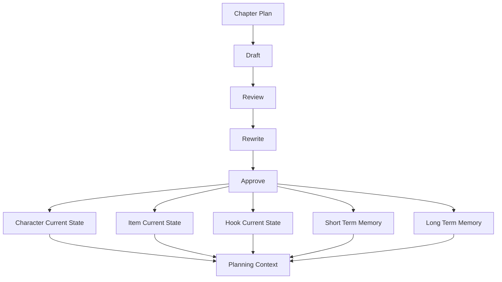

# AI 自动写小说工具 v1 设计方案

## 1. v1 总目标

`v1` 不再优先扩展更多命令，而是优先把“状态闭环”和“一致性体系”做实。

核心目标：

1. 让 `hooks`、`memory`、角色位置、物品状态从“记录结果”升级为“真正参与规划、写作、审查、重写”的核心上下文
2. 让章节推进后的状态更新从“最小占位”升级为“结构化、可校验、可追溯”的业务闭环
3. 让模型生成不只是会写，而是能持续保持长线一致性

一句话定义：

> `v0` 是跑通主链路，`v1` 是让这条主链路在连续写很多章时仍然不崩。

## 2. v1 设计原则

### 2.1 状态优先于文本

- 章节正文只是结果
- 世界状态才是下一章生成的约束来源
- `approve` 后的状态更新必须成为下一章 planning 和 writing 的输入

### 2.2 真源优先于派生

- 角色位置以角色状态真源为准
- 物品归属以全局物品状态真源为准
- 钩子状态以 `hook_current_state` 为准
- 短期与长期记忆以当前记忆表为准
- 一切 CLI 展示和上下文组装都从真源聚合，不做多头写入

### 2.3 审查必须覆盖一致性

- `review` 不只看字数和节奏
- 必须显式检查：
  - 人物位置是否合理
  - 物品归属是否合理
  - 钩子推进是否合理
  - 长期记忆是否被违背
  - 本章是否引入了未登记的新事实

## 3. v1 核心范围

### 3.1 角色状态闭环

把角色从静态设定提升为“设定 + 当前状态”双层模型。

需要补齐：

- 当前所在地点
- 当前状态备注
- 与章节推进相关的阶段变化
- 主角位置的显式更新能力

目标：

- 下一章规划时能准确知道主角和关键角色在哪里
- 审查阶段能发现“角色瞬移”或“人物不该出场却出场”的问题

### 3.2 物品状态闭环

把物品从弱占位升级成全局审计对象。

需要补齐：

- `Item` 实体表
- `item_current_state` 当前状态表
- 所属角色 / 所在地点 / 状态 / 数量
- 唯一物品约束

目标：

- 写作上下文中能注入本章关键物品
- 审查阶段能检查关键物品是否前后一致
- `approve` 后能把物品变化写入主线状态

### 3.3 Hook 状态闭环

当前已经有 `hooks` 和 `hook_current_state`，但还没有真正进入 planning 和 writing 上下文。

需要补齐：

- planning 时读取活跃钩子
- planning 时为本章生成 `hookPlan`
- review 时检查本章是否承接钩子
- approve 时更新钩子状态并生成后续建议

目标：

- 钩子不再只是挂在数据库里的清单
- 系统能知道哪些钩子正在活跃、哪些该推进、哪些该回收

### 3.4 短期记忆与长期记忆进入上下文

当前 memory 已能落表，但没有真正成为 planning / writing 的核心输入。

需要补齐：

- planning 时注入：最近章节摘要、最近事件、高重要长期记忆
- writing 时注入：本章相关角色/地点/物品/钩子的高价值记忆
- review 时检查：本章是否违反长期记忆事实
- approve 时沉淀：新增稳定事实和短期摘要

目标：

- 减少“上一章刚发生，这一章模型就忘了”的现象
- 减少设定漂移和关系漂移

### 3.5 一致性审查升级

`review` 从轻量规则审查升级为一致性审查中心。

新增检查维度：

- 角色位置一致性
- 物品状态一致性
- 钩子承接一致性
- 长期记忆事实一致性
- 新事实发现与归档建议

目标：

- 审查输出不再只是“字数不足”这类浅层问题
- 而是能指导是否需要重写，以及为什么要重写

## 4. v1 数据模型升级

## 4.1 建议新增或强化的表

- `character_current_state`
- `items`
- `item_current_state`
- `hook_current_state` 继续沿用并强化
- `short_term_memory_current` 继续沿用并强化
- `long_term_memory_current` 继续沿用并强化
- `chapter_state_updates`
- `chapter_memory_updates`
- `chapter_hook_updates`

## 4.2 数据流关系

这个闭环的关键含义是：

- `approve` 不只是写终稿
- `approve` 还是所有“下一章约束源”的统一更新入口

## 5. v1 模块优先级

## P1：状态真源模块

优先级最高。

涉及：

- `src/core/state`
- `src/infra/repository/character-current-state`
- `src/infra/repository/item-state`
- `src/infra/repository/hook-state`
- `src/infra/repository/memory`

完成标准：

- 角色位置、物品状态、钩子状态、记忆状态都能结构化读写

## P2：上下文组装升级

涉及：

- [`src/core/context/planning-context-builder.ts`](src/core/context/planning-context-builder.ts)
- [`src/core/context/writing-context-builder.ts`](src/core/context/writing-context-builder.ts)

完成标准：

- planning / writing 能读取真实状态，而不是只依赖章节设定

## P3：一致性审查升级

涉及：

- [`src/core/review/service.ts`](src/core/review/service.ts)

完成标准：

- `review` 能发现角色位置、物品、钩子、记忆层面的冲突

## P4：approve 状态提交升级

涉及：

- [`src/core/approve/service.ts`](src/core/approve/service.ts)

完成标准：

- `approve` 统一提交角色、物品、钩子、记忆的更新

## 6. v1 里程碑拆分

## M1：角色与钩子进入上下文

交付：

- 角色当前位置真实状态表
- 活跃钩子注入 planning / writing
- `approve` 更新主角位置和钩子状态

验收：

- 下一章 planning 能读取主角当前位置和活跃钩子
- `review` 能发现角色位置或钩子承接问题

---

## M2：物品状态闭环

交付：

- `Item` 与 `item_current_state`
- 物品上下文注入
- 物品一致性审查

验收：

- 关键物品能在章节前后持续追踪
- `review` 能发现物品状态冲突

---

## M3：记忆闭环升级

交付：

- 短期记忆参与 planning / writing
- 长期记忆召回策略
- 长期记忆事实一致性审查

验收：

- 新章能读到最近摘要与关键长期事实
- `review` 能识别长期事实冲突

---

## M4：状态提交与追溯增强

交付：

- `chapter_state_updates`
- `chapter_memory_updates`
- `chapter_hook_updates`
- 更清晰的 approve 提交日志

验收：

- 每章完成后可追踪状态更新来源
- 排查一致性问题时能定位哪一章引入变更

## 7. v1 验收标准

以下全部满足即可视为 `v1` 完成：

1. 角色当前位置真实参与 planning / writing / review / approve
2. 活跃钩子真实参与 planning / writing / review / approve
3. 关键物品真实参与 planning / writing / review / approve
4. 短期记忆和长期记忆真实参与 planning / writing
5. `review` 能发现角色、物品、钩子、记忆四类一致性问题
6. `approve` 能统一提交文本结果与状态更新
7. 章节更新后的状态可以成为下一章的真实约束输入
8. 对任意章节的当前状态来源可以追溯到对应更新记录

## 8. 推荐实施顺序

最建议按下面顺序推进：

1. 角色当前位置状态表 + 上下文注入
2. hook_current_state 真正进入 planning / writing / review
3. `Item` 与 `item_current_state`
4. memory 召回和一致性审查
5. approve 状态提交增强
6. 章节状态更新日志与追溯

## 9. 为什么这样排

原因很直接：

- 角色位置和钩子最先影响长线连贯性
- 物品状态是第二层一致性约束
- 记忆体系在前两者稳定后效果最好
- 审计和追溯应该建立在状态模型已经稳定的前提上

一句话总结：

> `v1` 的目标不是把文本写得更花，而是让系统在写到第 20 章、第 50 章时，仍然知道人物在哪、东西在哪、伏笔埋到哪、哪些事实不能被推翻。
