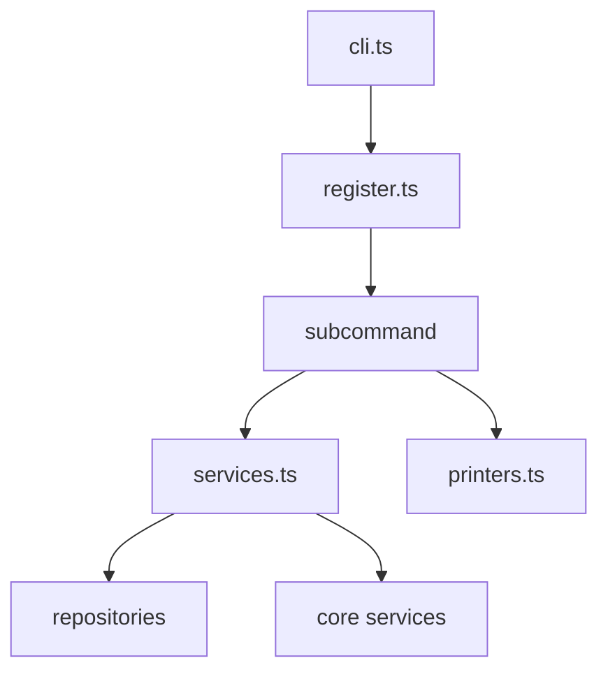

# v4 command 拆分重构专项计划

## 1. 目标

这份计划专门回答一个问题：

> 在进入 `v4` 的卷级 CLI 扩张前，如何先把现有 command 相关文件拆开，让命令层职责更内聚、扩展更安全、后续新增命令不再继续堆积到少数大文件中。

本计划服务于 [`plans/v4-creative-route-plan.md`](plans/v4-creative-route-plan.md:1) 的 `M5`，但单独拆出，便于先做结构治理，再接多章导演能力。

---

## 2. 当前问题

结合现有代码结构，命令层已经出现几个典型问题：

- [`src/cli/commands/chapter-commands.ts`](src/cli/commands/chapter-commands.ts:1) 同时承担命令注册、参数定义、服务装配、结果打印、局部流程控制，文件已经偏大
- [`src/cli/commands/workflow-commands.ts`](src/cli/commands/workflow-commands.ts:1) 后续还要继续接 `v4` 的卷级 planning / review / regression 入口，继续膨胀风险高
- [`src/cli/context.ts`](src/cli/context.ts:1) 当前负责数据库、日志、公共解析，但未来如果继续吸纳业务装配，会变成隐式总线
- 各命令文件内部存在大量 repository / service 实例化逻辑，导致：
  - 命令定义层太重
  - 同域命令难以复用装配逻辑
  - 新增命令时容易复制粘贴
  - 输出格式与业务执行耦合过深

这些问题在 `v3` 阶段还能接受，但到了 `v4`，命令层要新增卷级 planning、threads、ending、volume snapshot、volume doctor、volume regression，如果不先拆，会明显拖累迭代。

---

## 3. 重构原则

### 3.1 命令定义只负责入口

命令注册层只负责：

- 定义命令名
- 定义参数与选项
- 把参数交给执行器
- 输出简要结果或调用统一格式化器

不应继续承担大段 repository / service 装配细节。

### 3.2 同一命令域的装配逻辑应集中

例如 `chapter` 域内涉及：

- chapter show
- chapter rewrite
- chapter approve
- chapter drop

这些命令如果依赖相近的 repository / service，应由统一的 domain 级工厂或 helper 负责装配，而不是在每个 action 内重新拼一遍。

### 3.3 输出与执行分离

命令执行结果建议和终端打印逻辑分开：

- 执行器返回结构化结果
- formatter / printer 负责展示
- 这样后续 CLI、日志、snapshot、regression 更容易共享同一结果结构

### 3.4 新结构必须支持 `v4` 扩张

这次重构不是为了“代码更好看”，而是为了让 `v4` 的卷级命令可以直接挂进更清晰的结构中。

---

## 4. 推荐目录结构

建议把 [`src/cli/commands`](src/cli/commands:1) 下的结构逐步演化为：

```text
src/cli/
  commands/
    chapter/
      register.ts
      show.ts
      rewrite.ts
      approve.ts
      drop.ts
      printers.ts
      services.ts
    workflow/
      register.ts
      plan.ts
      review.ts
      rewrite.ts
      approve.ts
      printers.ts
      services.ts
    state/
      register.ts
      world.ts
      threads.ts
      ending.ts
      printers.ts
      services.ts
    doctor/
      register.ts
      project.ts
      chapter.ts
      volume.ts
      printers.ts
    snapshot/
      register.ts
      state.ts
      chapter.ts
      volume.ts
      printers.ts
    regression/
      register.ts
      list.ts
      run.ts
      printers.ts
  context.ts
  factories/
    chapter-command-factory.ts
    workflow-command-factory.ts
    state-command-factory.ts
```

第一阶段不需要一步到位，但建议至少先把大文件拆成“`register + 子命令 + printers + services`”四层。

---

## 5. 分阶段任务

## Phase 0：定义拆分边界

### 目标

先把哪些职责留在命令注册层、哪些移到 helper 层定义清楚。

### 任务

- 梳理 [`src/cli/commands/chapter-commands.ts`](src/cli/commands/chapter-commands.ts:1) 内部各 action 的职责边界
- 梳理 [`src/cli/commands/workflow-commands.ts`](src/cli/commands/workflow-commands.ts:1) 内部各 action 的职责边界
- 明确 [`src/cli/context.ts`](src/cli/context.ts:1) 的保留职责：
  - 数据库打开
  - 通用日志入口
  - 通用解析工具
- 明确禁止新增的职责：
  - 域业务装配堆积
  - 命令特定的业务判断
  - 大量结果格式拼接

### 完成定义

- 能明确区分命令层、装配层、执行层、展示层的边界

---

## Phase 1：拆 `chapter` 域

### 目标

优先拿 [`src/cli/commands/chapter-commands.ts`](src/cli/commands/chapter-commands.ts:1) 做样板重构，因为它最重、依赖最多、最能暴露结构问题。

### 任务

- 拆出 `register.ts`
- 把 `show / rewrite / approve / drop` 拆成独立子文件
- 把结果输出逻辑抽到 `printers.ts`
- 把 repository / service 装配抽到 `services.ts` 或 factory
- 让顶层 [`src/cli.ts`](src/cli.ts:3) 仍只调用一个注册入口

### 完成定义

- `chapter` 域不再由单文件承载所有命令
- 新增 `chapter` 子命令时无需继续修改大型文件主体

---

## Phase 2：拆 `workflow` 域

### 目标

在 `v4` 引入卷级 planning 前，先把 [`src/cli/commands/workflow-commands.ts`](src/cli/commands/workflow-commands.ts:1) 拆开。

### 任务

- 拆出 `plan / review / rewrite / approve` 子模块
- 为 `review show`、`rewrite show` 等输出抽 formatter
- 为 planning 相关服务装配预留卷级扩展位
- 保证 `v4` 的 `plan volume-window` 可以直接落入新结构

### 完成定义

- `workflow` 域可以平滑接入卷级 planning 与 review 扩展

---

## Phase 3：拆 `state / doctor / snapshot / regression` 域

### 目标

让后续卷级状态与诊断类命令在统一模式上演进。

### 任务

- 为 [`src/cli/commands/state-commands.ts`](src/cli/commands/state-commands.ts:1) 预留 `threads / ending / volume-plan`
- 为 [`src/cli/commands/doctor-commands.ts`](src/cli/commands/doctor-commands.ts:15) 预留 `volume`
- 为 [`src/cli/commands/snapshot-commands.ts`](src/cli/commands/snapshot-commands.ts:15) 预留 `volume`
- 为 [`src/cli/commands/regression-commands.ts`](src/cli/commands/regression-commands.ts:7) 预留卷级 case 执行器接口

### 完成定义

- 卷级命令不需要重新发明目录结构与装配方式

---

## 6. 推荐抽象层

建议新增三类辅助层：

### 6.1 `services.ts`

职责：

- 基于数据库创建该命令域所需 repository / service
- 聚合同域依赖
- 减少 action 内部的实例化噪音

### 6.2 `printers.ts`

职责：

- 接收结构化结果
- 统一终端打印风格
- 避免业务逻辑里夹杂大量 `console.log`

### 6.3 `register.ts`

职责：

- 只负责注册 commander 命令树
- 调用具体子命令模块的注册函数

---

## 7. 不建议做的事

这轮命令重构建议**不要**：

- 一次性把所有命令全部重写
- 为了重构而引入复杂 DI 框架
- 把简单命令过度工程化
- 在没有稳定边界前先改 [`src/cli/context.ts`](src/cli/context.ts:1) 成超大工厂层

重点是：

- 先拆大文件
- 先降复杂度
- 先为 `v4` 卷级命令扩张留位

---

## 8. 与 `v4` 主计划的衔接

这份专项计划建议在 [`plans/v4-creative-route-plan.md`](plans/v4-creative-route-plan.md:1) 中按以下方式落位：

- 在 `M4` 之后、卷级 CLI 开始前，先执行 command 拆分重构
- 注释强化与 command 拆分可并行，但注释强化应从 `M0-M1` 开始同步推进
- 卷级 CLI 的实现建立在拆分后的目录结构上

也就是说，建议顺序为：

1. `M0-M1` 同步补注释
2. 完成卷级真源与多章规划
3. 完成长线推进与结局收束核心逻辑
4. 先做 command 拆分重构
5. 再做卷级 CLI / doctor / snapshot / regression

---

## 9. 执行清单

- [ ] 梳理现有命令层职责边界
- [ ] 为 `chapter` 域设计拆分目录
- [ ] 为 `workflow` 域设计拆分目录
- [ ] 抽出 `services.ts` 装配层
- [ ] 抽出 `printers.ts` 展示层
- [ ] 保持 [`src/cli.ts`](src/cli.ts:3) 顶层入口稳定
- [ ] 为 `state / doctor / snapshot / regression` 预留卷级扩展位
- [ ] 在 `v4` 主计划中前置 command 拆分时序

---

## 10. 简化结构图


