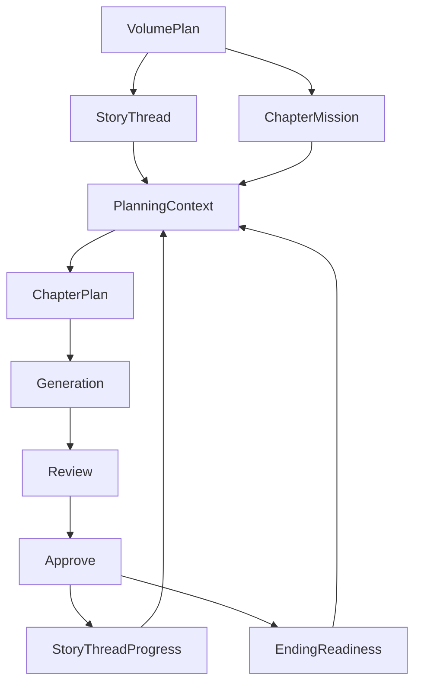

# AI 自动写小说工具 v4 创作路线计划

## 1. v4 总目标

`v4` 不再把重点放在“单章生成质量继续微调”或“运维工作流补齐”上，而是把系统从“章节级叙事操作系统”进一步升级成“多章连续推进的长篇创作导演系统”。

一句话定义：

> `v3` 解决的是单章状态、质量与工作流闭环，`v4` 要解决的是这些章节如何被组织成可连续推进、可控收束、可长期维持主线张力的多章创作链路。

`v4` 的优先级顺序建议固定为：

1. 多章连续规划
2. 长期主线推进控制
3. 结局收束与回收控制
4. 命令层拆分重构与可维护性强化
5. 最后再补配套验证与可视化

---

## 2. 为什么需要 v4

从当前 [`v3`](plans/v3-integrated-plan.md:1) 的完成情况看，系统已经基本具备：

- 单章级状态闭环
- 单章级 scene task 规划
- 单章级 review / rewrite / approve 主链路
- 债务、Hook 压力、角色弧线等局部叙事状态表达

但当前上限也很明显：

### 2.1 规划仍以“当前章”为中心，不是“章节串”

当前 [`PlanningService.planChapter()`](src/core/planning/service.ts:39) 已经能为单章生成结构化任务，但还缺少：

- 本卷未来数章的推进路线
- 每章在大主线中的职责分配
- 哪些债务应该本章处理，哪些应该延后
- 哪些 Hook 应该逐步升压，哪些应该进入兑现窗口

### 2.2 状态系统已经能表达压力，但还不能主动调度“长期推进节奏”

当前 [`PlanningContextBuilder.build()`](src/core/context/planning-context-builder.ts:30) 能把角色弧线、Hook 压力、叙事债务注入 planning，但系统仍偏“看见了压力”，还没真正做到：

- 自动判断哪条主线长期停滞
- 自动识别哪些角色弧线推进失衡
- 自动控制一卷内的主线/支线分配比
- 自动识别是否离结局太远或收束过早

### 2.3 结尾牵引有了，但“结局收束控制”还没建立

当前 [`GenerationService.writeNext()`](src/core/generation/service.ts:16) 与 [`ReviewService.reviewChapter()`](src/core/review/service.ts:46) 已经强调章节结尾牵引，但还缺少：

- 卷级收束目标
- 长篇终局准备度
- 已埋伏笔回收率
- 最终冲突所需前提是否成熟
- 主角弧线是否达到可收束阶段

因此，`v4` 的任务不是继续优化“单章写得更像小说”，而是让系统开始理解“下一组章节应该怎样连续推进，最终怎样走向结局”。

---

## 3. v4 设计原则

### 3.1 章节必须从“单点最优”升级为“序列最优”

- 单章精彩不代表长篇稳定
- 每章价值必须放到卷级推进和长线收束中衡量
- planning 必须知道“这章是这段弧线中的第几步”

### 3.2 长期主线必须显式建模，不能只靠 prompt 暗示

- 主线要有阶段
- 支线要有挂钩关系
- 高优先级债务要有承接窗口
- Hook 要有升压与兑现时间带

### 3.3 结局不是最后几章才考虑，而是全程受控收束

- 从中段开始就要知道哪些伏笔必须回收
- 哪些弧线必须在终局前完成准备
- 哪些世界事实需要提前锁定
- 哪些冲突必须在结局前进入不可逆阶段

### 3.4 规划、生成、审查必须共享“多章导演语义”

- planning 不只产出当前章任务，也要产出中程章节路线
- generation 必须知道当前章在多章链中的位置
- review 不只检查本章质量，也要检查是否偏离长线推进意图
- approve 不只提交本章结果，还要更新卷级推进状态

### 3.5 核心模型与主链逻辑必须可解释

- `domain` 层类型要补足结构化注释，明确每个模型在创作链中的职责
- 核心 service 的关键决策点要补足注释，说明为什么这样推进状态和质量控制
- 注释重点应放在“叙事语义”和“状态流转语义”，而不是重复代码表面行为
- 注释强化应从 `M0-M1` 开始同步执行，而不是等卷级能力做完后再补
- 后续新增类型和主链逻辑默认要把注释视作交付件的一部分

### 3.6 CLI 命令层必须按职责拆分，避免命令文件继续膨胀

- command 相关文件要按命令域拆分，而不是持续堆积到少数大文件中
- 命令注册、参数解析、服务装配、结果打印要尽量分层
- 复杂命令应优先抽为更内聚的模块，减少跨命令复制与隐式耦合
- `v4` 的新能力应建立在更清晰的命令结构上，而不是继续扩张现有大文件

---

## 4. v4 核心范围

### P0：多章导演基础设施

包含：

- 卷级计划模型
- 多章推进窗口
- 主线/支线任务池
- 结局准备度状态

### P1：多章连续规划系统

包含：

- `3-5` 章滚动规划
- 章节职责分配
- 主线推进节奏控制
- 债务与 Hook 的跨章安排

### P2：长期主线推进系统

包含：

- 主线阶段追踪
- 角色群像推进平衡
- 长线停滞检测
- 主线偏航审查

### P3：结局收束控制系统

包含：

- 回收清单
- 终局前提检测
- 收束风险审查
- 结局推进建议

### P4：可维护性与命令层重构

包含：

- `domain` 与核心逻辑注释强化
- service 主链关键决策点注释规范
- command 相关文件拆分重构
- 命令注册、装配、展示职责解耦

### P5：验证与产品化补强

包含：

- 多章回归样本
- 卷级 snapshot / doctor
- 主线推进报表
- 收束准备度报告

---

## 5. v4 总执行顺序

建议执行顺序如下：

1. 先定义卷级计划与多章路线真源，并从 `M0` 开始同步补注释
2. 再把 [`PlanningContextBuilder.build()`](src/core/context/planning-context-builder.ts:30) 和 [`PlanningService.planChapter()`](src/core/planning/service.ts:39) 升级为滚动规划入口，并在 `M1` 同步补注释
3. 再把 [`ReviewService.reviewChapter()`](src/core/review/service.ts:46) 与 [`ApproveService.approveChapter()`](src/core/approve/service.ts:88) 升级为长线推进校验与提交入口
4. 再补结局收束控制
5. 先完成命令层拆分重构，执行方式以 [`plans/v4-command-refactor-plan.md`](plans/v4-command-refactor-plan.md:1) 为准，再进入卷级 CLI 扩张
6. 持续补齐剩余核心链路的可解释性注释
7. 最后补卷级 CLI 与回归验证

如果顺序反过来，会出现：

- 没有卷级真源就开始做结局控制，容易变成 prompt 口号
- 没有多章规划就做主线推进，系统无法判断“本章为何该推进这件事”
- 没有终局前提模型就做收束检查，报告会很空泛

---

## 6. 里程碑拆解

## M0：卷级计划与多章导演真源

### M0 目标

建立一个高于单章 [`ChapterPlan`](src/shared/types/domain.ts:343) 的卷级规划层，使系统能表达未来数章的中程推进意图。

### M0 模块任务

- [`src/shared/types/domain.ts`](src/shared/types/domain.ts:1)
  - 新增 `VolumePlan`
  - 新增 `ChapterMission`
  - 新增 `StoryThread`
  - 新增 `ThreadStage`
  - 新增 `RollingPlanWindow`
  - 新增 `EndingSetupRequirement`
  - 同步补足这些卷级模型的结构化注释与字段语义说明
- [`src/infra/db/schema.ts`](src/infra/db/schema.ts:1)
  - 新增 `volume_plans`
  - 新增 `story_threads`
  - 新增 `chapter_missions`
- `src/infra/repository/volume-plan-repository.ts`
  - `create`
  - `getLatestByVolumeId`
  - `listByVolumeId`
- `src/infra/repository/story-thread-repository.ts`
  - `createBatch`
  - `listActiveByBookId`
  - `upsert`

### M0 完成定义

- 系统可以表达未来 `3-5` 章的推进窗口
- 每章可以被分配“主线职责”与“支线职责”
- 主线推进不再只依赖单章 [`ChapterPlan`](src/shared/types/domain.ts:343)
- 卷级核心 `domain` 模型已具备注释化语义，可直接支持后续实现与评审

---

## M1：多章连续规划

### M1 目标

让 planning 从“当前章计划生成器”升级为“滚动多章导演器”。

### M1 模块任务

- [`src/core/context/planning-context-builder.ts`](src/core/context/planning-context-builder.ts:30)
  - 注入当前卷的最新 `VolumePlan`
  - 注入活跃 `StoryThread`
  - 注入未来若干章的 mission 空槽
  - 注入结局准备度约束
  - 为卷级上下文拼装逻辑补足注释
- [`src/core/planning/service.ts`](src/core/planning/service.ts:39)
  - 新增 `planVolumeWindow()`
  - 补强 `planChapter()` 使其消费卷级 mission
  - 让单章 planning 自动解释“本章在多章窗口中的职责”
  - 为多章规划决策点补足注释
- [`src/infra/repository/chapter-plan-repository.ts`](src/infra/repository/chapter-plan-repository.ts:1)
  - 持久化 mission 引用字段
  - 持久化跨章承接字段
- [`src/cli/commands/workflow-commands.ts`](src/cli/commands/workflow-commands.ts:1)
  - 新增 `plan volume-window <volumeId>`
  - 新增 `plan mission show <chapterId>`

### M1 完成定义

- planning 能生成未来 `3-5` 章连续路线
- 当前章计划明确知道自己承担哪条主线推进任务
- 多章之间不再只是“上一章摘要 + 当前章目标”的弱承接
- `M1` 范围内的核心上下文与规划逻辑已同步具备注释化解释

---

## M2：长期主线推进控制

### M2 目标

让系统能够跟踪一条主线是否持续推进，而不是只统计局部状态变化。

### M2 模块任务

- [`src/shared/types/domain.ts`](src/shared/types/domain.ts:1)
  - 新增 `StoryThreadProgress`
  - 新增 `ThreadPriority`
  - 新增 `ThreadDriftRisk`
  - 新增 `ChapterThreadImpact`
- [`src/core/review/service.ts`](src/core/review/service.ts:46)
  - 检查本章是否完成指定主线推进任务
  - 检查是否发生主线偏航
  - 检查是否长期忽略高优先级线程
- [`src/core/approve/service.ts`](src/core/approve/service.ts:88)
  - 根据 outcome 更新 `StoryThreadProgress`
  - 标记线程是推进、停滞、转折还是兑现
- `src/infra/repository/story-thread-progress-repository.ts`
  - `create`
  - `getLatestByThreadId`
  - `listByBookId`

### M2 完成定义

- review 能指出“这章写得还行，但主线没推进”
- approve 后系统能更新主线推进状态，而不是只更新角色/Hook/债务
- planning 的输入从“静态状态”升级为“动态推进轨迹”

---

## M3：角色群像与多线平衡

### M3 目标

解决长篇常见问题：某些角色长期消失、某些支线长期闲置、群像推进比例失衡。

### M3 模块任务

- [`src/shared/types/domain.ts`](src/shared/types/domain.ts:1)
  - 新增 `CharacterPresenceWindow`
  - 新增 `EnsembleBalanceReport`
  - 新增 `SubplotCarryRequirement`
- [`src/core/context/planning-context-builder.ts`](src/core/context/planning-context-builder.ts:30)
  - 注入近几章角色出场窗口
  - 注入支线承接缺口
- [`src/core/planning/service.ts`](src/core/planning/service.ts:39)
  - 在 `ChapterPlan` 中加入群像平衡约束
  - 识别哪些角色与支线本章需要被重新拉回叙事视野
- [`src/core/review/service.ts`](src/core/review/service.ts:46)
  - 检查是否继续放大群像失衡

### M3 完成定义

- 系统能识别某角色或支线是否被长期遗忘
- planning 能主动安排“回收出场权”与“支线再挂接”

---

## M4：结局收束控制

### M4 目标

让系统从中后段开始对“终局准备度”进行持续管理，而不是最后几章突击收线。

### M4 模块任务

- [`src/shared/types/domain.ts`](src/shared/types/domain.ts:1)
  - 新增 `EndingReadiness`
  - 新增 `PayoffRequirement`
  - 新增 `ClosureGap`
  - 新增 `FinalConflictPrerequisite`
- [`src/core/review/service.ts`](src/core/review/service.ts:46)
  - 检查本章是否补足终局前提
  - 检查是否制造新的高风险未回收项
  - 检查是否过早收束或过晚收束
- [`src/core/approve/service.ts`](src/core/approve/service.ts:88)
  - 更新结局准备度
  - 更新已回收伏笔与剩余回收清单
- [`src/cli/commands/state-commands.ts`](src/cli/commands/state-commands.ts:1)
  - 新增 `state ending`
  - 展示终局前提成熟度、未回收项、收束风险

### M4 完成定义

- 系统能回答“现在离可写结局还有多远”
- 系统能回答“哪些伏笔与冲突必须在终局前处理”
- review 能指出收束风险，而不是只指出单章问题

---

## M5：命令层拆分重构

这部分执行以 [`plans/v4-command-refactor-plan.md`](plans/v4-command-refactor-plan.md:1) 为专项依据。

### M5 目标

在进入卷级 CLI 扩张前，先把现有 command 相关文件按职责拆开，避免 `v4` 新命令继续叠加到高复杂度文件上。

### M5 模块任务

- `src/cli/commands/`
  - 按命令域拆分大型命令文件
  - 抽离命令装配辅助函数
  - 抽离格式化输出与结果打印函数
  - 抽离 service 装配逻辑，减少命令定义文件中的依赖堆积
- [`src/cli.ts`](src/cli.ts:3)
  - 保持顶层注册简洁，只负责挂接模块化后的命令入口
- [`src/cli/context.ts`](src/cli/context.ts:1)
  - 明确保留通用数据库、日志、公共解析入口
  - 避免继续承担命令域业务逻辑

### M5 完成定义

- command 相关文件职责更内聚，单文件复杂度下降
- 卷级 CLI 新命令可以落在新结构中，而不是继续堆积到现有大文件
- 后续 `v4` CLI 能在更清晰的模块边界上扩展

---

## M6：注释强化与可解释性补强

### M6 目标

在卷级能力继续扩张前后，同步提升代码可解释性，特别是 `domain` 与核心主链逻辑的叙事语义说明。

### M6 模块任务

- [`src/shared/types/domain.ts`](src/shared/types/domain.ts:1)
  - 为新增的卷级模型补足注释
  - 为已有关键模型补足职责说明、字段语义说明、状态流转说明
- [`src/core/planning/service.ts`](src/core/planning/service.ts:39)
  - 为多章规划决策点补足注释
- [`src/core/review/service.ts`](src/core/review/service.ts:46)
  - 为主线推进审查、偏航判断、收束风险判断补足注释
- [`src/core/approve/service.ts`](src/core/approve/service.ts:88)
  - 为线程进度提交、终局准备度更新补足注释

### M6 完成定义

- `domain` 与核心主链逻辑的叙事语义可直接从代码中读懂
- 新增卷级能力不再依赖隐式知识理解

---

## M7：生成链路接入卷级导演语义

### M7 目标

让正文生成真正感知自己在长线中的位置。

### M7 模块任务

- [`src/core/context/writing-context-builder.ts`](src/core/context/writing-context-builder.ts:12)
  - 注入 chapter mission
  - 注入 story thread priority
  - 注入 ending readiness
  - 注入本章在卷级窗口中的位置
- [`src/core/generation/service.ts`](src/core/generation/service.ts:16)
  - prompt 增加“本章职责层”
  - prompt 增加“不可抢跑收束 / 不可拖延主线”的约束
- [`src/core/rewrite/service.ts`](src/core/rewrite/service.ts:1)
  - 策略增加 thread-focus、closure-focus、ensemble-balance

### M7 完成定义

- generation 写作不再只围绕 scene task，也围绕卷级 mission 展开
- rewrite 可以针对“主线推进不足”或“收束准备不足”做定向修复

---

## M8：卷级 CLI、报告与验证

### M8 目标

为 `v4` 的多章导演能力提供可检查、可回归、可解释入口。

### M8 模块任务

- [`src/cli/commands/state-commands.ts`](src/cli/commands/state-commands.ts:1)
  - 新增 `state threads`
  - 新增 `state volume-plan <volumeId>`
- [`src/cli/commands/doctor-commands.ts`](src/cli/commands/doctor-commands.ts:15)
  - 新增卷级推进诊断
  - 检查主线停滞、回收缺口、群像失衡
- [`src/cli/commands/snapshot-commands.ts`](src/cli/commands/snapshot-commands.ts:15)
  - 新增 `snapshot volume <volumeId>`
- [`src/cli/commands/regression-commands.ts`](src/cli/commands/regression-commands.ts:7)
  - 新增多章连续规划回归 case
  - 新增收束准备度回归 case
- `plans/v4-regression-cases.md`
  - 固化多章推进样本
  - 固化终局收束样本

### M8 完成定义

- `v4` 的卷级导演能力可以被命令化检查
- 回归不只看单章 review，还能看多章推进是否跑偏

---

## 7. 推荐第一批执行任务

如果要从 `v4` 开始实现，建议第一批只做下面六件事：

1. 在 [`src/shared/types/domain.ts`](src/shared/types/domain.ts:1) 中定义 `VolumePlan / StoryThread / ChapterMission / EndingReadiness`，并同步补结构化注释
2. 增加卷级仓储与表结构
3. 先升级 [`PlanningContextBuilder.build()`](src/core/context/planning-context-builder.ts:30) 与 [`PlanningService.planChapter()`](src/core/planning/service.ts:39)，并同步补关键注释
4. 再让 [`ReviewService.reviewChapter()`](src/core/review/service.ts:46) 能检查“本章是否完成卷级 mission”
5. 先启动 command 相关文件拆分，优先收口大型命令文件职责，执行依据为 [`plans/v4-command-refactor-plan.md`](plans/v4-command-refactor-plan.md:1)
6. 再继续扩展剩余核心 service 的结构化注释

这样做的原因是：

- 先做卷级真源，后续 generation / review / approve 才有统一输入
- 先做多章规划，再做结局收束，收束控制才不会悬空
- 先让 review 能指出“长线没推进”，系统价值会立刻上升

---

## 8. v4 执行清单

- [ ] 定义卷级计划与故事线程核心类型
- [ ] 在 `M0-M1` 同步为 `domain` 与规划核心逻辑补结构化注释
- [ ] 增加卷级数据库表与 repository
- [ ] 为 planning 注入卷级上下文
- [ ] 实现多章滚动规划入口
- [ ] 为单章计划增加 mission 语义
- [ ] 为 review 增加主线推进与偏航检查
- [ ] 为 approve 增加线程进度与终局准备度提交
- [ ] 先按 [`plans/v4-command-refactor-plan.md`](plans/v4-command-refactor-plan.md:1) 拆分重构 command 相关文件并收敛职责
- [ ] 为 generation / rewrite 接入卷级导演约束
- [ ] 增加卷级 state / doctor / snapshot / regression 命令
- [ ] 固化 `v4` 回归样本与计划文档

---

## 9. 简化架构图

## 10. 这版 v4 的边界

本版 `v4` 建议**先不做**：

- 自动生成整卷完整大纲
- 跨卷级全自动终局重排
- 多版本分叉宇宙管理
- 全自动批量重写整卷

本版 `v4` 只聚焦：

- 把“单章优秀”升级为“多章连续稳定”
- 把“局部状态更新”升级为“长期主线推进控制”
- 把“章节结尾牵引”升级为“终局收束准备度管理”
