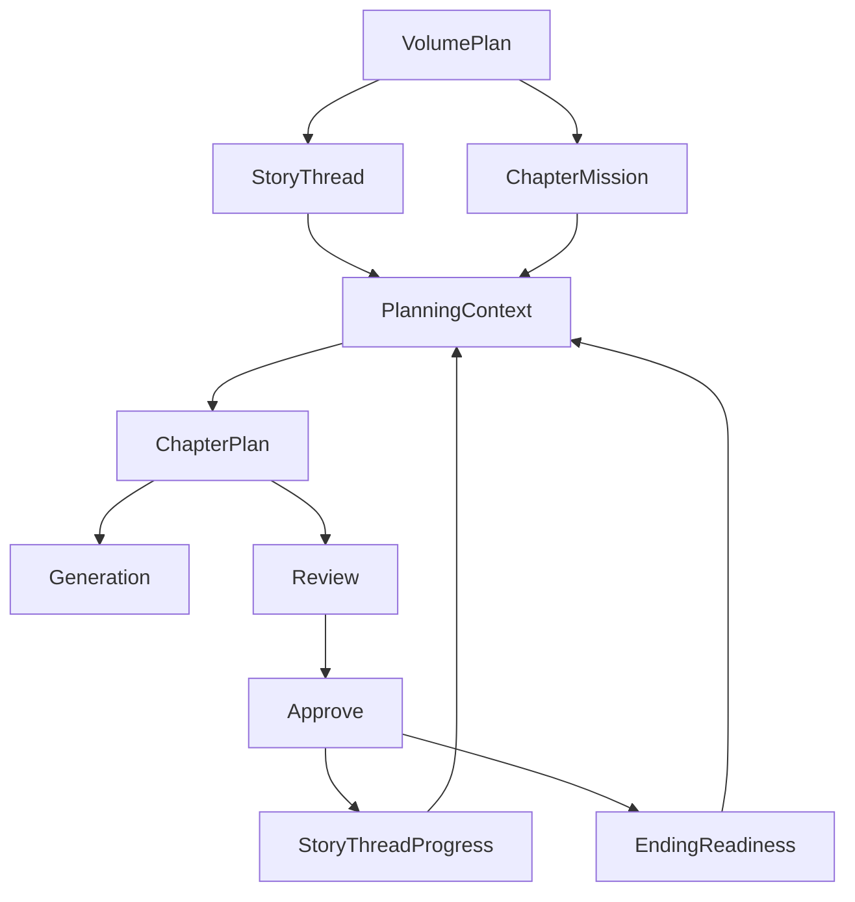

# AI 自动写小说工具 v4 模块级任务拆解

## 1. 这份文档的用途

- 这份文档是 [`plans/v4-creative-route-plan.md`](plans/v4-creative-route-plan.md:1) 的执行层拆解版本
- 同时吸收 [`plans/v4-command-refactor-plan.md`](plans/v4-command-refactor-plan.md:1) 中的命令层治理要求
- 目标不是重复解释 `v4` 的理念，而是回答“下一步先写什么文件、做什么模块、按什么顺序推进”
- 适合直接排开发任务，也适合后续切到实现模式逐项验收

---

## 2. v4 总执行策略

`v4` 的核心不是继续单章打磨，而是让系统开始稳定处理“多章连续规划、长期主线推进、终局收束准备”这三件事。

你已经把 `v4` 的路线定为创作优先，因此推荐执行顺序固定为：

1. 先建立卷级计划真源
2. 再建立多章连续规划入口
3. 再把主线推进检测与提交接入主链
4. 再建立终局准备度与回收控制
5. 在卷级 CLI 扩张前完成 command 拆分重构
6. 从 `M0-M1` 开始同步补 `domain` 与核心逻辑注释
7. 最后补卷级 CLI、回归、报表与文档固化

如果顺序反过来，会出现：

- 卷级 CLI 先长出来，但底层没有稳定卷级真源
- 主线推进检查先做，但 planning 还没有多章职责语义
- 终局收束报告先做，但系统还不知道哪些章节在承担哪条线程
- 命令层不先拆，后续 `volume-plan / threads / ending / volume snapshot / volume doctor` 会继续堆进大文件
- 注释不从前期同步补，后续 `domain` 与核心 service 的叙事语义会越来越依赖隐式知识

---

## 3. v4 模块总览

`v4` 建议优先新增或强化的模块：

- [`src/shared/types/domain.ts`](src/shared/types/domain.ts:1)
- [`src/infra/db/schema.ts`](src/infra/db/schema.ts:1)
- `src/infra/repository/volume-plan-repository.ts`
- `src/infra/repository/story-thread-repository.ts`
- `src/infra/repository/story-thread-progress-repository.ts`
- `src/infra/repository/ending-readiness-repository.ts`
- [`src/infra/repository/chapter-plan-repository.ts`](src/infra/repository/chapter-plan-repository.ts:1)
- [`src/core/context/planning-context-builder.ts`](src/core/context/planning-context-builder.ts:30)
- [`src/core/context/writing-context-builder.ts`](src/core/context/writing-context-builder.ts:12)
- [`src/core/planning/service.ts`](src/core/planning/service.ts:39)
- [`src/core/review/service.ts`](src/core/review/service.ts:46)
- [`src/core/approve/service.ts`](src/core/approve/service.ts:88)
- [`src/core/generation/service.ts`](src/core/generation/service.ts:16)
- [`src/core/rewrite/service.ts`](src/core/rewrite/service.ts:1)
- [`src/cli.ts`](src/cli.ts:3)
- [`src/cli/context.ts`](src/cli/context.ts:1)
- `src/cli/commands/chapter/register.ts`
- `src/cli/commands/chapter/services.ts`
- `src/cli/commands/chapter/printers.ts`
- `src/cli/commands/workflow/register.ts`
- `src/cli/commands/workflow/services.ts`
- `src/cli/commands/workflow/printers.ts`
- `src/cli/commands/state/register.ts`
- `src/cli/commands/doctor/register.ts`
- `src/cli/commands/snapshot/register.ts`
- `src/cli/commands/regression/register.ts`
- [`src/cli/commands/state-commands.ts`](src/cli/commands/state-commands.ts:1)
- [`src/cli/commands/chapter-commands.ts`](src/cli/commands/chapter-commands.ts:1)
- [`src/cli/commands/doctor-commands.ts`](src/cli/commands/doctor-commands.ts:15)
- [`src/cli/commands/snapshot-commands.ts`](src/cli/commands/snapshot-commands.ts:15)
- [`src/cli/commands/regression-commands.ts`](src/cli/commands/regression-commands.ts:7)
- [`plans/v4-command-refactor-plan.md`](plans/v4-command-refactor-plan.md:1)
- `plans/v4-regression-cases.md`

---

## 4. 里程碑拆解

## M0：卷级计划真源与注释化建模

### M0 目标

先建立高于单章计划的卷级真源，同时从一开始就把核心模型注释写清楚，避免后续实现建立在含混语义上。

### M0 模块任务

#### A. [`src/shared/types/domain.ts`](src/shared/types/domain.ts:1)

新增或补强：

- `VolumePlan`
- `RollingPlanWindow`
- `ChapterMission`
- `StoryThread`
- `ThreadStage`
- `ThreadPriority`
- `EndingSetupRequirement`
- `EndingReadiness`
- `PayoffRequirement`
- `ClosureGap`
- `FinalConflictPrerequisite`

注释要求：

- 为每个卷级模型写职责说明
- 为关键字段写语义说明
- 为状态型字段写阶段流转说明
- 为 mission / thread / readiness 的相互关系写总注释

完成定义：

- `v4` 的卷级真源有统一类型契约
- 仅看 [`src/shared/types/domain.ts`](src/shared/types/domain.ts:1) 就能理解卷级导演语义

#### B. [`src/infra/db/schema.ts`](src/infra/db/schema.ts:1)

新增：

- `volume_plans`
- `story_threads`
- `chapter_missions`
- `story_thread_progress`
- `ending_readiness_current`

建议字段至少包括：

- `volume_id`
- `window_start_chapter_index`
- `window_end_chapter_index`
- `thread_id`
- `mission_type`
- `priority`
- `stage`
- `progress_status`
- `closure_score`
- `risk_level`
- `updated_at`

完成定义：

- 卷级计划、线程、终局准备度有可落库真源

#### C. `src/infra/repository/volume-plan-repository.ts`

交付件：

- `create()`
- `getLatestByVolumeId()`
- `listByVolumeId()`

完成定义：

- 任意卷都能读取最新卷级计划

#### D. `src/infra/repository/story-thread-repository.ts`

交付件：

- `createBatch()`
- `listActiveByBookId()`
- `listByVolumeId()`
- `upsert()`

完成定义：

- 主线、支线、角色线都能被结构化读取

#### E. `src/infra/repository/ending-readiness-repository.ts`

交付件：

- `getByBookId()`
- `upsert()`

完成定义：

- 终局准备度成为可持续更新的当前状态，而不是临时计算结果

### M0 验收

- 系统可以表达未来 `3-5` 章的卷级推进窗口
- 每章可以被分配明确 mission
- `domain` 中的卷级模型已具备注释化解释
- 数据层已具备卷级真源落位

---

## M1：多章连续规划与注释化上下文

### M1 目标

让 planning 从“当前章计划”升级为“滚动窗口规划”，并同步把上下文拼装与决策点注释清楚。

### M1 模块任务

#### A. [`src/core/context/planning-context-builder.ts`](src/core/context/planning-context-builder.ts:30)

补强：

- 注入最新 `VolumePlan`
- 注入活跃 `StoryThread`
- 注入当前章 `ChapterMission`
- 注入未来窗口章节槽位
- 注入 `EndingReadiness`
- 注入线程优先级与停滞风险

注释要求：

- 标明每类上下文为何进入 planning
- 标明卷级上下文与单章状态上下文的边界
- 标明哪些字段服务于当章，哪些字段服务于窗口级连续性

完成定义：

- planning 上下文不再只围绕“上一章 + 当前章”构建
- 卷级拼装逻辑可直接从代码读懂

#### B. [`src/core/planning/service.ts`](src/core/planning/service.ts:39)

补强：

- 新增 `planVolumeWindow()`
- 补强 [`PlanningService.planChapter()`](src/core/planning/service.ts:39) 使其消费 mission
- 在 `ChapterPlan` 中明确记录：
  - `missionId`
  - `threadFocus`
  - `windowRole`
  - `carryInTasks`
  - `carryOutTasks`

注释要求：

- 为滚动规划策略补注释
- 为任务分配规则补注释
- 为“本章为何承担该职责”补注释

完成定义：

- planning 能生成未来 `3-5` 章连续路线
- 当前章计划明确知道自己承担哪条线程推进任务
- 规划核心逻辑已同步具备注释解释

#### C. [`src/infra/repository/chapter-plan-repository.ts`](src/infra/repository/chapter-plan-repository.ts:1)

补强：

- 持久化 mission 引用字段
- 持久化跨章承接字段
- 持久化 thread focus 字段

完成定义：

- 单章计划与卷级 mission 能稳定关联

#### D. [`src/cli/commands/workflow-commands.ts`](src/cli/commands/workflow-commands.ts:1)

只做最小补强，不做大扩张：

- 预留 `plan volume-window <volumeId>` 接口位
- 预留 `plan mission show <chapterId>` 展示位

完成定义：

- 在 command 重构前，只保留最小过渡入口

### M1 验收

- planning 能生成滚动窗口计划
- 单章与卷级 mission 已关联
- `M1` 范围内的上下文与规划逻辑完成注释强化

---

## M2：长期主线推进控制

### M2 目标

让系统开始判断“某条线程有没有真正推进”，而不是只看状态是否变化。

### M2 模块任务

#### A. [`src/shared/types/domain.ts`](src/shared/types/domain.ts:1)

新增或补强：

- `StoryThreadProgress`
- `ChapterThreadImpact`
- `ThreadDriftRisk`
- `ThreadProgressStatus`

完成定义：

- 主线推进、停滞、偏航、兑现有统一表达结构

#### B. [`src/core/review/service.ts`](src/core/review/service.ts:46)

补强：

- 检查本章是否完成 mission 指定推进
- 检查高优先级线程是否继续停滞
- 检查是否发生主线偏航
- 检查是否把过多篇幅投入低优先级支线

注释要求：

- 为线程推进检查标准补注释
- 为偏航判定补注释
- 为“推进不足但单章可读”这类情况补解释

完成定义：

- review 能指出“这章质量尚可，但主线没推进”

#### C. [`src/core/approve/service.ts`](src/core/approve/service.ts:88)

补强：

- 根据 outcome 更新 `StoryThreadProgress`
- 标记线程是推进、停滞、转折还是兑现
- 记录本章对各线程的影响摘要

注释要求：

- 为线程进度提交流程补注释
- 为 outcome 与 thread progress 的映射规则补注释

完成定义：

- approve 成为主线推进状态的提交入口

#### D. `src/infra/repository/story-thread-progress-repository.ts`

交付件：

- `create()`
- `getLatestByThreadId()`
- `listByBookId()`
- `listRecentByChapterWindow()`

完成定义：

- 系统可追踪线程推进轨迹，而不是只有当前值

### M2 验收

- review 能提示主线停滞与偏航
- approve 后主线推进轨迹可回读
- planning 可消费动态推进轨迹

---

## M3：角色群像与多线平衡

### M3 目标

解决长篇中常见的角色消失、支线闲置、群像失衡问题，让系统能主动安排“谁该回来”。

### M3 模块任务

#### A. [`src/shared/types/domain.ts`](src/shared/types/domain.ts:1)

新增或补强：

- `CharacterPresenceWindow`
- `EnsembleBalanceReport`
- `SubplotCarryRequirement`
- `CharacterFocusPriority`

完成定义：

- 群像平衡成为可结构化分析的问题，而不是感性判断

#### B. [`src/core/context/planning-context-builder.ts`](src/core/context/planning-context-builder.ts:30)

补强：

- 注入近几章角色出场窗口
- 注入支线承接缺口
- 注入群像失衡信号

完成定义：

- planning 能知道哪些角色与支线正在被长期忽视

#### C. [`src/core/planning/service.ts`](src/core/planning/service.ts:39)

补强：

- 在 `ChapterPlan` 中加入群像平衡约束
- 自动识别哪些角色和支线本章应被拉回

完成定义：

- planning 能主动安排“回收出场权”而非被动等待

#### D. [`src/core/review/service.ts`](src/core/review/service.ts:46)

补强：

- 检查本章是否继续放大群像失衡
- 检查 mission 是否过度偏向单线程

完成定义：

- review 能指出群像推进失衡，而不只指出局部问题

### M3 验收

- 系统能识别哪些角色和支线被长期遗忘
- planning 能主动承接群像再平衡任务

---

## M4：结局收束控制

### M4 目标

让系统从中后段开始持续管理“离可写结局还有多远”，而不是最后几章临时补线。

### M4 模块任务

#### A. [`src/shared/types/domain.ts`](src/shared/types/domain.ts:1)

补强：

- `EndingReadiness`
- `PayoffRequirement`
- `ClosureGap`
- `FinalConflictPrerequisite`
- `ClosureRiskLevel`

完成定义：

- 终局准备度、回收缺口、前提成熟度有统一模型

#### B. [`src/core/review/service.ts`](src/core/review/service.ts:46)

补强：

- 检查本章是否补足终局前提
- 检查是否制造新的高风险未回收项
- 检查是否过早收束或过晚收束

完成定义：

- review 能给出结局收束风险，而不是只关注本章文本表现

#### C. [`src/core/approve/service.ts`](src/core/approve/service.ts:88)

补强：

- 更新 `EndingReadiness`
- 更新已回收伏笔与剩余回收清单
- 更新终局前提成熟度

完成定义：

- approve 成为终局准备度的真源提交入口

#### D. [`src/cli/commands/state-commands.ts`](src/cli/commands/state-commands.ts:1)

预留或补强：

- `state ending`
- 展示：
  - 前提成熟度
  - 未回收项
  - 收束风险
  - 建议优先处理线程

完成定义：

- 系统能回答“现在离可写结局还有多远”

### M4 验收

- 系统知道哪些伏笔和冲突必须在终局前处理
- review 能指出收束风险
- approve 后终局准备度可回读

---

## M5：command 拆分重构

这部分执行以 [`plans/v4-command-refactor-plan.md`](plans/v4-command-refactor-plan.md:1) 为专项依据。

### M5 目标

在卷级 CLI 扩张前，先把现有 command 相关文件按职责拆开，给后续 `v4` 命令留出可扩展结构。

### M5 模块任务

#### A. [`src/cli/commands/chapter-commands.ts`](src/cli/commands/chapter-commands.ts:1)

拆分为：

- `src/cli/commands/chapter/register.ts`
- `src/cli/commands/chapter/show.ts`
- `src/cli/commands/chapter/rewrite.ts`
- `src/cli/commands/chapter/approve.ts`
- `src/cli/commands/chapter/drop.ts`
- `src/cli/commands/chapter/printers.ts`
- `src/cli/commands/chapter/services.ts`

完成定义：

- `chapter` 域不再由单文件承载全部子命令

#### B. [`src/cli/commands/workflow-commands.ts`](src/cli/commands/workflow-commands.ts:1)

拆分为：

- `src/cli/commands/workflow/register.ts`
- `src/cli/commands/workflow/plan.ts`
- `src/cli/commands/workflow/review.ts`
- `src/cli/commands/workflow/rewrite.ts`
- `src/cli/commands/workflow/approve.ts`
- `src/cli/commands/workflow/printers.ts`
- `src/cli/commands/workflow/services.ts`

完成定义：

- `workflow` 域为卷级 planning 扩张预留清晰落点

#### C. [`src/cli/context.ts`](src/cli/context.ts:1)

边界收敛：

- 保留数据库、日志、公共解析入口
- 不继续承载命令域业务装配

完成定义：

- `context` 继续是通用入口，而不是隐式业务总线

#### D. [`src/cli.ts`](src/cli.ts:3)

补强：

- 仅挂接模块化后的 register 入口
- 保持顶层清爽

完成定义：

- 顶层 CLI 注册保持稳定

### M5 验收

- command 相关文件职责更内聚
- 大文件复杂度下降
- 后续卷级命令可以直接挂入拆分后的结构

---

## M6：生成链路接入卷级导演语义

### M6 目标

让 generation 和 rewrite 真正理解“当前章在多章链中的职责”。

### M6 模块任务

#### A. [`src/core/context/writing-context-builder.ts`](src/core/context/writing-context-builder.ts:12)

补强：

- 注入 `chapter mission`
- 注入 `story thread priority`
- 注入 `ending readiness`
- 注入当前章在窗口中的位置

完成定义：

- 写作上下文真正具备卷级视角

#### B. [`src/core/generation/service.ts`](src/core/generation/service.ts:16)

补强：

- prompt 增加“本章职责层”
- prompt 增加“不可抢跑收束”的约束
- prompt 增加“不可拖延高优先级线程”的约束

完成定义：

- generation 不再只围绕 scene task，也围绕卷级 mission 展开

#### C. [`src/core/rewrite/service.ts`](src/core/rewrite/service.ts:1)

补强：

- 增加 `thread-focus`
- 增加 `closure-focus`
- 增加 `ensemble-balance`

完成定义：

- rewrite 能针对主线推进不足、收束准备不足、群像失衡做定向修复

### M6 验收

- generation 能体现卷级任务语义
- rewrite 可针对长线问题切换策略

---

## M7：卷级 CLI、报告与回归验证

### M7 目标

把 `v4` 的多章导演能力变成可检查、可回归、可报告的正式工作流。

### M7 模块任务

#### A. `src/cli/commands/state/`

交付件：

- `threads`
- `volume-plan <volumeId>`
- `ending`

完成定义：

- 卷级状态能被命令化查看

#### B. `src/cli/commands/doctor/`

交付件：

- `doctor volume <volumeId>`

检查内容建议包括：

- 主线停滞
- 回收缺口
- 群像失衡
- mission 断链

完成定义：

- 卷级创作风险可命令化诊断

#### C. `src/cli/commands/snapshot/`

交付件：

- `snapshot volume <volumeId>`

完成定义：

- 卷级导演状态可以被快照化保留

#### D. `src/cli/commands/regression/`

交付件：

- 多章连续规划回归 case
- 主线推进回归 case
- 终局准备度回归 case

完成定义：

- 回归不只看单章 review，还能看多章推进是否跑偏

#### E. `plans/v4-regression-cases.md`

交付件：

- 固化多章推进样本
- 固化终局收束样本
- 固化 command 重构后的 CLI 验收样本

完成定义：

- `v4` 回归样本与命令验收口径固定下来

### M7 验收

- 卷级 CLI、doctor、snapshot、regression 可用
- `v4` 关键能力可通过样本回归验证

---

## 5. 第一批推荐执行任务

如果切到实现模式，建议第一批先做下面七件事：

1. 在 [`src/shared/types/domain.ts`](src/shared/types/domain.ts:1) 中定义卷级核心类型，并同步补结构化注释
2. 在 [`src/infra/db/schema.ts`](src/infra/db/schema.ts:1) 中增加卷级表结构
3. 新建 `volume-plan`、`story-thread`、`ending-readiness` 相关 repository
4. 升级 [`PlanningContextBuilder.build()`](src/core/context/planning-context-builder.ts:30) 以消费卷级真源
5. 升级 [`PlanningService.planChapter()`](src/core/planning/service.ts:39) 并新增 `planVolumeWindow()`
6. 升级 [`ReviewService.reviewChapter()`](src/core/review/service.ts:46) 使其能检查 mission 完成度与主线停滞
7. 启动 `chapter / workflow` 两个命令域的拆分重构，按 [`plans/v4-command-refactor-plan.md`](plans/v4-command-refactor-plan.md:1) 执行

---

## 6. v4 执行清单

- [x] 定义卷级计划、线程、终局准备度核心类型
- [x] 从 `M0-M1` 同步补 `domain` 与规划核心逻辑注释
- [x] 增加卷级数据库表与 repository
- [x] 为 planning 注入卷级上下文
- [x] 实现多章滚动规划入口
- [x] 为单章计划增加 mission 语义
- [x] 为 review 增加主线推进与偏航检查
- [x] 为 approve 增加线程进度与终局准备度提交
- [x] 为角色群像与支线平衡建立结构化检测
- [x] 先按 [`plans/v4-command-refactor-plan.md`](plans/v4-command-refactor-plan.md:1) 拆分重构 command 相关文件
- [x] 为 generation / rewrite 接入卷级导演约束
- [x] 增加卷级 state / doctor / snapshot / regression 命令
- [x] 固化 `v4` 回归样本与计划文档

---

## 7. 简化架构图

## 8. 这版 task breakdown 的边界

这份拆解当前**不包含**：

- 自动整卷大纲生成
- 跨卷自动重排结局
- 多宇宙分支管理
- 全自动批量重写整卷

这份拆解只聚焦：

- 卷级真源
- 多章连续规划
- 长线推进控制
- 终局准备度管理
- command 层为 `v4` 扩张做结构治理
- 注释从前期同步补，减少后续理解成本
