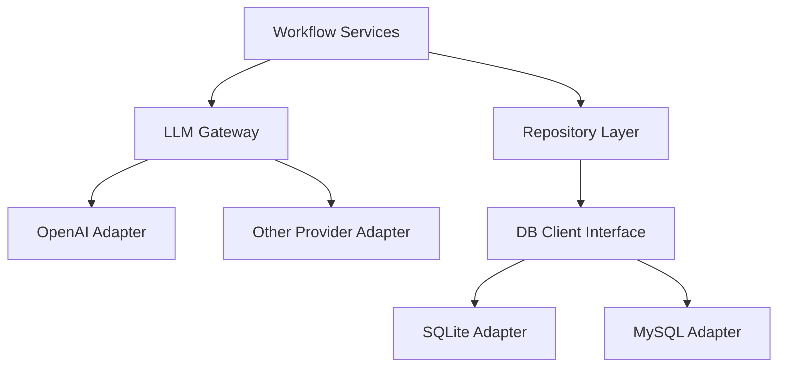

# v5-llm-mysql-plan.md

## 1. v5 总目标

`v5` 的目标不是再扩张新的创作链路，而是把当前系统的两块基础设施短板补成长期可扩展基线：

1. 把当前单一的 [`OpenAI`](src/infra/llm/openai-adapter.ts:18) 接入，升级成通用 LLM 抽象与多提供商接入层。
2. 把当前强绑定 [`SQLite`](src/infra/db/database.ts:5) 的存储层，升级成可通过配置选择 `SQLite` 或 `MySQL` 的单后端模式。
3. 在不强制迁移旧项目的前提下，让现有项目继续可运行，新项目可以按配置明确选择一种数据库后端。

---

## 2. 为什么需要 v5

### 2.1 LLM 接入还停留在单提供商单模型

当前 [`createLlmAdapter`](src/infra/llm/factory.ts:5) 只有一条分支：

- 读取 [`OPENAI_*`](src/shared/utils/env.ts:11)
- 创建 [`OpenAiLlmAdapter`](src/infra/llm/openai-adapter.ts:18)
- 没有 provider 抽象
- 没有模型能力配置
- 没有失败降级与可观测性分层

这会带来几个问题：

- 切换模型供应商时需要改代码，而不是改配置
- 很难为不同工作流阶段使用不同模型
- 很难控制成本、延迟、失败重试与 fallback
- 后续无法自然接入 OpenRouter、Anthropic、兼容 OpenAI 协议的私有网关

### 2.2 数据层还强绑定 SQLite 细节

当前 [`openDatabase`](src/infra/db/database.ts:5) 直接返回 [`better-sqlite3`](package.json:15) 实例，且 repository 与 migration 口径整体建立在 SQLite 风格上。

这会带来几个问题：

- 无法平滑支持 MySQL
- 迁移脚本和 SQL 方言与驱动绑定过深
- 未来如果要跑服务化部署、多人共享库、远程环境，会受单机 SQLite 限制
- CLI 看起来是“项目系统”，但存储能力还停留在“本地单机场景”

### 2.3 现在正适合做基础设施升级

`v4` / `v4.1` 已经把创作主链、卷级导演、诊断与回归打通。现在补 `v5`，时机是合适的：

- 主链已经足够稳定，适合抽底层接口
- 回归与 doctor 已经存在，可以作为基础设施升级的保护网
- 文档和 command 入口已较完整，适合新增配置与后端切换入口

---

## 3. v5 的设计原则

### 3.1 先抽象，再扩提供商与后端

先建立稳定接口层，再增加具体 provider / driver；不要直接把更多分支硬塞进现有工厂函数。

### 3.2 新能力必须“配置可选”，不是“强制迁移”

`SQLite` 仍然是默认、本地、零配置的起步方案；`MySQL` 是可选能力，项目在两者之间按配置二选一，不要求旧项目立即迁移。

### 3.3 不在 v5 一次性做分布式系统

`v5` 做的是：

- 多提供商 LLM 网关
- 可通过配置在 SQLite / MySQL 间二选一的存储抽象
- 配置、迁移、验收与回归补强

`v5` 不做：

- 在线协作编辑
- 多实例锁竞争治理
- 分布式任务队列
- SaaS 级租户隔离

### 3.4 先兼容 CLI，再考虑服务化

当前产品边界仍是 CLI，因此 `v5` 的抽象层应首先服务于：

- 现有命令
- 现有 repository
- 现有 migrate/init 流程

而不是为了未来服务化过早引入过重框架。

---

## 4. v5 主线拆分

### P0：LLM 抽象层重构

目标：让模型接入从“单个 OpenAI adapter”升级为“统一 provider 接口 + 多实现 + 可配置工厂”。

### P1：LLM 能力完善

目标：让 planning / generation / review / rewrite 可以按阶段选择模型、控制超时重试、记录 provider 元数据，并具备基础 fallback 能力。

### P2：存储抽象层重构

目标：把当前直接依赖 SQLite 驱动的底座，重构成可同时支持 `SQLite / MySQL` 的数据库访问抽象。

### P3：MySQL 可选支持

目标：让 `init / migrate / open database / repositories` 在不破坏 SQLite 的前提下支持通过配置切换到 MySQL 项目。

### P4：配置、命令与文档收口

目标：补齐环境变量、项目配置、CLI 文档、回归与验收口径。

---

## 5. v5 推荐执行顺序

### M0：LLM 配置与接口抽象

#### 目标

把当前 [`LlmAdapter`](src/shared/types/domain.ts:980) 与 [`createLlmAdapter`](src/infra/llm/factory.ts:5) 升级为真正的 provider 架构。

#### 模块任务

- 在 [`src/shared/types/domain.ts`](src/shared/types/domain.ts:971) 扩展 LLM 配置与结果元数据类型
- 重构 [`src/shared/utils/env.ts`](src/shared/utils/env.ts:5)，支持 provider 级配置读取
- 重构 [`src/infra/llm/factory.ts`](src/infra/llm/factory.ts:5)，按 `provider` 分发 adapter
- 保留 [`src/infra/llm/openai-adapter.ts`](src/infra/llm/openai-adapter.ts:18) 作为一个 provider 实现，而不是默认唯一实现
- 为后续 provider 预留统一错误模型、timeout、retry、response metadata 接口

#### 完成定义

- 系统可以通过配置明确选择 provider
- OpenAI 仍能工作
- 新 provider 的接入不需要改业务服务层

### M1：多提供商 LLM 接入

#### 目标

在统一抽象下接入不止一个 provider，并补齐模型级能力控制。

#### 模块任务

- 增加至少一个非 OpenAI 的 provider 实现，例如兼容 OpenAI 协议网关或 Anthropic 风格 adapter
- 让 [`Book`](src/shared/types/domain.ts:3) 或配置层可指定默认 provider / model / temperature / token 策略
- 为 planning / generation / review / rewrite 增加阶段级模型选择口径
- 为 LLM 输出补 provider / model / latency / fallbackSource 等 metadata
- 为失败情况补 retry 与 fallback 策略

#### 完成定义

- 同一套业务服务可切换不同 provider
- 可按工作流阶段配置模型
- 输出链路具备基础 provider 元数据

### M2：数据库访问抽象层

#### 目标

把当前 SQLite 驱动对象从业务基础设施中隔离出来。

#### 模块任务

- 重构 [`src/infra/db/database.ts`](src/infra/db/database.ts:1)，从“直接返回 SQLite Database”升级为统一数据库访问接口
- 识别 repository 当前依赖的最小 SQL 能力集合
- 为查询、单条、列表、事务定义统一访问面
- 让 migration 执行层与 driver 选择解耦
- 为 SQLite 实现一个 adapter，先确保现有逻辑不回退

#### 完成定义

- repository 不直接依赖 `better-sqlite3` 专属类型
- SQLite 仍可完整运行
- MySQL driver 能在接口层挂接

### M3：MySQL 可选支持

#### 目标

让项目可以通过配置在 `SQLite` 与 `MySQL` 之间二选一，而旧项目仍可继续使用 SQLite。

#### 模块任务

- 在 [`package.json`](package.json:14) 增加 MySQL 驱动依赖
- 在 [`src/shared/utils/env.ts`](src/shared/utils/env.ts:1) 或项目配置层新增数据库 provider 配置
- 扩展 [`src/infra/db/migrate.ts`](src/infra/db/migrate.ts:4) 与 schema 组织方式，使迁移可按方言执行
- 补 MySQL 的 database adapter 与连接管理
- 校验 repository SQL 是否存在 SQLite / MySQL 方言不兼容点，并逐步修正
- 让 `init` 与运行时数据库打开流程都能按配置选择 SQLite 或 MySQL

#### 完成定义

- 项目可按配置二选一使用 SQLite 或 MySQL
- 旧 SQLite 项目无需迁移仍可运行
- MySQL 项目能跑完整主链路与核心命令

### M4：配置、命令、验收与回归

#### 目标

把新的基础设施能力变成可用、可理解、可验证的产品功能。

#### 模块任务

- 补环境变量示例与配置文档，更新 [`.env.example`](.env.example)
- 更新 [`COMMAND_GUIDE.md`](COMMAND_GUIDE.md:1)，增加 provider / MySQL 使用说明
- 增加数据库后端显示命令或在现有状态命令中展示当前 provider
- 增加 LLM provider / DB backend 的 doctor 与 regression 检查项
- 新增 `v5` 回归样本，覆盖：
  - OpenAI provider smoke
  - secondary provider smoke
  - SQLite backend smoke
  - MySQL backend smoke
  - mixed config validation

#### 完成定义

- 用户能明确知道如何启用 provider 与数据库后端选择
- 基础设施切换具备最小可用回归面
- 文档、代码、回归三者一致

---

## 6. LLM 专项拆解

### 6.1 抽象目标

推荐把当前 [`LlmAdapter`](src/shared/types/domain.ts:980) 扩成三层：

```text
Workflow Service
  -> LLM Gateway
    -> Provider Adapter
      -> Remote API
```

建议职责：

- `gateway` 负责：provider 选择、fallback、retry、timeout、metadata
- `provider adapter` 负责：具体协议适配
- `workflow service` 只关心 prompt 和结果，不关心供应商细节

### 6.2 推荐新增能力

- provider registry
- stage-based model routing
- timeout / retry policy
- fallback provider chain
- generation metadata logging
- structured response validation
- 失败分类与诊断输出

### 6.3 推荐第一批 provider

优先级建议：

1. OpenAI 继续保留为标准实现
2. OpenAI-compatible provider 作为第二实现
3. 之后再扩 Anthropic / 其他专用协议 provider

这样可以先把抽象打稳，再处理协议差异更大的 provider。

---

## 7. MySQL 专项拆解

### 7.1 抽象目标

推荐把当前数据层切成三层：

```text
Repository
  -> Db Client Interface
    -> SQLite Adapter / MySQL Adapter
```

### 7.2 推荐策略

不建议在 `v5` 直接重写全部 repository 为 ORM。

更稳妥的路径是：

- 保持 repository 结构不变
- 先抽出最小 DB client 接口
- 逐步把查询执行从具体驱动中分离
- 再补 MySQL adapter

### 7.3 MySQL 支持边界

`v5` 推荐支持：

- 新项目初始化到 MySQL
- 使用 MySQL 跑完整 CLI 主链
- SQLite 与 MySQL 并行存在

`v5` 暂不强做：

- 自动从 SQLite 全量迁移到 MySQL
- 双写同步
- 远程连接池优化到服务端规模

---

## 8. 风险与约束

### 8.1 最大风险：repository 与驱动耦合过深

当前 repository 数量较多，如果不先抽象 DB client，MySQL 支持会快速演变成大面积散点修改。

### 8.2 第二风险：方言差异导致 migration 与 SQL 兼容问题

尤其要关注：

- JSON 存储字段
- `INTEGER` / `REAL` / `TEXT` 差异
- 主键与自定义 ID 策略
- 事务与锁行为
- `PRAGMA` 类 SQLite 专属语法

### 8.3 第三风险：多 provider 引入后 prompt 结果稳定性下降

不同 provider 的：

- 结构化 JSON 稳定性
- 长上下文表现
- 风格一致性
- 失败返回格式

都会不同，所以 `v5` 必须加强 response normalization 与 fallback 机制。

---

## 9. 推荐第一批直接开工的任务

1. 重构 [`src/infra/llm/factory.ts`](src/infra/llm/factory.ts:5)，建立 provider registry
2. 扩展 [`src/shared/utils/env.ts`](src/shared/utils/env.ts:5)，支持 `LLM_PROVIDER` 与数据库 provider 配置
3. 重构 [`src/infra/db/database.ts`](src/infra/db/database.ts:1)，抽出统一 DB client 接口
4. 为 SQLite 先实现 adapter，保证现有逻辑不退化
5. 新建 `v5` 任务拆解文档，进入逐项实现

---

## 10. 简化架构图



---

## 11. 边界说明

这版 `v5` 规划当前不包含：

- 自动 SQLite -> MySQL 迁移工具
- 在线协作服务化改造
- 批量异步任务编排
- 多租户权限系统

这版 `v5` 只聚焦：

- LLM 多提供商抽象
- LLM 运行能力补强
- SQLite / MySQL 并行后端
- 配置、回归、文档与验收口径收口
